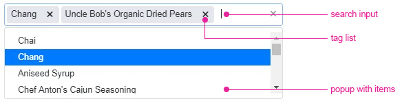

# MultiSelect Accessibility

The MultiSelect is accessible by screen readers and provides WAI-ARIA, Section 508, WCAG 2.2, and keyboard support.

For more information, refer to:
* [Keyboard navigation by the Telerik UI MultiSelect]()
* [Accessibility in {{ site.product }}]()

## WAI-ARIA

The component follows the WAI-ARIA Authoring Practices for implementing the keyboard navigation for its component role and is tested against the popular screen readers. For more information, refer to the article on [WAI-ARIA support in {{ site.product_short }}](#wai-aria).

The MultiSelect provides the following building blocks which, depending on its current state and options, use different `aria` properties on their nested elements:

* [Search input](#search-input)&mdash;Filters the list of choices.
* [Tag list](#tag-list)&mdash;Displays the selected values.
* [Items popup](#items-popup)&mdash;Displays the list of items that can be selected.

### Search Input

If the `placeholder` option is set and in order for screen readers to announce the placeholder text, you have to manually toggle the WAI-ARIA `label` attribute on the `input` element.

The MultiSelect implements the following WAI-ARIA roles, states, and properties for its search input:

| Role     | Attribute             | Usage                                       |
|----------|---------------------- |---------------------------------------------|
|[`listbox`](https://www.w3.org/TR/wai-aria-1.1/#listbox)  |                              | Identifies the popup with items.
|          | [`aria-expanded`](https://www.w3.org/TR/wai-aria-1.1/#aria-expanded)         | Indicates the state of the popup with items&mdash;expanded or collapsed. |
|          | [`aria-haspopup`](https://www.w3.org/TR/wai-aria-1.1/#aria-haspopup)         | Indicates that the MultiSelect has a popup. |
|          | [`aria-autocomplete`](https://www.w3.org/TR/wai-aria-1.1/#aria-autocomplete) | Indicates that the provided user input will display a popup that contains a list of values which can complete the provided input. |
|          | [`aria-describedby`](https://www.w3.org/TR/wai-aria-1.1/#aria-describedby)   | Identifies the tag list as the description object and allows screen readers to announce the selected options upon focusing them. |
|          | [`aria-busy`](https://www.w3.org/TR/wai-aria-1.1/#aria-busy)                 | Indicates if the MultiSelect is in the process of loading data. |
|          | [`aria-disabled`](https://www.w3.org/TR/wai-aria-1.1/#aria-disabled)         | Indicates if the MultiSelect is disabled. |
|          | [`aria-activedescendant`](https://www.w3.org/TR/wai-aria-1.1/#aria-activedescendant) | Indicates the active element when navigating through the list of selected options. |

### Tag List

In order for the screen readers to announce the selected options after deleting an item from the tag list:

1. Enable the focusing of the option with the keyboard arrows.
1. Enable the removal of the option by pressing the `Backspace` or `Delete` keys.

The MultiSelect implements the following WAI-ARIA roles, states, and properties for its tag list:

| Role                                                    | Attribute     | Usage                                       |
|---------------------------------------------------------|---------------|---------------------------------------------|
|[`listbox`](https://www.w3.org/TR/wai-aria-1.1/#listbox) |               | Identifies the list of selected options.
|[`option`](https://www.w3.org/TR/wai-aria-1.1/#option)   |               | Identifies each element which contains the name of an option. |
|                                                         | [`aria-setsize`](https://www.w3.org/TR/wai-aria-1.1/#aria-setsize)   | Indicates the position of the option in the list. |
|                                                         | [`aria-selected`](https://www.w3.org/TR/wai-aria-1.1/#aria-selected) | Indicates that the tag list item is selected. |

### Items Popup

The MultiSelect implements the following WAI-ARIA roles, states, and properties for its items popup:

| Role     | Attribute     | Usage                                       |
|----------|-------------  |---------------------------------------------|
|[`listbox`](https://www.w3.org/TR/wai-aria-1.1/#listbox)  |              | Identifies the list of selected options.
|[`option`](https://www.w3.org/TR/wai-aria-1.1/#option)    |              | Identifies each element which contains the name of an option. |
|          |[`aria-selected`](https://www.w3.org/TR/wai-aria-1.1/#aria-selected) | Indicates that the tag list item is selected. |

## Section 508

The MultiSelect is compliant with the Section 508 requirements. For more information, refer to the article on [Section 508 support in {{ site.product }}](#section-508).

## WCAG 2.2

The MultiSelect supports the standards for providing accessible web content which are set by the [Web Content Accessibility Guidelines 2.1](https://www.w3.org/TR/WCAG/). For more information, refer to the article on [WCAG 2.2 compliance in {{ site.product_short }} ](#wcag-21)

## See Also

* [Keyboard Navigation by the MultiSelect HtmlHelper for {{ site.framework }} (Demo)](https://demos.telerik.com/{{ site.platform }}/multiselect/keyboard-navigation)
* [Keyboard Navigation by the MultiSelect HtmlHelper for {{ site.framework }}]()
* [Accessibility in {{ site.product }}]()
