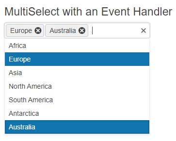

# Getting Started with the MultiSelect

This tutorial explains how to set up a basic Telerik UI for {{ site.framework }} MultiSelect and highlights the major steps in the configuration of the component.

You will initialize a MultiSelect component with several items and a placeholder text. Finally, you can run the sample code in [Telerik REPL](https://netcorerepl.telerik.com/) and continue exploring the components.

 

@[template](/_contentTemplates/core/getting-started-prerequisites.md#repl-component-gs-prerequisites)

## 1. Prepare the CSHTML File

@[template](/_contentTemplates/core/getting-started-directives.md#gs-adding-directives)

You will also add some sample data that the MultiSelect will present. Optionally, you can structure the document by adding the desired HTML elements like headings, divs, paragraphs, and others.

```HtmlHelper
    @using Kendo.Mvc.UI

    @{
    var continents = new List<SelectListItem> {
    new SelectListItem() {Text = "Africa", Value = "1"},
    new SelectListItem() {Text = "Europe", Value = "2"},
    new SelectListItem() {Text = "Asia", Value = "3"},
    new SelectListItem() {Text = "North America", Value = "4"},
    new SelectListItem() {Text = "South America", Value = "5"},
    new SelectListItem() {Text = "Antarctica", Value = "6"},
    new SelectListItem() {Text = "Australia", Value = "7"}
    };
    }

    <h4>MultiSelect with a Placeholder</h4>
    <div>

    </div>
```

```TagHelper
    @addTagHelper *, Kendo.Mvc


    @{
    var continents = new List<SelectListItem> {
    new SelectListItem() {Text = "Africa", Value = "1"},
    new SelectListItem() {Text = "Europe", Value = "2"},
    new SelectListItem() {Text = "Asia", Value = "3"},
    new SelectListItem() {Text = "North America", Value = "4"},
    new SelectListItem() {Text = "South America", Value = "5"},
    new SelectListItem() {Text = "Antarctica", Value = "6"},
    new SelectListItem() {Text = "Australia", Value = "7"}
    };
    }

    <h4>MultiSelect with a Placeholder</h4>
    <div>

    </div>
```


## 2. Initialize the MultiSelect

Use the MultiSelect HtmlHelper or TagHelper to add the component to a page:

* The `Name()` configuration method is mandatory as its value is used for the `id` and the name attributes of the MultiSelect element.
* The `Placeholder()` configuration specifies the text that is shown initially within the MultiSelect. 

```HtmlHelper
    @using Kendo.Mvc.UI

    @{
    var continents = new List<SelectListItem> {
    new SelectListItem() {Text = "Africa", Value = "1"},
    new SelectListItem() {Text = "Europe", Value = "2"},
    new SelectListItem() {Text = "Asia", Value = "3"},
    new SelectListItem() {Text = "North America", Value = "4"},
    new SelectListItem() {Text = "South America", Value = "5"},
    new SelectListItem() {Text = "Antarctica", Value = "6"},
    new SelectListItem() {Text = "Australia", Value = "7"}
    };
    }

    <h4>MultiSelect with a Placeholder</h4>
    <div>
      @(Html.Kendo().MultiSelect()
          .Name("multiselect")
          .DataTextField("Text")
          .DataValueField("Value")
          .Placeholder("Select a continent")
          .HtmlAttributes(new { style = "width:   300px;"})
          .BindTo(continents)
      )
    </div>
```

```TagHelper
    @addTagHelper *, Kendo.Mvc

    @{
    var continents = new List<SelectListItem> {
    new SelectListItem() {Text = "Africa", Value = "1"},
    new SelectListItem() {Text = "Europe", Value = "2"},
    new SelectListItem() {Text = "Asia", Value = "3"},
    new SelectListItem() {Text = "North America", Value = "4"},
    new SelectListItem() {Text = "South America", Value = "5"},
    new SelectListItem() {Text = "Antarctica", Value = "6"},
    new SelectListItem() {Text = "Australia", Value = "7"}
    };

    <h4>MultiSelect with a Placeholder</h4>
    <div>
       <kendo-multiselect name="multiselect"
           datatextfield="Text"
           datavaluefield="Value"
           placeholder="Select a continent"
           bind-to="continents"
           style="width: 300px;">
       </kendo-multiselect>
    </div>
```


## 3. Select a Default Value

The next step is to select some predefined values of the MultiSelect. The following will display Europe and Australia as initially selected.

```HtmlHelper
    @using Kendo.Mvc.UI

    @{
    var continents = new List<SelectListItem> {
    new SelectListItem() {Text = "Africa", Value = "1"},
    new SelectListItem() {Text = "Europe", Value = "2"},
    new SelectListItem() {Text = "Asia", Value = "3"},
    new SelectListItem() {Text = "North America", Value = "4"},
    new SelectListItem() {Text = "South America", Value = "5"},
    new SelectListItem() {Text = "Antarctica", Value = "6"},
    new SelectListItem() {Text = "Australia", Value = "7"}
    };
    }

    <h4>MultiSelect with a Default Value</h4>
    <div>
      @(Html.Kendo().MultiSelect()
          .Name("multiselect")
          .DataTextField("Text")
          .DataValueField("Value")
          .Placeholder("Select a continent")
          .HtmlAttributes(new { style = "width:   300px;"})
          .BindTo(continents)
          .Value(new string[] { "2", "7" })
      )
    </div>
```

```TagHelper
    @addTagHelper *, Kendo.Mvc

    @{
    var continents = new List<SelectListItem> {
    new SelectListItem() {Text = "Africa", Value = "1"},
    new SelectListItem() {Text = "Europe", Value = "2"},
    new SelectListItem() {Text = "Asia", Value = "3"},
    new SelectListItem() {Text = "North America", Value = "4"},
    new SelectListItem() {Text = "South America", Value = "5"},
    new SelectListItem() {Text = "Antarctica", Value = "6"},
    new SelectListItem() {Text = "Australia", Value = "7"}
    };

    <h4>MultiSelect with a Default Value</h4>
    <div>
       <kendo-multiselect name="multiselect"
           datatextfield="Text"
           datavaluefield="Value"
           placeholder="Select a continent"
           bind-to="continents"
           style="width: 300px;"
           value='new string[] { "2", "7" }'>
       </kendo-multiselect>
    </div>
```


## 4. Handle a MultiSelect Event

The MultiSelect component provides convenient events for implementing your desired logic. In this tutorial, you will use the exposed `Change()` and `Open()` events to log a new entry in the browser's console.

```HtmlHelper
    @using Kendo.Mvc.UI

    @{
        var continents = new List<SelectListItem> {
        new SelectListItem() {Text = "Africa", Value = "1"},
        new SelectListItem() {Text = "Europe", Value = "2"},
        new SelectListItem() {Text = "Asia", Value = "3"},
        new SelectListItem() {Text = "North America", Value = "4"},
        new SelectListItem() {Text = "South America", Value = "5"},
        new SelectListItem() {Text = "Antarctica", Value = "6"},
        new SelectListItem() {Text = "Australia", Value = "7"}
    };
    }

    <script>
        function change(e) {
            console.log("Change :: " + this.value());
        }

        function open(e) {
            console.log("MultiSelect opened");
        }
    </script>

    <h4>MultiSelect with an Event Handler</h4>
    <div>
        @(Html.Kendo().MultiSelect()
                .Name("multiselect")
                .DataTextField("Text")
                .DataValueField("Value")
                .Placeholder("Select a continent")
                .HtmlAttributes(new { style = "width: 300px;" })
                .BindTo(continents)
                .Value(new string[] { "2", "7" })
                .Events(e => e // Configure the client-side events.
                    .Change("change")
                    .Open("open")
                )
        )
    </div>
```

```TagHelper
    @addTagHelper *, Kendo.Mvc

    @{
        var continents = new List<SelectListItem> {
        new SelectListItem() {Text = "Africa", Value = "1"},
        new SelectListItem() {Text = "Europe", Value = "2"},
        new SelectListItem() {Text = "Asia", Value = "3"},
        new SelectListItem() {Text = "North America", Value = "4"},
        new SelectListItem() {Text = "South America", Value = "5"},
        new SelectListItem() {Text = "Antarctica", Value = "6"},
        new SelectListItem() {Text = "Australia", Value = "7"}
    };
    }

    <script>
        function change(e) {
            console.log("Change :: " + this.value());
        }

        function open(e) {
            console.log("MultiSelect opened");
        }
    </script>

    <h4>MultiSelect with an Event Handler</h4>
    <div>
        <kendo-multiselect name="multiselect"
            datatextfield="Text"
            datavaluefield="Value"
            placeholder="Select a continent"
            bind-to="continents"
            value='new string[] { "2", "7" }'
            style="width: 300px;"
            on-change="change"
            on-open="open">
        </kendo-multiselect>
    </div>
```



## 5. (Optional) Reference Existing MultiSelect Instances

You can reference the MultiSelect instances that you have created and build on top of their existing configuration:

1. Use the `id` attribute of the component instance to establish a reference.

    ```script
    <script>
        var multiselectReference = $("#multiselect").data("kendoMultiSelect"); // multiselectReference is a reference to the existing MultiSelect instance of the helper.
    </script>
    ```

1. Use the [MultiSelect client-side API](https://docs.telerik.com/kendo-ui/api/javascript/ui/multiselect#methods) to control the behavior of the widget. In this example, you will use the `value` method to select an item.

    ```script
    <script>
        var multiselectReference = $("#multiselect").data("kendoMultiSelect"); // multiselectReference is a reference to the existing MultiSelect instance of the helper.
        multiselectReference.value("3"); 
    </script>
    ```


## Explore this Tutorial in REPL

You can continue experimenting with the code sample above by running it in the Telerik REPL server playground:

* [Sample code with the MultiSelect HtmlHelper](https://netcorerepl.telerik.com/wdObPPkj49bi0T5L26)
* [Sample code with the MultiSelect TagHelper](https://netcorerepl.telerik.com/mdEvvlOj50PJhPiw23)



## Next Steps

* [Binding the MultiSelect to Data]()
* [Customize the Appearance of the MultiSelect]()
* [Controlling the Rendering of the MultiSelect through Templates]()

## See Also

* [Using the API of the MultiSelect for {{ site.framework }} (Demo)](https://demos.telerik.com/{{ site.platform }}/multiselect/api)
* [MultiSelect Client-Side API](https://docs.telerik.com/kendo-ui/api/javascript/ui/multiselect)
* [Server-Side API of the MultiSelect](/api/multiselect)
* [Knowledge Base Section](/knowledge-base)
