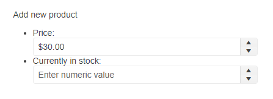

# Getting Started with the NumericTextBox

This tutorial explains how to set up a basic Telerik UI for {{ site.framework }} NumericTextBox and highlights the major steps in the configuration of the component.

You will initialize two NumericTextBox components, one of them will have an event handler. Finally, you can run the sample code in [Telerik REPL](https://netcorerepl.telerik.com/) and continue exploring the components.

 

@[template](/_contentTemplates/core/getting-started-prerequisites.md#repl-component-gs-prerequisites)

## 1. Prepare the CSHTML File

The first step is to add the required directives at the top of the `.cshtml` document:

* To use the Telerik UI for {{ site.framework }} HtmlHelpers:
    ```
    @using Kendo.Mvc.UI
    ```

* To use the Telerik UI for {{ site.framework }} TagHelpers:
    ```
    @addTagHelper *, Kendo.Mvc
    ```


Optionally, you can structure the document by adding the desired HTML elements like headings, divs, paragraphs, and others. In this tutorial, you will create a list that contains two items&mdash;one for each NumericTextBox. You will also add labels.

```HtmlHelper
@using Kendo.Mvc.UI

<p class="title">Add new product</p>
<ul id="products-list">
    <li>
        <label for="currency">Price:</label>
        
    </li>
    <li>
        <label for="numeric">Currently in stock:</label>

    </li>
</ul>
```

```TagHelper
@addTagHelper *, Kendo.Mvc

<p class="title">Add new product</p>
<ul id="products-list">
    <li>
        <label for="currency">Price:</label>
        
    </li>
    <li>
        <label for="numeric">Currently in stock:</label>

    </li>
</ul>
```


## 2. Initialize the NumericTextBox

Use the NumericTextBox HtmlHelper or TagHelper to add the component to a page. The `Name()` configuration method is mandatory as its value is used for the id and the name attributes of the NumericTextBox element.

```HtmlHelper
@using Kendo.Mvc.UI

<p class="title">Add new product</p>
<ul id="products-list">
    <li>
        <label for="currency">Price:</label>
        @(Html.Kendo().NumericTextBox<decimal>()
            .Name("currency") // The name is required.
        )

    </li>
    <li>
        <label for="numeric">Currently in stock:</label>
        @(Html.Kendo().NumericTextBox<double>()
            .Name("numeric")
        )
    </li>
</ul>
```

```TagHelper
@addTagHelper *, Kendo.Mvc

<p class="title">Add new product</p>
<ul id="products-list">
    <li>
        <label for="currency">Price:</label>
            <kendo-numerictextbox name="currency">
            </kendo-numerictextbox>
    </li>
    <li>
        <label for="numeric">Currently in stock:</label>
            <kendo-numerictextbox name="numeric">
            </kendo-numerictextbox>
    </li>
</ul>
```


>Do not set the `Name()` option when using `NumericTextBoxFor`. The `[WidgetName]For` method automatically sets the widget's `Name()` to the field it is bound to. For more information, see the [Fundamentals]()() article.

## 3. Configure the Displayed Values

The NumericTextBox provides a [variety of methods](/api/NumericTextBox) that allow you to configure its values. In this tutorial, you will perform the following configuration:

* To specify the number format for the control when it isn't focused, use the `Format()` method.
* To define what is the accepted minimal value, use the `Min()` method.
* To set the value, use the `Value()` method.
* To add a placeholder text in the NumericTextBox, use the `Placeholder()` method.

```HtmlHelper
@using Kendo.Mvc.UI

<p class="title">Add new product</p>
<ul id="products-list">
    <li>
        <label for="currency">Price:</label>
        @(Html.Kendo().NumericTextBox<decimal>()
            .Name("currency")
            .Format("c") // Format the value as currency.
            .Min(0) // The minimal value is 0.
            .Value(30) // The current value is 30.
            .Placeholder("Enter product price") // Use the placeholder to display a hint.
        )

    </li>
    <li>
        <label for="numeric">Currently in stock:</label>
        @(Html.Kendo().NumericTextBox<double>()
            .Name("numeric")
            .Placeholder("Enter numeric value")
        )
    </li>
</ul>
```

```TagHelper
@addTagHelper *, Kendo.Mvc

<p class="title">Add new product</p>
<ul id="products-list">
    <li>
        <label for="currency">Price:</label>
            <kendo-numerictextbox name="currency"
                min="0"
                format="c"
                value="30"
                placeholder="Enter product price">
            </kendo-numerictextbox>
    </li>
    <li>
        <label for="numeric">Currently in stock:</label>
            <kendo-numerictextbox name="numeric"
                min="0"
                placeholder="Enter numeric value">
            </kendo-numerictextbox>
    </li>
</ul>
```


## 4. Handle a NumericTextBox Event

The NumericTextBox exposes the `Change` and `Spin` events that you can handle and customize the component's functions. In this tutorial, you will use these events to log a new entry in the browser's console.

```HtmlHelper
@using Kendo.Mvc.UI

<p class="title">Add new product</p>
<ul id="products-list">
    <li>
        <label for="currency">Price:</label>
        @(Html.Kendo().NumericTextBox<decimal>()
            .Name("currency")
            .Format("c")
            .Min(0)
            .Value(30)
            .Placeholder("Enter product price")
            .Events(e => e // Configure the client-side events.
                .Change("change")
                .Spin("spin")
            )
        )
    </li>
    <li>
        <label for="numeric">Currently in stock:</label>
        @(Html.Kendo().NumericTextBox<double>()
            .Name("numeric")
            .Placeholder("Enter numeric value")
        )
    </li>
</ul>

<script>
    function change() {
        console.log("Change :: " + this.value());
    }

    function spin() {
        console.log("Spin :: " + this.value());
    }
</script>
```

```TagHelper
@addTagHelper *, Kendo.Mvc

<p class="title">Add new product</p>
<ul id="products-list">
    <li>
        <label for="currency">Price:</label>
            <kendo-numerictextbox name="currency"
                min="0"
                format="c"
                value="30"
                placeholder="Enter product price"
                on-change="change"
                on-spin="spin">
            </kendo-numerictextbox>
    </li>
    <li>
        <label for="numeric">Currently in stock:</label>
            <kendo-numerictextbox name="numeric"
                min="0"
                placeholder="Enter numeric value">
            </kendo-numerictextbox>
    </li>
</ul>

<script>
    function change() {
        console.log("Change :: " + this.value());
    }

    function spin() {
        console.log("Spin :: " + this.value());
    }
</script>
```


## 5. (Optional) Reference Existing NumericTextBox Instances

You can reference the NumericTextBox instances that you have created and build on top of their existing configuration:

1. Use the `id` attribute of the component instance to establish a reference.

    ```script
    <script>
        var numericTextBoxRef = $('#currency').data('kendoNumericTextBox'); // numericTextBoxRef is a reference to the existing currency instance of the helper.
    </script>
    ```

1. Use the [NumericTextBox client-side API](https://docs.telerik.com/kendo-ui/api/javascript/ui/numerictextbox#methods) to control the behavior of the widget. In this example, you will use the `readonly` method to disable user input.

    ```script
    <script>
        var numericTextBoxRef = $('#currency').data('kendoNumericTextBox'); // numericTextBoxRef is a reference to the existing currency instance of the helper.
        numericTextBoxRef.readonly(true); // Set the readonly method to true and disable user input.
    </script>
    ```

For more information on referencing specific helper instances, see the [Methods and Events]() article.


## Explore this Tutorial in REPL

You can continue experimenting with the code sample above by running it in the Telerik REPL server playground:

* [Sample code with the Button HtmlHelper](https://netcorerepl.telerik.com/cwlEwObH06CrG6GO25)
* [Sample code with the Button TagHelper](https://netcorerepl.telerik.com/QQFYwuvR074hPOq107)


## Next Steps

* [Customizing the Appearance of the NumericTextBox]()
* [Associating the label HTML element with the NumericTextBox]()
* [Setting a number Format in the NumericTextBox]()

## See Also

* [Using the API of the NumericTextBox for {{ site.framework }} (Demo)](https://demos.telerik.com/{{ site.platform }}/numerictextbox/api)
* [NumericTextBox client-side API](https://docs.telerik.com/kendo-ui/api/javascript/ui/numerictextbox)
* [NumericTextBox server-side API](/api/NumericTextBox)
* [Knowledge Base Section](/knowledge-base)
