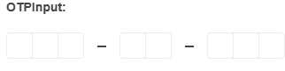

# Getting Started with the OTPInput

This tutorial explains how to set up a basic Telerik UI for {{ site.framework }} OTPInput component and highlights the major steps in the configuration of the component.

You will initialize an OTPInput component with a set of items. Then, you will use the events of the UI component. Finally, you can run the sample code in [Telerik REPL](https://netcorerepl.telerik.com/) and continue exploring the components.

 

@[template](/_contentTemplates/core/getting-started-prerequisites.md#repl-component-gs-prerequisites)

## 1. Prepare the CSHTML File

@[template](/_contentTemplates/core/getting-started-directives.md#gs-adding-directives)

Optionally, you can structure the document by adding the desired HTML elements like headings, divs, paragraphs, and others.

```HtmlHelper
    @using Kendo.Mvc.UI

    <h4>OTPInput with Predefined Items</h4>
    <br/>
    <div>

    </div>
```

```TagHelper
    @addTagHelper *, Kendo.Mvc

    <h4>OTPInput with Predefined Items</h4>
    <br/>
    <div>

    </div>
```


## 2. Initialize the OTPInput

Use the OTPInput HtmlHelper or TagHelper to add the component to a page:

* The `Name()` configuration method is mandatory as its value is used for the `id` and the `name` attributes of the OTPInput element.
* The `Items()` collection contains the list of items representing the different input groups.
* The `Space()` configuration controls the spacing behavior between each of the input groups.

```HtmlHelper
    @using Kendo.Mvc.UI

    <h4>OTPInput with Predefined Items</h4>
    <br/>
    <div>
        @(Html.Kendo().OTPInput()
                .Name("otp")
                .Items(items => {
                    items.Add().GroupLength(3);
                    items.Add().GroupLength(2);
                    items.Add().GroupLength(3);
                })
                .Space(false)
        )
    </div>
```

```TagHelper
    @addTagHelper *, Kendo.Mvc

    <h4>OTPInput with Predefined Items</h4>
    <br/>
    <div>
        <kendo-otpinput name="otp" space="false">
                <otpinput-items>
                    <item group-length="3" />
                    <item group-length="2" />
                    <item group-length="3" />
                </otpinput-items>
         </kendo-otpinput>
    </div>
```


## 3. Configure the Separator

The OTPInput components allows you to add a separator between each of the established input groups. In this tutorial, you will use the available `SeparatorHandler()` option to render a [SVG Icon](https://docs.telerik.com/{{ site.platform }}/styles-and-layout/sass-themes/svg-icons#what-are-svg-icons).

```HtmlHelper
    @using Kendo.Mvc.UI

    <h4>OTPInput with Predefined Items</h4>
    <br/>
    <div>
        @(Html.Kendo().OTPInput()
                .Name("otp")
                .Items(items => {
                    items.Add().GroupLength(3);
                    items.Add().GroupLength(2);
                    items.Add().GroupLength(3);
                })
                .Space(false)
                .SeparatorHandler("separatorHandler")
        )
    </div>
```

```TagHelper
    @addTagHelper *, Kendo.Mvc

    <h4>OTPInput with Predefined Items</h4>
    <br/>
    <div>
        <kendo-otpinput name="otp"
                        space="false"
                        separator-handler="separatorHandler">
                <otpinput-items>
                    <item group-length="3" />
                    <item group-length="2" />
                    <item group-length="3" />
                </otpinput-items>
         </kendo-otpinput>
    </div>
```

```JavaScript
    <script>
        function separatorHandler(e) {
            return kendo.ui.icon({icon: "minus", type:"svg"});
        }
    </script>
```

## 4. Handle an OTPInput Event

The OTPInput component provides a convenient event for implementing your desired logic. In this tutorial, you will use the exposed `Change()` event to log a new entry in the browser's console.

```HtmlHelper
    @using Kendo.Mvc.UI

    <h4>OTPInput with Predefined Items</h4>
    <br/>
    <div>
       @(Html.Kendo().OTPInput()
           .Name("otp")
           .Items(items => {
               items.Add().GroupLength(3);
               items.Add().GroupLength(2);
               items.Add().GroupLength(3);
           })
           .Space(false)
           .SeparatorHandler("separatorHandler")
           .Events(events => events.Change("onChange"))
       )
    </div>
```

```TagHelper
    @addTagHelper *, Kendo.Mvc

    <h4>OTPInput with Predefined Items</h4>
    <br/>
    <div>
        <kendo-otpinput name="otp" 
                        space="false"
                        separator-handler="separatorHandler"
                        on-change="onChange">
             <otpinput-items>
                 <item group-length="3" />
                 <item group-length="2" />
                 <item group-length="3" />
             </otpinput-items>
        </kendo-otpinput>
    </div>
```

```JavaScript
    <script>
       function onChange(e) {
          console.log("Change :: " + e.value);
       }

       function separatorHandler(e) {
            return kendo.ui.icon({icon: "minus", type:"svg"});
       }
    </script>
```

## 5. (Optional) Reference Existing OTPInput Instances

You can reference the OTPInput instances that you have created and build on top of their existing configuration:

1. Use the `id` attribute of the component instance to establish a reference.

    ```JS script
    <script>
        var otpinputReference = $("#otpinput").getKendoOTPInput(); // otpinputReference is a reference to the existing OTPInput instance of the helper.
    </script>
    ```

1. Use the [OTPInput client-side API](https://docs.telerik.com/kendo-ui/api/javascript/ui/otpinput#methods) to control the behavior of the widget. In this example, you will use the `enable` method to disable the OTPInput.

    ```JS script
    <script>
         var otpinputReference = $("#otpinput").getKendoOTPInput(); // otpinputReference is a reference to the existing OTPInput instance of the helper.
         otpinputReference.enable(false); 
    </script>
    ```

## Next Steps

* [Customize the Type of the OTPInput]()
* [Configure the Appearance of the OTPInput]()

## See Also

* [Using the API of the OTPInput for {{ site.framework }} (Demo)](https://demos.telerik.com/{{ site.platform }}/otpinput/api)
* [Server-Side API of the OTPInput HtmlHelper](/api/otpinput)

* [Server-Side API of the OTPInput TagHelper](/api/taghelpers/otpinput)

* [Client-Side API of the OTPInput](https://docs.telerik.com/kendo-ui/api/javascript/ui/otpinput)
* [Knowledge Base Section](/knowledge-base)
