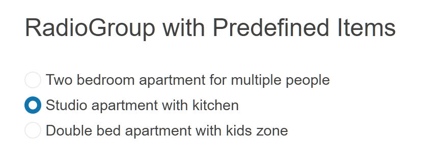

# Getting Started with the RadioGroup

This tutorial explains how to set up a basic Telerik UI for {{ site.framework }} RadioGroup component and highlights the major steps in the configuration of the component.

You will initialize a RadioGroup component with a set of items. Then, you will use the events of the UI component. Finally, you can run the sample code in [Telerik REPL](https://netcorerepl.telerik.com/) and continue exploring the components.

 

@[template](/_contentTemplates/core/getting-started-prerequisites.md#repl-component-gs-prerequisites)

## 1. Prepare the CSHTML File

@[template](/_contentTemplates/core/getting-started-directives.md#gs-adding-directives)

Optionally, you can structure the document by adding the desired HTML elements like headings, divs, paragraphs, and others.

```HtmlHelper
    @using Kendo.Mvc.UI

    <h4>RadioGroup with Predefined Items</h4>
    <br/>
    <div>

    </div>
```

```TagHelper
    @addTagHelper *, Kendo.Mvc

    <h4>RadioGroup with Predefined Items</h4>
    <br/>
    <div>

    </div>
```


## 2. Initialize the RadioGroup

Use the RadioGroup HtmlHelper or TagHelper to add the component to a page:

* The `Name()` configuration method is mandatory as its value is used for the `id` and the `name` attributes of the RadioGroup element.
* The `Items()` collection contains the list of Items representing the available options.
* The `Value()` configuration applies the initial selection to a given item.

```HtmlHelper
 @using Kendo.Mvc.UI

<h4>RadioGroup with Predefined Items</h4>
<br/>
<div>
    @(Html.Kendo().RadioGroup()
        .Name("radiogroup")
        .Items(i =>
        {
            i.Add().Label("Two bedroom apartment for multiple people").Value("1");
            i.Add().Label("Studio apartment with kitchen").Value("2");
            i.Add().Label("Double bed apartment with kids zone").Value("3");
        })
        .Value("2")
    )
</div>
```

```TagHelper
@addTagHelper *, Kendo.Mvc

<h4>RadioGroup with Predefined Items</h4>
<br/>
<div>
        <kendo-radiogroup name="radiogroup"
                          radio-name="radiogroup"    
                          value="2">
            <kendo-radiogroup-items>
                <kendo-radiogroup-item label="Two bedroom apartment for multiple people" value="1"></kendo-radiogroup-item>
                <kendo-radiogroup-item label="Studio apartment with kitchen" value="2"></kendo-radiogroup-item>
                <kendo-radiogroup-item label="Double bed apartment with kids zone" value="3"></kendo-radiogroup-item>
            </kendo-radiogroup-items>
        </kendo-radiogroup>
</div>
```


## 3. Handle a RadioGroup Event

The RadioGroup component provides convenient events for implementing your desired logic. In this tutorial, you will use the exposed `Change()` event to log a new entry in the browser's console.

```HtmlHelper
 @using Kendo.Mvc.UI

<script>
   function onChange(e) {
      console.log("Change :: old value: " + e.oldValue + ", new value: " + e.newValue);
   }
</script>

<h4>RadioGroup with Predefined Items</h4>
<br/>
<div>
    @(Html.Kendo().RadioGroup()
        .Name("radiogroup")
        .Items(i =>
        {
            i.Add().Label("Two bedroom apartment for multiple people").Value("1");
            i.Add().Label("Studio apartment with kitchen").Value("2");
            i.Add().Label("Double bed apartment with kids zone").Value("3");
        })
        .Value("2")
        .Events(e => e.Change("onChange"))
    )
</div>
```

```TagHelper
@addTagHelper *, Kendo.Mvc

<script>
   function onChange(e) {
      console.log("Change :: old value: " + e.oldValue + ", new value: " + e.newValue);
   }
</script>

<h4>RadioGroup with Predefined Items</h4>
<br/>
<div>
        <kendo-radiogroup name="radiogroup" on-change="onChange"
                          radio-name="radiogroup"    
                          value="2">
            <kendo-radiogroup-items>
                <kendo-radiogroup-item label="Two bedroom apartment for multiple people" value="1"></kendo-radiogroup-item>
                <kendo-radiogroup-item label="Studio apartment with kitchen" value="2"></kendo-radiogroup-item>
                <kendo-radiogroup-item label="Double bed apartment with kids zone" value="3"></kendo-radiogroup-item>
            </kendo-radiogroup-items>
        </kendo-radiogroup>
</div>
```



## 4. (Optional) Reference Existing RadioGroup Instances

You can reference the RadioGroup instances that you have created and build on top of their existing configuration:

1. Use the `id` attribute of the component instance to establish a reference.

    ```script
    <script>
        var radiogroupReference = $("#radiogroup").data("kendoRadioGroup"); // radiogroupReference is a reference to the existing RadioGroup instance of the helper.
    </script>
    ```

1. Use the [RadioGroup client-side API](https://docs.telerik.com/kendo-ui/api/javascript/ui/radiogroup#methods) to control the behavior of the widget. In this example, you will use the `enable` method to disable the RadioGroup.

    ```script
    <script>
        var radiogroupReference = $("#radiogroup").data("kendoRadioGroup"); // radiogroupReference is a reference to the existing RadioGroup instance of the helper.
        radiogroupReference.enable(false); 
    </script>
    ```


## Explore this Tutorial in REPL

You can continue experimenting with the code sample above by running it in the Telerik REPL server playground:

* [Sample code with the RadioGroup HtmlHelper](https://netcorerepl.telerik.com/wRYJmRuG15rMGJbj15)
* [Sample code with the RadioGroup TagHelper](https://netcorerepl.telerik.com/cnEfGRuG15gyzdwr27)



## Next Steps

* [Customize the Labels of the RadioGroup]()
* [Configure the Layout]()

## See Also

* [Using the API of the RadioGroup for {{ site.framework }} (Demo)](https://demos.telerik.com/{{ site.platform }}/radiogroup/api)
* [Client-Side API of the RadioGroup](https://docs.telerik.com/kendo-ui/api/javascript/ui/radiogroup)
* [Server-Side API of the RadioGroup](/api/radiogroup)
* [Knowledge Base Section](/knowledge-base)
