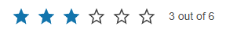

# Getting Started with the Rating

This tutorial explains how to set up the Telerik UI for {{ site.framework }} Rating and goes through the steps in the configuration of the component.

You will declare the Rating component. Then, you will configure the range of the Rating. Next, you'll set a default value and configure a label by using [Kendo Templates](https://docs.telerik.com/kendo-ui/framework/templates/overview). Finally, you will learn to handle the JavaScript events of the Rating and how to access client-side reference of the component.

After completing this guide, you will achieve the following results:

 

@[template](/_contentTemplates/core/getting-started-prerequisites.md#component-gs-prerequisites)

## 1. Prepare the CSHTML File

@[template](/_contentTemplates/core/getting-started-directives.md#gs-adding-directives)

Optionally, you can structure the document by adding the desired HTML elements like headings, divs, paragraphs, and others.

## 2. Initialize the Rating

Use the Rating HtmlHelper or TagHelper to configure the component.

* Use the `Name()` configuration method to assign a name to the instance of the helper&mdash;this is mandatory as its value is used for the `id` and the `name` attributes of the Rating element.
* Configure the range of the Rating with the `Min` and `Max` properties, and set a default `Value`.
* Use a [Kendo Template](https://docs.telerik.com/kendo-ui/framework/templates/overview) to customize the `Label` of the component.

```HtmlHelper
    @using Kendo.Mvc.UI

    @(Html.Kendo().Rating()
        .Name("ratingLabelTemplate")
        .Min(1)
        .Max(6)
        .Value(3)
        .Label(l => l.Template("<span>#=value# out of #=maxValue#</span>"))
    )
```

```TagHelper
    @addTagHelper *, Kendo.Mvc

    <kendo-rating min="1"
                  max="6"
                  value="3"
                  name="ratingLabelTemplate">
	    <label template="<span>#=value# out of #=maxValue#</span>" />
    </kendo-rating>
```


## 3. Handle the Rating Events

The Rating exposes a [`Change` event](https://docs.telerik.com/aspnet-core/api/kendo.mvc.ui.fluent/ratingeventbuilder#changesystemstring) that you can handle and assign specific functions to the component. In this tutorial, you will use the `Change` event to log a message in the browser's console when value of the Rating changes.

```HtmlHelper
    @using Kendo.Mvc.UI

    @(Html.Kendo().Rating()
        .Name("ratingLabelTemplate")
        .Min(1)
        .Max(6)
        .Value(3)
        .Label(l => l.Template("<span>#=value# out of #=maxValue#</span>"))
        .Events(e=>e.Change("onChange"))
    )
    </div>
```

```TagHelper
    @addTagHelper *, Kendo.Mvc


    <kendo-rating min="1"
                  max="6"
                  value="3"
                  name="ratingLabelTemplate">
                  on-change="onChange">
	    <label template="<span>#=value# out of #=maxValue#</span>" />
    </kendo-rating>
```

```JavaScript
    function onChange(e){
        console.log(e.newValue)
    }
```

## (Optional) Reference Existing Rating Instances

Referencing existing component instances allows you to build on top of their configuration. To reference an existing Rating instance, use the [`jQuery.data()`](http://api.jquery.com/jQuery.data/) method. Once a reference is established, use the [Rating client-side API](https://docs.telerik.com/kendo-ui/api/javascript/ui/rating#methods) to control its behavior.

1. Use the `id` attribute of the component instance to establish a reference.

    ```script
        <script>
            var ratingReference = $("#ratingExample").data("kendoRating"); // ratingReference is a reference to the existing instance of the helper.
        </script>
    ```

1. Use the [Rating client-side API](https://docs.telerik.com/kendo-ui/api/javascript/ui/rating#methods) to control the behavior of the widget. In this example, you will see how to adjust the value of Rating programmatically.

    ```script
        <script>
            var rating = $("#trip").data("kendoRating");		
            rating.value(5);
        </script>
    ```


## Explore this Tutorial in REPL

You can continue experimenting with the code sample above by running it in the Telerik REPL server playground:

* [Sample code with the Rating HtmlHelper](https://netcorerepl.telerik.com/QxuKGqEM19lOWnsg51)
* [Sample code with the Rating TagHelper](https://netcorerepl.telerik.com/mxEAvtFk23fFpQ0015)



## Next Steps

* [Handling the Rating Events]()
* [Controlling the Precision of the Rating ]()
* [Using the Rating Templates]() 

## See Also

* [Using the API of the Rating for {{ site.framework }} (Demo)](https://demos.telerik.com/{{ site.platform }}/rating/api)
* [Client-Side API of the Rating](https://docs.telerik.com/kendo-ui/api/javascript/ui/rating)
* [Server-Side API of the Rating](/api/rating)
* [Knowledge Base Section](/knowledge-base)
