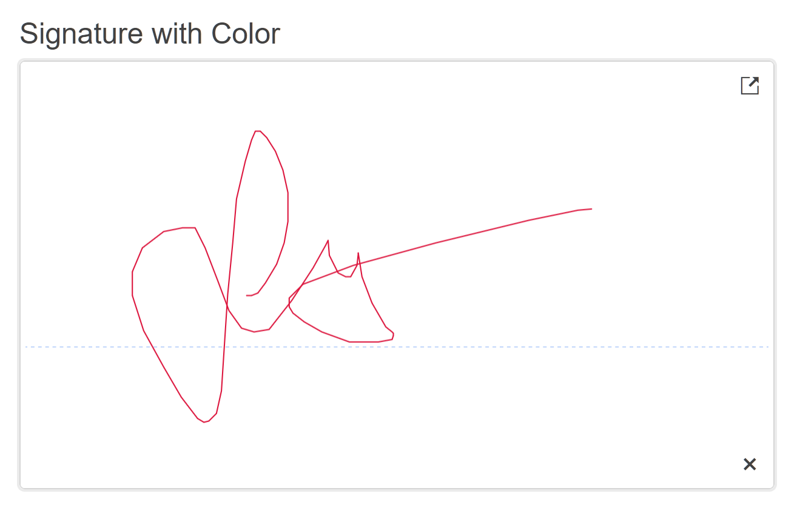

# Getting Started with the Signature

This tutorial explains how to set up a basic Telerik UI for {{ site.framework }} Signature component and highlights the major steps in the configuration of the component.

You will initialize a Signature component and change its line color. Then, you will use the events of the UI component. Finally, you can run the sample code in [Telerik REPL](https://netcorerepl.telerik.com/) and continue exploring the components.

 

@[template](/_contentTemplates/core/getting-started-prerequisites.md#repl-component-gs-prerequisites)

## 1. Prepare the CSHTML File

@[template](/_contentTemplates/core/getting-started-directives.md#gs-adding-directives)

Optionally, you can structure the document by adding the desired HTML elements like headings, divs, paragraphs, and others.

```HtmlHelper
 @using Kendo.Mvc.UI

<h4>Signature with Color</h4>
<div>

</div>
```

```TagHelper
    @addTagHelper *, Kendo.Mvc

    <h4>Signature with Color</h4>
    <div>

    </div>
```


## 2. Initialize the Signature

Use the Signature HtmlHelper or TagHelper to add the component to a page:

* The `Name()` configuration method is mandatory as its value is used for the `id` and the `name` attributes of the Signature element.
* The `Width()` setting allows you to declare the width size of the component.
* The `Height()` setting allows you to declare the height size of the component.
* The `Color()` configuration allows you define the color of the Signature line.

```HtmlHelper
 @using Kendo.Mvc.UI

<h4>Signature with Color</h4>
<div>
    @(Html.Kendo().Signature()
        .Name("signature")
        .Color("crimson")
        .Width(600)
        .Height(340))
</div>
```

```TagHelper
@addTagHelper *, Kendo.Mvc

<h4>Signature with Color</h4>
<div>
    <kendo-signature name="signature" color="crimson"
       width="600" height="340">
    </kendo-signature>
</div>
```



## 3. Handle a Signature Event

The Signature component provides convenient events for implementing your desired logic. In this tutorial, you will use the exposed `Change()` event to log a new entry in the browser's console.

```HtmlHelper
 @using Kendo.Mvc.UI

<script>
   function onChange() {
      console.log("Signature has changed!");
   }
</script>

<h4>Signature with Color</h4>
<div>
    @(Html.Kendo().Signature()
        .Name("signature")
        .Color("crimson")
        .Width(600)
        .Height(340)
        .Events(e => e.Change("onChange"))
    )
</div>
```

```TagHelper
@addTagHelper *, Kendo.Mvc

<script>
   function onChange() {
      console.log("Signature has changed!");
   }
</script>

<h4>Signature with Color</h4>
<div>
    <kendo-signature name="signature" color="crimson"
       width="600" height="340" on-change="onChange">
    </kendo-signature>
</div>
```



## 4. (Optional) Reference Existing Signature Instances

You can reference the Signature instances that you have created and build on top of their existing configuration:

1. Use the `id` attribute of the component instance to establish a reference.

    ```script
    <script>
        var signatureReference = $("#signature").data("kendoSignature"); // signatureReference is a reference to the existing Signature instance of the helper.
    </script>
    ```

1. Use the [Signature client-side API](https://docs.telerik.com/kendo-ui/api/javascript/ui/signature#methods) to control the behavior of the widget. In this example, you will use the `enable` method to disable the Signature.

    ```script
    <script>
        var signatureReference = $("#signature").data("kendoSignature"); // signatureReference is a reference to the existing Signature instance of the helper.
        signatureReference.enable(false); 
    </script>
    ```


## Explore this Tutorial in REPL

You can continue experimenting with the code sample above by running it in the Telerik REPL server playground:

* [Sample code with the Signature HtmlHelper](https://netcorerepl.telerik.com/wHkTGRud04S8Qi7v25)
* [Sample code with the Signature TagHelper](https://netcorerepl.telerik.com/cdapwHYd04jIlB8v34)



## Next Steps

* [Customize the Appearance of the Signature]()
* [Configure the Form Integration]()

## See Also

* [Using the API of the Signature for {{ site.framework }} (Demo)](https://demos.telerik.com/{{ site.platform }}/signature/api)
* [Client-Side API of the Signature](https://docs.telerik.com/kendo-ui/api/javascript/ui/signature)
* [Server-Side API of the Signature](/api/signature)
* [Knowledge Base Section](/knowledge-base)
