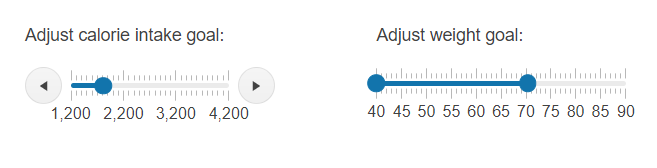

# Getting Started with the Slider

This tutorial explains how to set up the Telerik UI for {{ site.framework }} Slider and goes through the steps required to configure the component.

You will initialize a Slider and RangeSlider components with minimum and maximum values. Next, you will learn to handle the JavaScript events of the Slider and how to access client-side references of the component. Finally, you will dynamically disable the Slider when the user sets a specified minimum value.

 

@[template](/_contentTemplates/core/getting-started-prerequisites.md#component-gs-prerequisites)

## 1. Prepare the CSHTML File

@[template](/_contentTemplates/core/getting-started-directives.md#gs-adding-directives)

Optionally, you can structure the View content by adding the desired HTML elements like headings, divs, paragraphs, and others.

```HtmlHelper
    @using Kendo.Mvc.UI

    <div class="main-container">
        <div class="control">
            <div class="control-label">Adjust calorie intake goal:</div>
        </div>
        <div class="control">
            <div class="control-label">Adjust weight goal:</div>
        </div>
    </div>
```

```TagHelper
    @addTagHelper *, Kendo.Mvc

    <div class="main-container">
        <div class="control">
            <div class="control-label">Adjust calorie intake goal:</div>
        </div>
        <div class="control">
            <div class="control-label">Adjust weight goal:</div>
        </div>
    </div>
```


## 2. Initialize the Slider

Use the Slider HtmlHelper or TagHelper to add the component to a page:

* The `Name()` configuration method is mandatory as its value is used for the `id` and the `name` attributes of the Slider element.
* The `Min()` and `Max()` options specify the minimum and maximum values on the Slider scale.
* The `SmallStep()` and `LargeStep()` methods define the small and large steps when you click the increase or decrease buttons, press the arrow keys, or drag the drag handle.
* The `Orientation()` option sets the Slider direction position—horizontal or vertical.

```HtmlHelper
    @using Kendo.Mvc.UI

    @(Html.Kendo().Slider()
        .Name("caloriesSlider")
        .Min(1200)
        .Max(4200)
        .SmallStep(100)
        .LargeStep(1000)
        .Orientation(SliderOrientation.Horizontal)
    )
```

```TagHelper
    @addTagHelper *, Kendo.Mvc

    <kendo-slider name="caloriesSlider" 
        max="4200" 
        min="1200"
        small-step="100"
        large-step="1000"
        orientation="SliderOrientation.Horizontal">
    </kendo-slider>
```


## 3. Initialize the RangeSlider

The next step is to define the RangeSlider that allows you to select a range of values.

```HtmlHelper
    @using Kendo.Mvc.UI

    @(Html.Kendo().RangeSlider()
        .Name("weightSlider")
        .Min(40)
        .Max(90)
        .LargeStep(5)
        .Orientation(SliderOrientation.Horizontal)
    )
```

```TagHelper
    @addTagHelper *, Kendo.Mvc

    <kendo-rangeslider name="weightSlider"
        max="90"
        min="40"
        large-step="5"
        orientation="SliderOrientation.Horizontal">
    </kendo-rangeslider>
```


## 4. Handle the Slider Events

The Slider exposes [events](/api/kendo.mvc.ui.fluent/slidereventbuilder) that you can handle and implement a custom logic. In this tutorial, you will use the `Change` event and check the selected Slider value.

```HtmlHelper
    @using Kendo.Mvc.UI

    @(Html.Kendo().Slider()
        .Name("caloriesSlider")
        .Min(1200)
        .Max(4200)
        .SmallStep(100)
        .LargeStep(1000)
        .Orientation(SliderOrientation.Horizontal)
        .Events(ev => ev.Change("onChange"))
    )
```

```TagHelper
    @addTagHelper *, Kendo.Mvc

    <kendo-slider name="caloriesSlider" on-change="onChange"
        max="4200" 
        min="1200"
        small-step="100"
        large-step="1000"
        orientation="SliderOrientation.Horizontal">
    </kendo-slider>
```

```Scripts
    <script>
        function onChange(e) {
            let selectedValue = e.sender.value(); // Get the Slider value.
            // Custom logic when the Slider value changes.
        }
    </script>
```

## 5. (Optional) Reference Existing Slider Instances

You can reference the Slider instances that you have created and build on top of their existing configuration:

1. Use the `id` attribute of the component instance to get its reference.

    ```script
        <script>
            $(document).ready(function() {
                var sliderReference = $("#caloriesSlider").data("kendoSlider"); // sliderReference is a reference to the existing Slider instance of the helper.
            });
        </script>
    ```

1. Use the [Slider client-side API](https://docs.telerik.com/kendo-ui/api/javascript/ui/slider#methods) to control the behavior of the component. In this example, you will use the `enable()` method to disable the Slider when the user selects a value greater than 3000. Then, when the button **Enable** is clicked, the Slider will be enabled again.

    ```HtmlHelper
        @(Html.Kendo().Slider()
            .Name("caloriesSlider")
            .Min(1200)
            .Max(4200)
            .SmallStep(100)
            .LargeStep(1000)
            .Orientation(SliderOrientation.Horizontal)
            .Events(ev => ev.Change("onChange"))
        )

        @(Html.Kendo().Button()
            .Name("reset-btn")
            .Content("Enable")
            .Events(ev => ev.Click("onBtnClick"))
        )
    ```
    
    ```TagHelper
        @addTagHelper *, Kendo.Mvc

        <kendo-slider name="caloriesSlider" on-change="onChange"
            max="4200" 
            min="1200"
            small-step="100"
            large-step="1000"
            orientation="SliderOrientation.Horizontal">
        </kendo-slider>

        <kendo-button name="reset-btn" on-click="onBtnClick">
            Enable
        </kendo-button>
    ```
    
    ```Scripts
        <script>
            function onChange(e) {
                var slider = e.sender;
                if(this.value() > 3000){
                    slider.enable(false);
                }
            }

            function onBtnClick() {
                var sliderReference = $("#caloriesSlider").data("kendoSlider");
                sliderReference.enable(true);
            }
        </script>
    ```

For more information on referencing specific helper instances, see the [Methods and Events]() article.


## Explore this Tutorial in REPL

You can continue experimenting with the code sample above by running it in the Telerik REPL server playground:

* [Sample code with the Slider HtmlHelper](https://netcorerepl.telerik.com/GIEPaGPw134EO8jZ37)
* [Sample code with the Slider TagHelper](https://netcorerepl.telerik.com/wIkvuwPm14PuZfyX29)



## Next Steps

* [Customizing the Appearance of the Slider]()
* [Handling the Slider Events]()

## See Also

* [Using the API of the Slider for {{ site.framework }} (Demo)](https://demos.telerik.com/{{ site.platform }}/slider/api)
* [Client-Side API of the Slider](https://docs.telerik.com/kendo-ui/api/javascript/ui/slider)
* [Client-Side API of the RangeSlider](https://docs.telerik.com/kendo-ui/api/javascript/ui/rangeslider)
* [Server-Side API of the Slider](/api/slider)
* [Server-Side API of the RangeSlider](/api/rangeslider)

* [Server-Side API of the Slider TagHelper](/api/taghelpers/slider)


* [Server-Side API of the RangeSlider TagHelper](/api/taghelpers/rangeslider)

* [Knowledge Base Section](/knowledge-base)
