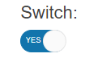

# Getting Started with the Switch

This tutorial explains how to set up a basic Telerik UI for {{ site.framework }} Switch and highlights the major steps in the configuration of the component.

You will initialize a Switch component with explicitly defined messages depending on its check state, and then change its appearance. Finally, you will learn how to handle the events of the Switch.

 

@[template](/_contentTemplates/core/getting-started-prerequisites.md#repl-component-gs-prerequisites)

## 1. Prepare the CSHTML File

@[template](/_contentTemplates/core/getting-started-directives.md#gs-adding-directives)

Optionally, you can structure the document by adding the desired HTML elements like headings, divs, and paragraphs.

```HtmlHelper
    @using Kendo.Mvc.UI
    <h4>Switch with a placeholder</h4>
    <div>
    
    </div>
```

```TagHelper
    @addTagHelper *, Kendo.Mvc
    <h4>Switch with a placeholder</h4>
    <div>
    
    </div>
```


## 2. Initialize the Switch

Use the Switch HtmlHelper or TagHelper to add the component to a page:

* The `Name()` configuration method is mandatory as its value is used for the `id` and the `name` attributes of the  Switch element.

```HtmlHelper
    @(Html.Kendo().Switch()
        .Name("switch")
    )
```

```TagHelper
    <kendo-switch name="switch">
    </kendo-switch>
```


## 3. Configure the Messages

The next step is to explicitly define the messages functionality for the Switch. The following example will configure the messages functionality based on the checked or unchecked state of the component.

```HtmlHelper
    @(Html.Kendo().Switch()
        .Name("switch")
        .Messages(c => c.Checked("YES").Unchecked("NO"))
    )
```


```TagHelper
    <kendo-switch name="switch">
        <messages checked="YES" unchecked="NO" />
    </kendo-switch>
```


## 4. Customize the Appearance of Switch

To change the [appearance]() of the Switch, use any of its built-in styling options, for example, `Size()`, `TrackRounded()` and `ThumbRounded()`.

```HtmlHelper
    @(Html.Kendo().Switch()
        .Name("switch")
        .Messages(c => c.Checked("YES").Unchecked("NO"))
        .Size(ComponentSize.Medium)
        .TrackRounded(Rounded.Full)
        .ThumbRounded(Rounded.Full)
    )
```

```TagHelper
    <kendo-switch name="switch"
                  size="ComponentSize.Medium"
                  track-rounded="Rounded.Full"
                  thumb-rounded="Rounded.Full">
        <messages checked="YES" unchecked="NO" />
    </kendo-switch>
```


## 5. Handle the Switch Events

The Switch component exposes various [events](api/kendo.mvc.ui.fluent/switcheventbuilder) that you can handle and further customize the functionality of the component. In this tutorial, you will use the `Change` event to display a popup message when the value of the Switch changes through user interaction.

```HtmlHelper
    @(Html.Kendo().Switch()
        .Name("switch")
        .Messages(c => c.Checked("YES").Unchecked("NO"))
        .Events(events => events.Change("onChange"))
        .Size(ComponentSize.Medium)
        .TrackRounded(Rounded.Full)
        .ThumbRounded(Rounded.Full)
    )

    <script>
        function onChange(e){
            alert("Changed value: "+ e.sender.value());
        }
    </script>
```

```TagHelper
    <kendo-switch name="switch"
                  on-change="onChange"
                  size="ComponentSize.Medium"
                  track-rounded="Rounded.Full"
                  thumb-rounded="Rounded.Full">
        <messages checked="YES" unchecked="NO" />
    </kendo-switch>

    <script>
        function onChange(e){
            alert("Changed value: "+ e.sender.value());
        }
    </script>
```


## 6. (Optional) Reference Existing Switch Instances

You can reference the Switch instances that you have created and build on top of their existing configuration:

1. Use the `.Name()` (`id` attribute) of the component instance to get a reference.

    ```script
         <script>
             $(document).ready(function() {
                 var switchReference = $("#switch").data("kendoSwitch"); // switchReference is a reference to the existing Switch instance of the helper.
             })
         </script>
    ```
1. Set the check state of the component by using the [`check()`](https://docs.telerik.com/kendo-ui/api/javascript/ui/switch/methods/check) client-side method.

    ```script
        <script>
            $(document).ready(function() {
               var switchInstance = $("#switch").kendoSwitch().data("kendoSwitch");// switchReference is a reference to the existing Switch instance of the helper.
               switchInstance.check(true); // Set the initial check state of the component.
            })
        </script>
    ```


## Explore this Tutorial in REPL

You can continue experimenting with the code sample above by running it in the Telerik REPL server playground:

* [Sample code with the Switch HtmlHelper](https://netcorerepl.telerik.com/GnOAvFFr0418nwKs40)
* [Sample code with the Switch TagHelper](https://netcorerepl.telerik.com/cnkUllPA29Luxur938)



## Next Steps


* [Configuring the Switch in Razor Pages]()

* [Customizing the Appearance of the Switch]()

## See Also

* [Using the API of the Switch for {{ site.framework }} (Demo)](https://demos.telerik.com/{{ site.platform }}/switch/api)
* [Client-Side API of the Switch](https://docs.telerik.com/kendo-ui/api/javascript/ui/switch)
* [Server-Side API of the Switch for {{ site.framework }}](/api/switch)
* [Knowledge Base Section](/knowledge-base)
