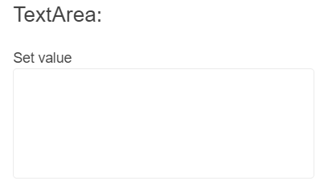

# Getting Started with the TextArea

This tutorial explains how to set up a basic Telerik UI for {{ site.framework }} TextArea and highlights the major steps in the configuration of the component.

You will initialize the TextArea component, customize it, and configure its label functionality. Finally, you will learn how to handle the events of the TextArea.

 

@[template](/_contentTemplates/core/getting-started-prerequisites.md#repl-component-gs-prerequisites)

## 1. Prepare the CSHTML File
@[template](/_contentTemplates/core/getting-started-directives.md#gs-adding-directives)

Optionally, you can structure the document by adding the desired HTML elements like headings, divs, and paragraphs.

```HtmlHelper
    @using Kendo.Mvc.UI
    <h4>TextArea with a placeholder</h4>
    <div>
    
    </div>
```

```TagHelper
    @addTagHelper *, Kendo.Mvc
    <h4>TextArea with a placeholder</h4>
    <div>
    
    </div>
```


## 2. Initialize the TextArea
Use the TextArea HtmlHelper or TagHelper to add the component to a page:

* The `Name()` configuration method is mandatory as its value is used for the `id` and the name attributes of the TextArea element.
* The `Rows()` configuration method lets you specify the number of visible text lines for the component.

```HtmlHelper
    @(Html.Kendo().TextArea()
        .Name("textArea")
        .Rows(5)
    )
```

```TagHelper
    <kendo-textarea name="textArea" rows="5">
    </kendo-textarea>
```


## 3. Configure the Label

The next step is to enable the label functionality for the TextArea. The following example will configure the floating label functionality and specify the label's content.

```HtmlHelper
    @(Html.Kendo().TextArea()
        .Name("textArea")
        .Rows(5)
        .Label(label => {
             label.Content("Description");
             label.Floating(true);
        })
    )
```

```TagHelper
    <kendo-textarea name="textArea" rows="5">
        <label content="Set value" floating="true"/>
    </kendo-textarea>
```


## 4. Customize the TextArea

To change the [appearance]() of the TextArea, use any of its built-in styling options, for example, `Size()` and `FillMode()`.

```HtmlHelper
    @(Html.Kendo().TextArea()
        .Name("textArea")
        .Rows(5)
        .Size(ComponentSize.Medium)
        .FillMode(FillMode.Outline)
        .Label(label => {
             label.Content("Description");
             label.Floating(true);
        })
    )
```


```TagHelper
    <kendo-textarea name="textArea"
                    rows="5"
                    size="ComponentSize.Medium"
                    fill-mode="FillMode.Outline">
        <label content="Set value" floating="true"/>
    </kendo-textarea>
```



## 5. Handle the TextArea Events

The TextArea exposes various [events](/api/Kendo.Mvc.UI.Fluent/TextAreaEventBuilder) that you can handle and further customize the functionality of the component. In this tutorial, you will use the `Change` event to display a popup message when the value of the TextArea changes through user interaction.

```HtmlHelper
    @(Html.Kendo().TextArea()
        .Name("textArea")
        .Rows(5)
        .Size(ComponentSize.Medium)
        .FillMode(FillMode.Outline)
        .Events(events => events.Change("onChange"))
        .Label(label => {
             label.Content("Description");
             label.Floating(true);
        })
    )

    <script>
        function onChange(e){
            alert("Changed value: "+ e.sender.value());
        }
    </script>
```


```TagHelper
    <kendo-textarea name="textArea"
                    rows="5"
                    on-change="onChange"
                    size="ComponentSize.Medium"
                    fill-mode="FillMode.Outline">
        <label content="Set value" floating="true"/>
    </kendo-textarea>

    <script>
        function onChange(e){
            alert("Changed value: "+ e.sender.value());
        }
    </script>
```


## 6. (Optional) Reference Existing TextArea Instances
You can reference the TextArea instances that you have created and build on top of their existing configuration:

1. Use the `.Name()` (id attribute) of the component instance to get a reference.

    ```script
         <script>
             $(document).ready(function() {
                 var textAreaReference = $("#textArea").data("kendoTextArea"); // textAreaReference is a reference to the existing TextArea instance of the helper.
             })
         </script>
    ```

1. Use the [TextArea Client-Side API](https://docs.telerik.com/kendo-ui/api/javascript/ui/textarea#methods) to control the behavior of the widget. In this example, you will change the value of the widget programmatically.

    ```script
        <script>
            $(document).ready(function() {
                var textAreaReference = $("#textArea").data("kendoTextArea"); 
                textAreaReference.value("new value");
                textAreaReference.trigger("change"); // Trigger the change event of the widget in order to ensure that the updated value is processed.
            })    
        </script>
    ```



## Explore this Tutorial in REPL

You can continue experimenting with the code sample above by running it in the Telerik REPL server playground:

* [Sample code with the TextArea HtmlHelper](https://netcorerepl.telerik.com/wnYGlDvS28EwSlie18)
* [Sample code with the TextArea TagHelper](https://netcorerepl.telerik.com/QHYGbZbI28HbuH6E19)



## Next Steps

* [Configuring the Right-To-Left Support]()
* [Customizing the Appearance of the TextArea]()


## See Also

* [Using the API of the TextArea for {{ site.framework }} (Demo)](https://demos.telerik.com/{{ site.platform }}/textarea/api)
* [Client-Side API of the TextArea](https://docs.telerik.com/kendo-ui/api/javascript/ui/textarea)
* [Server-Side API of the TextArea for {{ site.framework }}](/api/textarea)
* [Knowledge Base Section](/knowledge-base)

