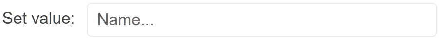

# Getting Started with the TextBox

This tutorial explains how to set up a basic Telerik UI for {{ site.framework }} TextBox and highlights the major steps in the configuration of the component.

You will initialize a TextBox component with a placeholder text and a label. Finally, you can run the sample code in [Telerik REPL](https://netcorerepl.telerik.com/) and continue exploring the components.

 

@[template](/_contentTemplates/core/getting-started-prerequisites.md#repl-component-gs-prerequisites)

## 1. Prepare the CSHTML File

@[template](/_contentTemplates/core/getting-started-directives.md#gs-adding-directives)

Optionally, you can structure the document by adding the desired HTML elements like headings, divs, paragraphs, and others.

```HtmlHelper
    @using Kendo.Mvc.UI

    <h4>TextBox with a Placeholder</h4>
    <div>

    </div>
```

```TagHelper
    @addTagHelper *, Kendo.Mvc

    <h4>TextBox with a Placeholder</h4>
    <div>

    </div>
```


## 2. Initialize the TextBox

Use the TextBox HtmlHelper or TagHelper to add the component to a page:

* The `Name()` configuration method is mandatory as its value is used for the `id` and the name attributes of the TextBox element.
* The `Placeholder()` configuration specifies the text that appears initially as a hint. 

```HtmlHelper
@using Kendo.Mvc.UI

<h4>TextBox with a Placeholder</h4>
<div>
    @(Html.Kendo().TextBox()
        .Name("textbox")
        .Placeholder("Name...")
        .HtmlAttributes(new { style = "width: 300px;" })
    )
</div>
```

```TagHelper
@addTagHelper *, Kendo.Mvc

<h4>TextBox with a Placeholder</h4>
<div>
    <kendo-textbox name="textbox" style="width: 300px;" 
    placeholder="Name...">
    </kendo-textbox>
</div>
```


## 3. Define a Label Text

The next step is to present a description in front of the TextBox component by using the `Label()` property.

```HtmlHelper
@using Kendo.Mvc.UI

<h4>TextBox with a Placeholder</h4>
<div>
    @(Html.Kendo().TextBox()
        .Name("textbox")
        .Label(l => l.Content("Set value:"))
        .Placeholder("Name...")
        .HtmlAttributes(new { style = "width: 300px;" })
    )
</div>
```

```TagHelper
 @addTagHelper *, Kendo.Mvc

<h4>TextBox with a Placeholder</h4>
<div>
    <kendo-textbox name="textbox" style="width: 300px;" placeholder="Name...">
         <textbox-label content="Set value:"/>
         </kendo-textbox>
</div>
```


## 4. Handle a TextBox Event

The TextBox component provides convenient events for implementing your desired logic. In this tutorial, you will use the exposed `Change()` event to log a new entry in the browser's console.

```HtmlHelper
@using Kendo.Mvc.UI

<h4>TextBox with a Placeholder</h4>
<div>
    <script>
       function change(e) {
          console.log("Change :: " + this.value());
       }
    </script>

    @(Html.Kendo().TextBox()
        .Name("textbox")
        .Label(l => l.Content("Set value:"))
        .Placeholder("Name...")
        .Events(e => e.Change("change"))
        .HtmlAttributes(new { style = "width: 300px;" })
    )
</div>
```

```TagHelper
@addTagHelper *, Kendo.Mvc

<h4>TextBox with a Placeholder</h4>
<div>
    <script>
       function change(e) {
          console.log("Change :: " + this.value());
       }
    </script>

    <kendo-textbox name="textbox" style="width: 300px;" 
    placeholder="Name..." on-change="change">
       <textbox-label content="Set value:"/>
       </kendo-textbox>
</div>
```


## 5. (Optional) Reference Existing TextBox Instances

You can reference the TextBox instances that you have created and build on top of their existing configuration:

1. Use the `id` attribute of the component instance to establish a reference.

    ```script
    <script>
        var textboxReference = $("#textbox").data("kendoTextBox"); // textboxReference is a reference to the existing TextBox instance of the helper.
    </script>
    ```

1. Use the [TextBox client-side API](https://docs.telerik.com/kendo-ui/api/javascript/ui/textbox#methods) to control the behavior of the widget. In this example, you will use the `value` method to select an item.

    ```script
    <script>
        var textboxReference = $("#textbox").data("kendoTextBox"); // textboxReference is a reference to the existing TextBox instance of the helper.
        textboxReference.value("Sample text"); 
    </script>
    ```


## Explore this Tutorial in REPL

You can continue experimenting with the code sample above by running it in the Telerik REPL server playground:

* [Sample code with the TextBox HtmlHelper](https://netcorerepl.telerik.com/QHEvbJFL14nUQBCX42)
* [Sample code with the TextBox TagHelper](https://netcorerepl.telerik.com/GnObbJFh14nVCZns54)



## Next Steps

* [Set Labels to the TextBox]()
* [Customize the Appearance of the TextBox]()
* [Explore the Accessibility Features of the TextBox]()

## See Also

* [Using the API of the TextBox for {{ site.framework }} (Demo)](https://demos.telerik.com/{{ site.platform }}/textbox/api)
* [Client-Side API of the TextBox](https://docs.telerik.com/kendo-ui/api/javascript/ui/textbox)
* [Server-Side API of the TextBox](/api/textbox)
* [Knowledge Base Section](/knowledge-base)
