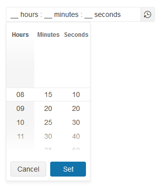

# Getting Started with the TimeDurationPicker

This tutorial explains how to set up a basic Telerik UI for {{ site.framework }} TimeDurationPicker and highlights the major steps in the configuration of the component.

You will initialize the TimeDurationPicker component, configure its columns and separator. Finally, you will learn how to handle the TimeDurationPicker events.

 

@[template](/_contentTemplates/core/getting-started-prerequisites.md#component-gs-prerequisites)

## 1. Initialize the TimeDurationPicker

The first step is to add the required directives at the top of the `.cshtml` document. Then define the TimeDurationPicker.

```HtmlHelper
    @using Kendo.Mvc.UI

    @(Html.Kendo().TimeDurationPicker()
        .Name("timeDurationPicker")
    )
```

```TagHelper
    @addTagHelper *, Kendo.Mvc

    <kendo-timedurationpicker name="timedurationpicker"></kendo-timedurationpicker>
```


## 2. Configure the Columns

The next step is to set the columns configuration, which:

* Is a fundamental and mandatory setting for the TimeDurationPicker&mdash;the component will not work without it.
* Allows you to specify which time portion columns will be visible when the drop-down is expanded.
* Enables you to specify a format, min and max allowed values, and step for each individual column.

```HtmlHelper
    @using Kendo.Mvc.UI

    @(Html.Kendo().TimeDurationPicker()
        .Name("timeDurationPicker")
        .Columns(c =>
        {
            c.Hours().Format("## hours ").Min(8).Max(11);
            c.Minutes().Format(" ## minutes ").Min(15).Max(45).Step(5);
            c.Seconds().Format(" ## seconds").Min(10).Max(50).Step(10);
        })
    )
```


```TagHelper
    @addTagHelper *, Kendo.Mvc

    <kendo-timedurationpicker name="timedurationpicker">
        <timedurationpicker-columns>
            <timedurationpicker-column name="hours" format="## hours " min="8" max="11"></timedurationpicker-column>
            <timedurationpicker-column name="minutes" format=" ## minutes" min="15" max="45" step="5"></timedurationpicker-column>
            <timedurationpicker-column name="seconds" format=" ## seconds" min="10" max="50" step="10"></timedurationpicker-column>
        </timedurationpicker-columns>
    </kendo-timedurationpicker>
```


## 3. Configure the Separator

The TimeDurationPicker enables you to specify your own [`separator`](/api/javascript/ui/timedurationpicker/configuration/separator) that will be used to divide the individual time portions such as hours, minutes, and seconds.

```HtmlHelper
    @using Kendo.Mvc.UI

    @(Html.Kendo().TimeDurationPicker()
        .Name("timeDurationPicker")
        .Columns(c =>
        {
            c.Hours().Format("## hours ").Min(8).Max(11);
            c.Minutes().Format(" ## minutes ").Min(15).Max(45).Step(5);
            c.Seconds().Format(" ## seconds").Min(10).Max(50).Step(10);
        })
        .Separator(":")
    )
```


```TagHelper
    @addTagHelper *, Kendo.Mvc

    <kendo-timedurationpicker name="timedurationpicker" separator=":">
        <timedurationpicker-columns>
            <timedurationpicker-column name="hours" format="## hours " min="8" max="11"></timedurationpicker-column>
            <timedurationpicker-column name="minutes" format=" ## minutes" min="15" max="45" step="5"></timedurationpicker-column>
            <timedurationpicker-column name="seconds" format=" ## seconds" min="10" max="50" step="10"></timedurationpicker-column>
        </timedurationpicker-columns>
    </kendo-timedurationpicker>
```


## 4. Handle a TimeDurationPicker Event

The TimeDurationPicker exposes the `Open`, `Close`, and `Change` [events](/api/Kendo.Mvc.UI.Fluent/TimeDurationPickerEventBuilder) that you can handle and customize the component's functions. In this tutorial, you will use the `Open` and `Close` events to log a new entry in the browser's console.

```HtmlHelper
    @using Kendo.Mvc.UI

    @(Html.Kendo().TimeDurationPicker()
        .Name("timeDurationPicker")
        .Columns(c =>
        {
            c.Hours().Format("## hours ").Min(8).Max(11);
            c.Minutes().Format(" ## minutes ").Min(15).Max(45).Step(5);
            c.Seconds().Format(" ## seconds").Min(10).Max(50).Step(10);
        })
        .Separator(":")
        .Events(e => e.Open("onOpen").Close("onClose"))
    )

    <script>
        function onOpen(e) {
            console.log("Open");
        }

        function onClose(e) {
            console.log("Close");
        }
    </script>

```


```TagHelper
    @addTagHelper *, Kendo.Mvc

    <kendo-timedurationpicker name="timedurationpicker" separator=":" on-open="onOpen" on-close="onClose">
        <timedurationpicker-columns>
            <timedurationpicker-column name="hours" format="## hours " min="8" max="11"></timedurationpicker-column>
            <timedurationpicker-column name="minutes" format=" ## minutes" min="15" max="45" step="5"></timedurationpicker-column>
            <timedurationpicker-column name="seconds" format=" ## seconds" min="10" max="50" step="10"></timedurationpicker-column>
        </timedurationpicker-columns>
    </kendo-timedurationpicker>

    <script>
        function timedurationpicker_open(e) {
            console.log("Open");
        }

        function timedurationpicker_close(e) {
            console.log("Close");
        }
    </script>
```


## 5. (Optional) Reference Existing TimeDurationPicker Instances

You can reference the TimeDurationPicker instances that you have created and build on top of their existing configuration:

1. Use the `id` attribute of the component instance to establish a reference.

    ```script
    <script>
        var timeDurationPickerRef = $("#timedurationpicker").data("kendoTimeDurationPicker"); // timeDurationPickerRef is a reference to the existing currency instance of the helper.
    </script>
    ```

1. Use the [TimeDurationPicker client-side API](https://docs.telerik.com/kendo-ui/api/javascript/ui/timedurationpicker#methods) to control the behavior of the widget. In this example, you will use the `readonly` method to disable user input.

    ```script
    <script>
        var timeDurationPickerRef = $("#timedurationpicker").data("kendoTimeDurationPicker"); // timeDurationPickerRef is a reference to the existing currency instance of the helper.
        timeDurationPickerRef.readonly(true); // Set the readonly method to true and disable user input.
    </script>
    ```

For more information on referencing specific helper instances, see the [Methods and Events]() article.

## Next Steps

* [Customizing the Appearance of the TimeDurationPicker]()
* [Configuring the TimeDurationPicker Columns]()
* [Adding TimeDurationPicker Shortcuts]()

## See Also

* [Using the API of the TimeDurationPicker for {{ site.framework }} (Demo)](https://demos.telerik.com/{{ site.platform }}/timedurationpicker/api)
* [TimeDurationPicker client-side API](https://docs.telerik.com/kendo-ui/api/javascript/ui/timedurationpicker)
* [TimeDurationPicker server-side API](/api/timedurationpicker)
* [Knowledge Base Section](/knowledge-base)
