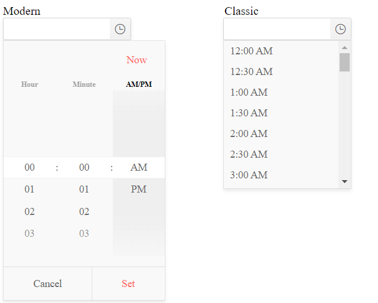

# Component Types

As of R2 2020 version of the Telerik UI TimePicker for {{ site.framework }} suite, the TimePicker widget introduces a new component type. It aims to enhance the existing rendering and deliver a fresh and modern look and feel. 

By default, the TimePicker is initialized with the `classic` render mode. In order to set it to `modern`, configure the options of the widget as follows:

```
    @(Html.Kendo().TimePicker()
        .Name("timePicker")
        .ComponentType("modern")
    )
```

As a result, the appearance of the widget is alternated. 



> The rendered selectors in the Telerik UI TimePicker for {{ site.framework }} depend on the currently applied format. If the format is omitted, the default format from the application's culture is used. 

## See Also

* [Server-Side API](/api/timepicker)
