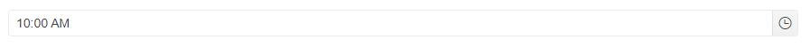

# Getting Started with the TimePicker

This tutorial explains how to set up a basic Telerik UI for {{ site.framework }} TimePicker and highlights the major steps in the configuration of the component.

You will initialize a TimePicker control with a number of tools. Next, you will handle some of the TimePicker events. Finally, you can run the sample code in [Telerik REPL](https://netcorerepl.telerik.com/) and continue exploring the components.

 

@[template](/_contentTemplates/core/getting-started-prerequisites.md#repl-component-gs-prerequisites)

## 1. Prepare the CSHTML File

@[template](/_contentTemplates/core/getting-started-directives.md#gs-adding-directives)

Optionally, you can structure the document by adding the desired HTML elements like headings, divs, paragraphs, and apply some basic styles.

## 2. Initialize the TimePicker

Use the TimePicker HtmlHelper or TagHelper to add the component to a page:

* The `Name()` configuration method is mandatory as its value is used for the `id` and the `name` attributes of the TimePicker element.

* The `DateInput()` configuration method specifies if the TimePicker will use the [DateInput]) component for value editing.

* The `Value()` configuration method specifies the initially selected time.

```HtmlHelper

@using Kendo.Mvc.UI

    @(Html.Kendo().TimePicker()
            .Name("timepicker")
            .Value("10:00 AM")
            .DateInput()
    )
```


```TagHelper
@addTagHelper *, Kendo.Mvc

    <kendo-timepicker name="timepicker" value="new DateTime(1900, 1, 1, 10, 00, 0)" date-input="true">
    </kendo-timepicker>

```


## 3. Handle the TimePicker Events

The TimePicker [exposes various events](/api/kendo.mvc.ui.fluent/timepickereventbuilder) that you can handle and further customize the functionality of the component. In this tutorial, you will use the `Open`, `Close`, and `Change` events of the TimePicker to log a message in the Browser's console.

```HtmlHelper
@using Kendo.Mvc.UI

    @(Html.Kendo().TimePicker()
            .Name("timepicker")
            .Value("10:00 AM")
            .DateInput()
            .Events(e =>
            {
                e.Change("change").Open("open").Close("close");
            })
    )

<script>
   function open() {
        console.log("Open");
    }

    function close() {
        console.log("Close");
    }

    function change() {
        console.log("Change :: " + kendo.toString(this.value(), 't'));
    }
</script>
```

```TagHelper

@addTagHelper *, Kendo.Mvc

    <kendo-timepicker name="timepicker" value="new DateTime(1900, 1, 1, 10, 00, 0)" date-input="true" on-change="change" on-open="open" on-close="close">
    </kendo-timepicker>

<script>
    function open() {
        console.log("Open");
    }

    function close() {
        console.log("Close");
    }

    function change() {
        console.log("Change :: " + kendo.toString(this.value(), 't'));
    }
</script>
```


For more examples, refer to the [demo on using the events of the TimePicker](https://demos.telerik.com/{{ site.platform }}/timepicker/events).

## 4. (Optional) Reference Existing TimePicker Instances

To use the [client-side API of the TimePicker](https://docs.telerik.com/kendo-ui/api/javascript/ui/timepicker) and build on top of its initial configuration, you need a reference to the TimePicker instance. Once you get a valid reference, you can call the respective API methods:

1. Use the `.Name()` (`id` attribute) of the component instance to get a reference.

    ```script
        <script>
            var timePickerReference = $("#timepicker").data("kendoTimePicker"); // timePickerReference is a reference to the existing instance of the helper.
        </script>
    ```

1. Use the [client-side API of the TimePicker](https://docs.telerik.com/kendo-ui/api/javascript/ui/timepicker) to control the behavior of the widget. In this example, you will use the [`enable`](https://docs.telerik.com/kendo-ui/api/javascript/ui/timepicker/methods/enable) method to disable the TimePicker.

    ```script
        <script>
            $(document).ready(function () {
                var timepicker = $("#timepicker").data("kendoTimePicker");

                timepicker.enable(false);
            })
        </script>
    ```

For more information on referencing specific helper instances, see the [Methods and Events]() article.



## Explore this Tutorial in REPL

You can continue experimenting with the code sample above by running it in the Telerik REPL server playground:

* [Sample code with the TimePicker HtmlHelper](https://netcorerepl.telerik.com/QxOzlvvH41DZ6oLL00)

* [Sample code with the TimePicker TagHelper](https://netcorerepl.telerik.com/mHOzlbFR41l9KNn444)


## Next Steps

* [Configuring the Floating Label of the TimePicker]()
* [Customizing the Appearance of the TimePicker]()
* [Using Validation with the TimePicker]()

## See Also

* [Using the API of the TimePicker for {{ site.framework }} (Demo)](https://demos.telerik.com/{{ site.platform }}/timepicker/api)
* [Client-Side API of the TimePicker](https://docs.telerik.com/kendo-ui/api/javascript/ui/timepicker)
* [Server-Side API of the TimePicker](/api/timepicker)
* [Knowledge Base Section](/knowledge-base)
