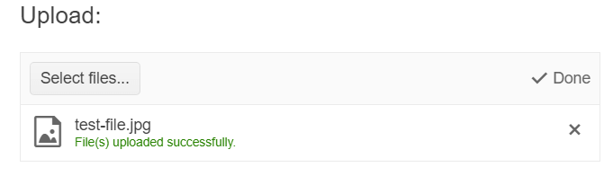

# Getting Started with the Upload

This tutorial explains how to set up a basic Telerik UI for {{ site.framework }} Upload and highlights the major steps in the configuration of the component.

You will initialize the Upload component and configure its mode of operation. Finally, you will learn how to handle the events of the Upload.

 

@[template](/_contentTemplates/core/getting-started-prerequisites.md#component-gs-prerequisites)

## 1. Prepare the CSHTML File

@[template](/_contentTemplates/core/getting-started-directives.md#gs-adding-directives)

Optionally, you can structure the content in the view by adding the desired HTML elements like headings, divs, paragraphs, and others.

```HtmlHelper
    @using Kendo.Mvc.UI

    <h4>Upload with a placeholder</h4>
    <div>
    
    </div>
```

```TagHelper
    @addTagHelper *, Kendo.Mvc

    <h4>Upload with a placeholder</h4>
    <div>
    
    </div>
```


## 2. Initialize the Upload

Use the Upload HtmlHelper or TagHelper to add the component to a page:

* The `Name()` configuration method is mandatory as its value is used for the `id` and the name attributes of the Upload element.
* The `Multiple()` configuration method specifies if the user can select only one file at a time.


```HtmlHelper
    @(Html.Kendo().Upload()
         .Name("upload")
         .Multiple(true)
    )
```

```TagHelper
    <kendo-upload name="upload" multiple="true">
    </kendo-upload>
```    


## 3. Configure the Mode of Operation

The next step is to specify the mode of operation for the Upload. In this tutorial, you will configure the asynchronous mode,  which requires dedicated server handlers to store and remove uploaded files in the application.


```HtmlHelper
    .Async(a => a
        .Save("SaveAsync", "Upload")
        .Remove("Remove", "Upload")
    )  
```


```TagHelper
    <async save-url="@Url.Action("SaveAsync", "Upload")" 
           remove-url="@Url.Action("Remove","Upload")" />
```


```Controller
    public IWebHostingEnvironment WebHostEnvironment { get; set; }

    public UploadController(IWebHostEnvironment webHostEnvironment)
    {
        WebHostEnvironment = webHostEnvironment;
    }

    public async Task<ActionResult> SaveAsync(IEnumerable<IFormFile> files)
    {
        // The Name of the Upload component is "files".
        if (files != null)
        {
            foreach (var file in files)
            {
                var fileContent = ContentDispositionHeaderValue.Parse(file.ContentDisposition);

                // Some browsers send file names with full path.
                // We are only interested in the file name.
                var fileName = Path.GetFileName(fileContent.FileName.ToString().Trim('"'));
                var physicalPath = Path.Combine(WebHostEnvironment.WebRootPath, "App_Data", fileName);

                using (var fileStream = new FileStream(physicalPath, FileMode.Create))
                {
                    await file.CopyToAsync(fileStream);
                }
            }
        }

        // Return an empty string to signify success.
        return Content("");
    }

    public ActionResult Remove(string[] fileNames)
    {
        // The parameter of the Remove action must be called "fileNames".

        if (fileNames != null)
        {
            foreach (var fullName in fileNames)
            {
                var fileName = Path.GetFileName(fullName);
                var physicalPath = Path.Combine(WebHostEnvironment.WebRootPath, "App_Data", fileName);

                // TODO: Verify user permissions.

                if (System.IO.File.Exists(physicalPath))
                {
                    System.IO.File.Delete(physicalPath);
                }
            }
        }

        // Return an empty string to signify success.
        return Content("");
    }
```

## 4. Handle the Upload Events

The Upload exposes various [events](/api/Kendo.Mvc.UI.Fluent/UploadEventBuilder) that you can handle and further customize the functionality of the component. In this tutorial, you will use the `Upload` event to capture one or more files and the `Success` event to verify whether the upload operation has been completed successfully.

```HtmlHelper
    @(Html.Kendo().Upload()
         .Name("upload")
         .Multiple(true)
         .Async(a => a
            .Save("SaveAsync", "Upload")
            .Remove("Remove", "Upload")
         )  
         .Events(events => events
            .Upload("onUpload")
            .Success("onSuccess")
        )
    )

    <script>
        function onUpload(e) {
            // An array with information about the uploaded files.
            var files = e.files;
            alert("Uploaded files" + files);
        }
        function onSuccess(e) {
            // An array with information about the successfully uploaded files.
            var files = e.files;

            if (e.operation == "upload") {
                alert("Successfully uploaded " + files.length + " files");
            }
        }
    </script>
```


```TagHelper
    <kendo-upload name="upload"
                  on-upload="onUpload"
                  on-success="onSuccess">
        <async auto-upload="true" 
               save-url="@Url.Action("SaveAsync", "Upload")" 
               remove-url="@Url.Action("Remove","Upload")" />
    </kendo-upload>

    <script>
        function onUpload(e) {
            // An array with information about the uploaded files.
            var files = e.files;
            alert("Uploaded files" + files);
        }
        function onSuccess(e) {
            // An array with information about the successfully uploaded files.
            var files = e.files;

            if (e.operation == "upload") {
                alert("Successfully uploaded " + files.length + " files");
            }
        }
    </script>
```


## 5. (Optional) Reference Existing Menu Instances
You can reference the Upload instances that you have created and build on top of their existing configuration:

1. Use the `.Name()` (id attribute) of the component instance to get a reference.

   ```script
        <script>
            $(document).ready(function() {
                var uploadReference = $("#upload").data("kendoUpload"); // uploadReference is a reference to the existing Upload instance of the helper.
            })
        </script>
   ```

1. Use the [Upload client-side API](https://docs.telerik.com/kendo-ui/api/javascript/ui/upload#methods) to control the behavior of the control. In this example, you will use the `removeAllFiles` method to remove all of the uploaded files by sending a remove request to the specified handler.

    ```script
        <script>
            $(document).ready(function() {
                var uploadReference = $("#upload").data("kendoUpload");
                uploadReference.removeAllFiles();
            })
        </script>
    ```


## Next Steps

* [Validating the Files]()
* [Using the Drag and Drop of the Upload]()
* [Enabling Chunk Upload]()


## See Also

* [Using the API of the Upload for {{ site.framework }} (Demo)](https://demos.telerik.com/{{ site.platform }}/upload/api)
* [Client-Side API of the Upload](https://docs.telerik.com/kendo-ui/api/javascript/ui/upload)
* [Server-Side API of the Upload](/api/upload)
* [Knowledge Base Section](/knowledge-base)
