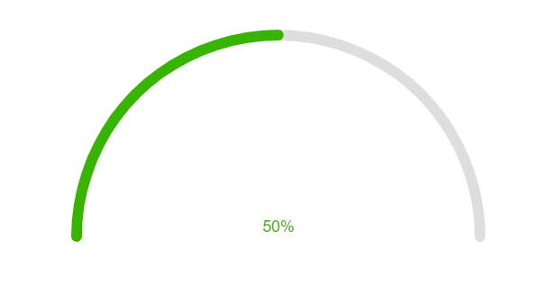

# Getting Started with the ArcGauge

This tutorial explains how to set up a basic Telerik UI for {{ site.framework }} ArcGauge and highlights the major steps in the configuration of the component.

You will initialize an ArcGauge component with different colors depending on the current value. Next, you will use the built-in client-side methods to update the ArcGauge options and change its value dynamically. Finally, you can run the sample code in [Telerik REPL](https://netcorerepl.telerik.com/) and continue exploring the components.

 

@[template](/_contentTemplates/core/getting-started-prerequisites.md#component-gs-prerequisites)

## 1. Prepare the CSHTML File

@[template](/_contentTemplates/core/getting-started-directives.md#gs-adding-directives)

Optionally, you can structure the View content by adding the desired HTML elements like headings, divs, paragraphs, and others.

```HtmlHelper
    @using Kendo.Mvc.UI

    <div id="gauge-container">

    </div>
```

```TagHelper
    @addTagHelper *, Kendo.Mvc

    <div id="gauge-container">

    </div>
```


## 2. Initialize the ArcGauge

Use the ArcGauge HtmlHelper or TagHelper to add the component to a page:

* The `Name()` configuration method is mandatory as its value is used for the `id` and the `name` attributes of the ArcGauge element.
* The `Scale()` option specifies the ArcGauge scale options, like labels, the lowest and highest value, and more.
* The `Value()` option sets the initial ArcGauge value.
* The `CenterTemplate()` specifies the label template displayed in the center of the arc.

```HtmlHelper
    @using Kendo.Mvc.UI

    <div id="gauge-container">
        @(Html.Kendo().ArcGauge()
            .Name("gauge")
            .Value(50)
            .Scale(x => x.Min(0).Max(100))
            .CenterTemplate("<span>#: value #%</span>")
        )
    </div>
```

```TagHelper
    @addTagHelper *, Kendo.Mvc

    <div id="gauge-container">
        <kendo-arcgauge name="gauge" 
            value="50" 
            center-template="<span>#: value #%</span>">
            <scale min="0" max="100"></scale>
        </kendo-arcgauge>
    </div>
```


## 3. Configure the Color Ranges

The next step is to set up the color ranges of the ArcGauge and update the label template to display the current value in the respective color.

```HtmlHelper
    @using Kendo.Mvc.UI

    <div id="gauge-container">
        @(Html.Kendo().ArcGauge()
            .Name("gauge")
            .Value(50)
            .Scale(x => x.Min(0).Max(100))
            .CenterTemplate("<span style='color: #: color #;'>#: value #%</span>")
            .Colors(colors =>
            {
                colors.Add().From(0).To(25).Color("#0058e9");
                colors.Add().From(25).To(50).Color("#37b400");
                colors.Add().From(50).To(75).Color("#ffc000");
                colors.Add().From(75).To(100).Color("#f31700");
            })
        )
    </div>
```

```TagHelper
    @addTagHelper *, Kendo.Mvc

    <div id="gauge-container">
        <kendo-arcgauge name="gauge" 
            value="50" 
            center-template="<span style='color: #: color #;'>#: value #%</span>">
            <scale min="0" max="100"></scale>
            <colors>
                <color from="0" to="25" color="#0058e9" />
                <color from="25" to="50" color="#37b400" />
                <color from="50" to="75" color="#ffc000" />
                <color from="75" to="100" color="#f31700" />
            </colors>
        </kendo-arcgauge>
    </div>
```



## 4. (Optional) Reference Existing ArcGauge Instances

You can reference the ArcGauge instances that you have created and build on top of their existing configuration:

1. Use the `id` attribute of the component instance to get its reference.

    ```script
        <script>
            $(document).ready(function() {
                var arcGaugeReference = $("#gauge").data("kendoArcGauge"); // arcGaugeReference is a reference to the existing ArcGauge instance of the helper.
            });
        </script>
    ```

1. Use the [ArcGauge client-side API](https://docs.telerik.com/kendo-ui/api/javascript/dataviz/ui/arcgauge#methods) to control the behavior of the component. In this example, you will use the `value()` method to change the ArcGauge value and the `setOptions()` method to update the background color (for example, when a button is clicked).

    ```HtmlHelper
        @(Html.Kendo().Button()
            .Name("btn")
            .Content("Update value")
            .Events(ev => ev.Click("onBtnClick"))
        )
    ```
    
    ```TagHelper
        @addTagHelper *, Kendo.Mvc
        <kendo-button name="btn" on-click="onBtnClick">
            Update value
        </kendo-button>
    ```
    
    ```Scripts
        <script>
            function onBtnClick() {
                var arcGaugeReference = $("#gauge").data("kendoArcGauge");
                if(arcGaugeReference.value() < 80) {
                    arcGaugeReference.setOptions({gaugeArea: {background: "#FFD700"}});
                    arcGaugeReference.value(80);
                }
            }
        </script>
    ```

For more information on referencing specific helper instances, see the [Methods and Events]() article.


## Explore this Tutorial in REPL

You can continue experimenting with the code sample above by running it in the Telerik REPL server playground:

* [Sample code with the ArcGauge HtmlHelper](https://netcorerepl.telerik.com/wHvPQauM27xs1Dqu49)
* [Sample code with the ArcGauge TagHelper](https://netcorerepl.telerik.com/QRPPcEks29XxyRxu22)



## Next Steps

* [Configuring the ArcGauge Scale]()
* [Setting the ArcGauge Colors]()

## See Also

* [Client-Side API of the ArcGauge](https://docs.telerik.com/kendo-ui/api/javascript/dataviz/ui/arcgauge)
* [Server-Side API of the ArcGauge HtmlHelper](/api/arcgauge)

* [Server-Side API of the ArcGauge TagHelper](/api/taghelpers/arcgauge)

* [Knowledge Base Section](/knowledge-base)
