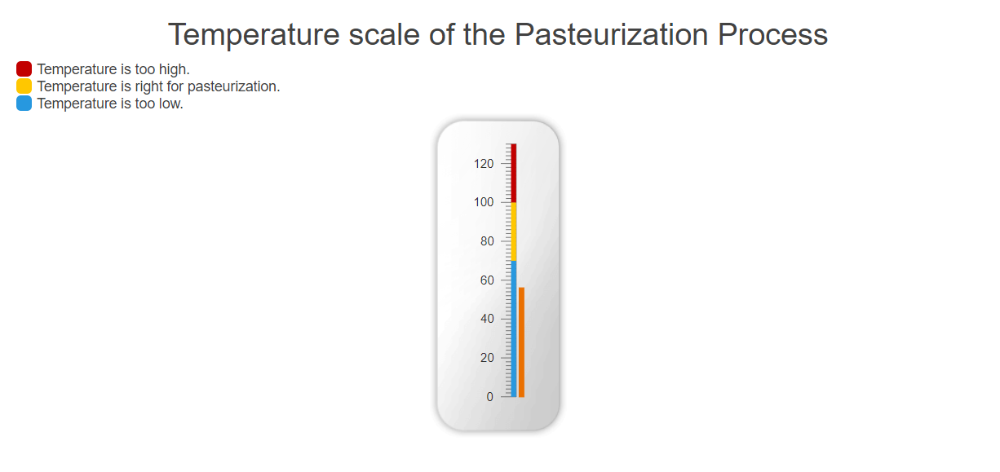

# Getting Started with the Linear Gauge

This tutorial explains how to set up a basic Telerik UI for {{ site.framework }} Linear Gauge and highlights the major steps in the configuration of the component.

You will initialize a Linear Gauge and set up the `Scale` property, which configures the visualization of the gauge. Then, you will use JavaScript to update the value of the Linear Gauge using its client-side reference. Finally, you can run the sample code in [Telerik REPL](https://netcorerepl.telerik.com/) and continue exploring the components.

 

@[template](/_contentTemplates/core/getting-started-prerequisites.md#repl-component-gs-prerequisites)

## 1. Prepare the CSHTML File
@[template](/_contentTemplates/core/getting-started-directives.md#gs-adding-directives)

Optionally, you can structure the document by adding the desired HTML elements like headings, divs, and paragraphs. In this tutorial, you will also apply some styles to the gauge and its container.

```html
    <h2>Tempretature scale of the Pasteurization Process</h2>
    <div class="legend">
        <div class="legend-item">
            <span class="color red"></span>
                Temperature is too high.
        </div>
        <div class="legend-item">
            <span class="color yellow"></span>
                Temperature is right for pasteurization.
        </div>
        <div class="legend-item">
            <span class="color blue"></span>
                Temperature is too low.
        </div>
    </div>
    <div id="gauge-container">
            <!-- Component Configuration -->
    </div>
    <style>
        #gauge-container {
            text-align: center;
            margin: 0 auto;
            background: transparent url("@Url.Content("~/shared/dataviz/gauge/linear-gauge-container.png")") no-repeat 50% 50%;
            background-size: contain;
            background-position:bottom;
            padding: 18px;
            width: 320px;
            height: 320px;
        }

        #gauge {
            height: 100%;
            display: inline-block;
            zoom: 1;
        }
        h2{
            display:flex;
            justify-content:center;
        }
        .legend-item{
            display:flex;
            flex-direction: row;
        }
        .color{
            display:flex;
            width: 15px;
            height: 15px;
            margin-right:5px;
            border-radius:30%;
        }
        .red{
            background-color:#c20000;
        }
        .yellow{
            background-color:#ffc700;
        }
        .blue{
            background-color:#2798df;
        }
    </style>
```

## 2. Initialize the Linear Gauge

Use the Linear Gauge HtmlHelper or TagHelper to add the component to a page:

* The `Name()` configuration method is mandatory as its value is used for the `id` and the `name` attributes of the Linear Gauge element.
* Utilize the [`LinearGaugePointerBuilder`](https://docs.telerik.com/{{ site.platform }}/api/kendo.mvc.ui.fluent/lineargaugepointerbuilder)'s [`Value`](https://docs.telerik.com/{{ site.platform }}/api/kendo.mvc.ui.fluent/lineargaugepointerbuilder#valuesystemdouble) method to set an initial value for the Linear Gauge.

```HtmlHelper
    @using Kendo.Mvc.UI

   @(Html.Kendo().LinearGauge()
          .Name("gauge")
          .Pointer(pointer => pointer.Value(56))
    )
```

```TagHelper
    @using Kendo.Mvc.UI
    @addTagHelper *, Kendo.Mvc

    <kendo-lineargauge name="gauge">
        <lineargauge-pointers>
            <pointer value="56"></pointer>
        </lineargauge-pointers>
    </kendo-lineargauge>
```


## 3. Configure the Linear Gauge

Configure the [Scale](https://docs.telerik.com/{{ site.platform }}/api/kendo.mvc.ui.fluent/circulargaugebuilder#scalesystemaction) configuration method of the Linear Gauge. It exposes the [LinearGaugeScaleSettingsBuilder](https://docs.telerik.com/{{ site.platform }}/api/kendo.mvc.ui.fluent/lineargaugescalesettingsbuilder) which allows you to set up the `Min`, `Max`, `MajorTicks`, `MinorTicks`, `Labels` and `Ranges` properties.

The [`Ranges`](https://docs.telerik.com/{{ site.platform }}/api/kendo.mvc.ui.fluent/lineargaugescalesettingsrangebuilder) property exposes the following configuration methods that are responsible for the graphics rendering of the component:

* [`From`](https://docs.telerik.com/{{ site.platform }}/api/kendo.mvc.ui.fluent/lineargaugescalesettingsrangebuilder#fromsystemdouble) — The start position of the range in scale units.
* [`To`](https://docs.telerik.com/{{ site.platform }}/api/kendo.mvc.ui.fluent/lineargaugescalesettingsrangebuilder#tosystemdouble) — The end position of the range in scale units.
* [`Color`](https://docs.telerik.com/{{ site.platform }}/api/kendo.mvc.ui.fluent/lineargaugescalesettingsrangebuilder#colorsystemstring) — The color of the range. Any valid CSS color string will work here, including hex and rgb.
* [`Opacity`](https://docs.telerik.com/{{ site.platform }}/api/kendo.mvc.ui.fluent/lineargaugescalesettingsrangebuilder#opacitysystemdouble) — The opacity of the range.

Finally, fine tune the size and the position of the component with the [`GaugeAreas`](https://docs.telerik.com/{{ site.platform }}/api/kendo.mvc.ui.fluent/lineargaugegaugeareasettingsbuilder)'s `Height` and `Margin` properties.

```HtmlHelper
    @using Kendo.Mvc.UI

   @(Html.Kendo().LinearGauge()
          .Name("gauge")
          .Pointer(pointer => pointer.Value(56))
          .Scale(scale => scale
              .MajorUnit(20)
              .MinorUnit(2)
              .Min(0)
              .Max(130)
              .Ranges(ranges =>
              {
                  ranges.Add().From(0).To(70).Color("#2798df");
                  ranges.Add().From(70).To(100).Color("#ffc700");
                  ranges.Add().From(100).To(130).Color("#c20000");
              }
              )
          )
          .GaugeArea(g=>g.Height(280).Margin(m=>m.Top(30)))
    )
```

```TagHelper
    @using Kendo.Mvc.UI
    @addTagHelper *, Kendo.Mvc

    <kendo-lineargauge name="gauge">
        <lineargauge-pointers>
            <pointer value="56"></pointer>
        </lineargauge-pointers>
        <scale major-unit="20" minor-unit="2" min="0" max="130">
            <lineargauge-scale-ranges>
                <range color="#2798df" from="0" to="70">
                </range>
                <range color="#ffc700" from="70" to="100">
                </range>
                <range color="#c20000" from="100" to="130">
                </range>
            </lineargauge-scale-ranges>
        </scale>
        <gauge-area height="280">
            <lineargauge-gauge-area-margin top="30"/>
        </gauge-area>
    </kendo-lineargauge>
```



## 4. (Optional) Reference Existing Linear Gauge Instances

You can reference the Linear Gauge instances that you have created and build on top of their existing configuration:

1. Use the `id` attribute of the component instance to establish a reference.

    ```JavaScript
        $(document).ready( function (e) {
            var lineargaugeReference = $("#gauge").data("kendoLinearGauge"); // lineargaugeReference is a reference to the existing Linear Gauge instance of the helper.
        });
    ```

1. Use the [Linear Gauge client-side API](https://docs.telerik.com/kendo-ui/api/javascript/ui/lineargauge#methods) to control the behavior of the component. In this example, you will use the [`value`](https://docs.telerik.com/kendo-ui/api/javascript/ui/lineargauge/methods/value) method to change the value of the Linear Gauge every second to ensure that the visualized thermometer is exact.

    ```JavaScript
        setInterval(function(){
            updateValue(temperatureSensor); // update the value of the Linear Gauge based on external input every second
        },1000)
        
        function updateValue(number) {
            var gauge = $("#gauge").data("kendoLinearGauge");
            gauge.value(number);
        }
    ```


## Explore this Tutorial in REPL

You can continue experimenting with the code sample above by running it in the Telerik REPL server playground:

* [Sample code with the Linear Gauge HtmlHelper](https://netcorerepl.telerik.com/cHbGvdbr32FYJNjn16)
* [Sample code with the Linear Gauge TagHelper](https://netcorerepl.telerik.com/wnlGvRPB4268Iskl35)



## Next Steps

* [Explore the Scale Options of the Linear Gauge]()
* [Customize the Pointers of the Linear Gauge]()

## See Also

* [Client-Side API of the Linear Gauge](https://docs.telerik.com/kendo-ui/api/javascript/dataviz/ui/lineargauge)
* [Server-Side API of the Linear Gauge](/api/lineargauge)
* [Knowledge Base Section](/knowledge-base)
