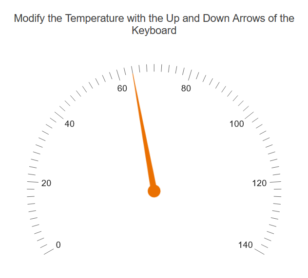

# Getting Started with the Radial Gauge

This tutorial explains how to set up a basic Telerik UI for {{ site.framework }}  Radial Gauge and highlights the major steps in the configuration of the component.

You will initialize a Radial Gauge and configure its `Scale`, which is responsible for the visualization of the gauge. Then, you will handle the basic JavaScript `keydown` event to acknowledge when the user presses the `Up` or `Down` arrow keys and update the value of the Radial Gauge Pointer using its client-side reference.  Finally, you can run the sample code in [Telerik REPL](https://netcorerepl.telerik.com/) and continue exploring the components.

 

@[template](/_contentTemplates/core/getting-started-prerequisites.md#repl-component-gs-prerequisites)

## 1. Prepare the CSHTML File
@[template](/_contentTemplates/core/getting-started-directives.md#gs-adding-directives)

Optionally, you can structure the document by adding the desired HTML elements like headings, divs, and paragraphs. In this tutorial, you will also apply some styles to the gauge and its container.

```html
    <style>
        #gauge-container {
            width: 386px;
            height: 386px;
            text-align: center;
            margin: 20px auto 30px auto;
        }

        #gauge {
            width: 350px;
            height: 300px;
            margin: 0 auto;
        }
    </style>
    <div id="example">
        
        <div id="gauge-container">
            <p>Modify the Temperature with the Up and Down Arrows of the Keyboard</p>
            <!-- Component Configuration -->
        </div>
    </div>
```

## 2. Initialize the Radial Gauge

Use the Radial Gauge HtmlHelper or TagHelper to add the component to a page:

* The `Name()` configuration method is mandatory as its value is used for the `id` and the `name` attributes of the Radial Gauge element.
* Utilize the `.Pointer()` method to set an initial value for the Radial Gauge.

```HtmlHelper
    @using Kendo.Mvc.UI

    @(Html.Kendo().RadialGauge()
        .Name("gauge")
        .Pointer(pointer => pointer.Value(65))
    )
```

```TagHelper
    @using Kendo.Mvc.UI
    @addTagHelper *, Kendo.Mvc

    <kendo-radialgauge name="gauge" >
        <radialgauge-pointers>
            <pointer value="65">
            </pointer>
        </radialgauge-pointers>
    </kendo-radialgauge>
```


## 3. Configure the Radial Gauge

Configure the [Scale](https://docs.telerik.com/{{ site.platform }}/api/kendo.mvc.ui.fluent/radialgaugebuilder#scalesystemaction) configuration method of the Radial Gauge. It exposes the [RadialGaugeSettingsBuilder](https://docs.telerik.com/{{ site.platform }}/api/kendo.mvc.ui.fluent/radialgaugescalesettingsbuilder) which allows you to then set up the `Min`, `Max`, `MajorTicks`, `MinorTicks`, `Labels` and `Reverse` properties.

```HtmlHelper
    @using Kendo.Mvc.UI

    @(Html.Kendo().RadialGauge()
        .Name("gauge")
        .Pointer(pointer => pointer.Value(65))
        .Scale(x =>
           x.Min(0)
            .Max(140)
            .MajorTicks(M=>M.Visible(true))
            .MinorTicks(m => m.Visible(true))
            .Labels(l => l.Visible(true))
        )
    )
```

```TagHelper
    @using Kendo.Mvc.UI
    @addTagHelper *, Kendo.Mvc

    <kendo-radialgauge name="gauge">
        <radialgauge-pointers>
            <pointer value="65">
            </pointer>
        </radialgauge-pointers>
        <scale min="0" max="140">
                <radialgauge-scale-major-ticks visible="true"/>
                <radialgauge-scale-minor-ticks visible="true"/>
                <radialgauge-scale-labels position="GaugeRadialScaleLabelsPosition.Inside"/>
         </scale>
    </kendo-radialgauge>
```



## 4. (Optional) Reference Existing Radial Gauge Instances

You can reference the Radial Gauge instances that you have created and build on top of their existing configuration:

1. Use the `id` attribute of the component instance to establish a reference.

    ```JavaScript
        $(document).ready( function (e) {
            var radialgaugeReference = $("#gauge").data("kendoRadialGauge"); // radialgaugeReference is a reference to the existing Radial Gauge instance of the helper.
        });
    ```

1. Use the [Radial Gauge client-side API](https://docs.telerik.com/kendo-ui/api/javascript/ui/radialgauge#methods) to control the behavior of the component. In this example, you will use the [`value`](https://docs.telerik.com/kendo-ui/api/javascript/ui/radialgauge/methods/value) method to change the value of the Radial Gauge when the user presses the ArrowUp or ArrowDown keyboard buttons.

    ```JavaScript
        $("body").on("keydown",function(e){
            if(e.key=="ArrowUp"){
                updateValue(1);
            }else if(e.key=="ArrowDown"){
                updateValue(-1);
            }
        })   
        
        function updateValue(number) {
            var gauge = $("#gauge").data("kendoRadialGauge");
            gauge.value(gauge.value()+number);
        }
    ```


## Explore this Tutorial in REPL

You can continue experimenting with the code sample above by running it in the Telerik REPL server playground:

* [Sample code with the Radial Gauge HtmlHelper](https://netcorerepl.telerik.com/wRFQGJlI39kH6ylt58)
* [Sample code with the Radial Gauge TagHelper](https://netcorerepl.telerik.com/cdFcQzlo46oSauSw36)



## Next Steps

* [Explore the Scale Options of the Radial Gauge]()

## See Also

* [Using the API of the Radial Gauge for {{ site.framework }} (Demo)](https://demos.telerik.com/{{ site.platform }}/radialgauge/api)
* [Client-Side API of the Radial Gauge](https://docs.telerik.com/kendo-ui/api/javascript/ui/radialgauge)
* [Server-Side API of the Radial Gauge](/api/radialgauge)
* [Knowledge Base Section](/knowledge-base)
