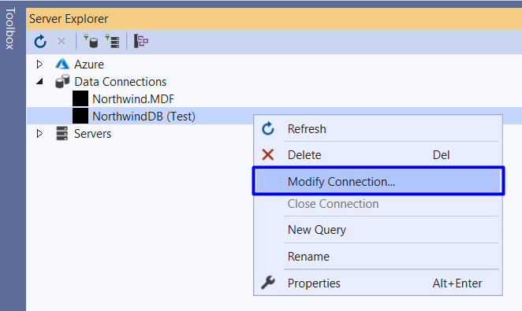
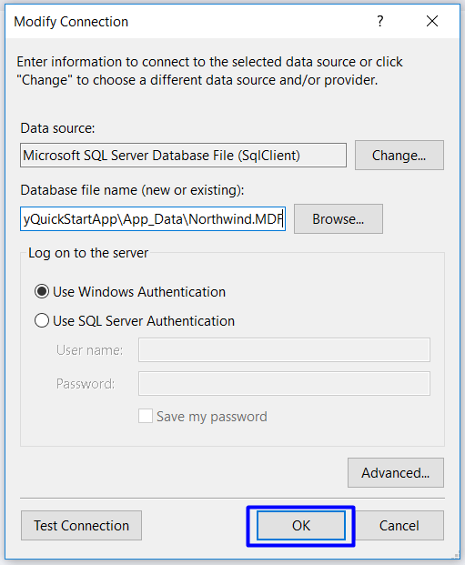
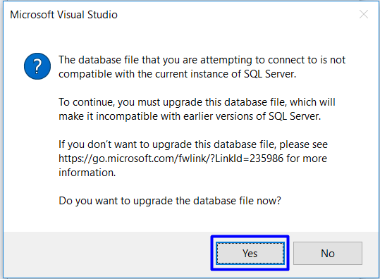
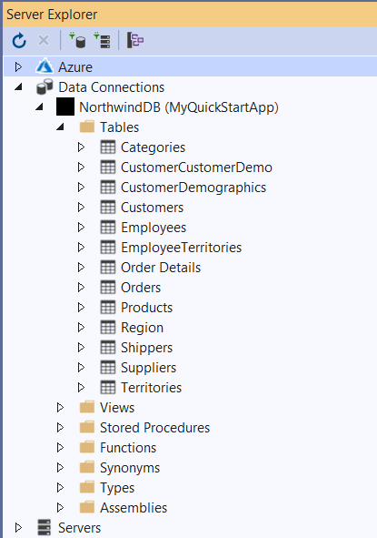
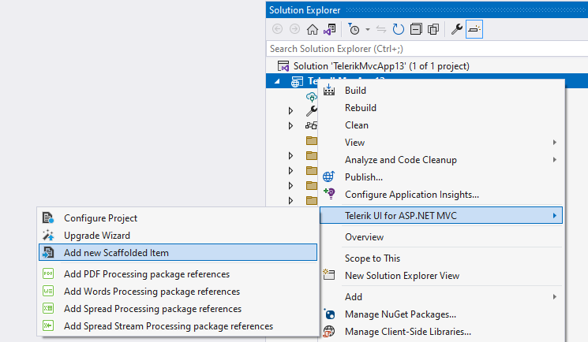
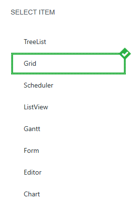
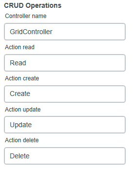
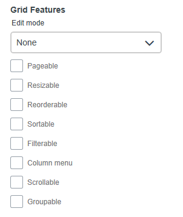

# Build the Team Efficiency Dashboard Project

## Step 3: Scaffolding

In this chapter, you'll learn how to add leverage Telerik UI for ASP.NET MVC scaffolding capabilities. One feature that MVC developers are quite used to is scaffolding. Visual-Studio-powered MVC scaffolding is a code generation framework that allows you to hook up your model to a controller and render views that are strongly typed, among other things. Since the scaffolding is simply a code generation tool, you are free to change any of the code that it generated.

### Upgrade the Database

#### Overview

A copy of the Northwind database is included in the Kendo UI Quick Start Boilerplate. Before you begin scaffolding, make sure the Northwind database is upgraded. Having a working connection to the database is needed for the scaffolding wizard to work properly.

> Upgrading the database is only necessary for this guide because the database supplied must support multiple versions of SQL. Therefore, we chose the lowest database version possible.

#### Exercise: Upgrade the Northwind Database

> If you do not have an SQL Server instance installed on your machine, you may need to install the SQL Server Express Edition from Microsoft. You can download the free installer [here](http://www.microsoft.com/en-us/server-cloud/products/sql-server-editions/sql-server-express.aspx).

1. Using Visual Studio's **Server Explorer**, expand **DataConnections**, and right-click **NorthwindDB** > **Modify Connection**.

    

1. Next, click **OK**.

    

1. Finally, click **Yes** to complete the upgrade.

    

1. Once the upgrade is complete, expand the Northwind Database Tables to verify connectivity.

    

With the database upgraded, use the scaffolding wizard to create an interactive grid view.

### Telerik UI for MVC Scaffolding Wizard

#### Overview

The scaffolding wizard will aid you in creating the view by providing point-and-click configuration screen. Use the scaffolding wizard to create an interactive Kendo UI Grid view of orders for the Team Efficiency Dashboard. By enabling grid features such as sorting, paging, and exporting, users will receive the opportunity to analyze and share data in a familiar way.

#### Exercise: Scaffold a Grid View of Orders

1. Start the scaffolding wizard by right-clicking at the Project > **Telerik UI for ASP.NET {{ site.product_short}}** > **Add new Scaffolded Item**:

    

1. Notice that the Scaffolder is capable of creating TreeList, Grid, Scheduler, ListView, Gantt, Form, Editor, and Chart. For this guide you have to choose **Grid**.

    

1. From the **Create a new grid page* scaffolding dialog, the Page Name for the Grid, the name of the component, the Data Binding for the Model, the CRUD Operations, and the Features of the Grid are defined. 

    The Data Binding options are the following:

    - **Model name**&mdash;The name of the Model created by the Scaffolder.
    - **Model id**&mdash;The id of the Model in the scaffolded grid.

    

    Define the CRUD Operations for the scaffolded Grid:

    - **Controller Name**&mdash;The name of the Controller.
    - **Action read**&mdash;The name of the Read Action Method in the Controller.
    - **Action create**&mdash;The name of the Create Action Method in the Controller.
    - **Action update**&mdash;The name of the Update Action Method in the Controller.
    - **Action delete**&mdash;The name of the Delete Action Method in the Controller.

    

    Choose the Features for the Grid:

    - **Edit mode**&mdash;The Grid supports various `editing modes` that allow you to control the way the data is represented.
    - **Pageable**&mdash;To control the `paging` in the Grid, use the Pageable option.
    - **Resizable**&mdash;To control the `resizing` settings of the columns in the Grid.
    - **Reordable**&mdash;To control the `reordable` settings of the columns in the Grid.
    - **Sortable**&mdash;To control the `sorting` configuration of the items in the columns.
    - **Filterable**&mdash;To control the `filtering` functionality for the items in the columns.
    - **Column menu**&mdash;To control the `column menu` configuration of the columns in the Grid.
    - **Scrollable**&mdash;To control the `scrollable` configuration of the Grid.
    - **Groupable**&mdash;To control the `groupable` configuration of the items in the Grid.

    

Now that the Telerik UI for MVC Scaffolder has generated a starting point for working with the Grid, you can modify the scaffolded code to meet your needs. In the next chapter we'll do just that.