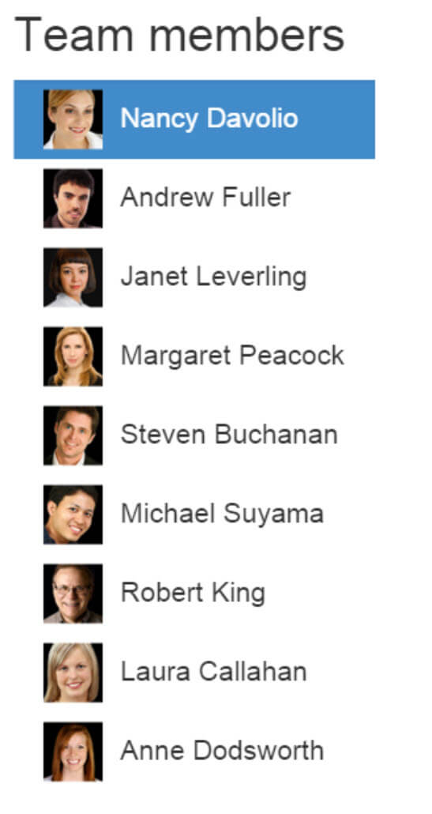
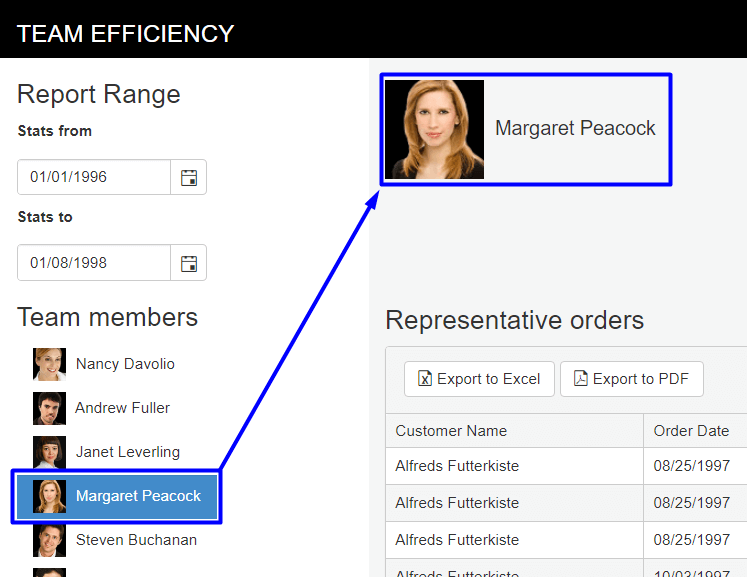

# Build the Team Efficiency Dashboard Project

## Step 6: Manage the Client Side

The client side is where Kendo UI really shines. Kendo UI uses a common JavaScript language and standards so that it’s easy for any JavaScript developer to get started. In this chapter you'll learn about client-side events and how to take control of Kendo UI using JavaScript.

### Working with Client-Side Events

#### Overview

Telerik UI for MVC helpers provide an Events method that is part of the HTML Helper's property chain. The `events` method is used to set event handlers for the Kendo UI widget. Each widget has a variety of events that can be handled including: `cancel`, `change`, `dataBound`, `dataBinding`, `edit`, `remove`, and `save`.

     @(Html.Kendo().ListView<KendoQsBoilerplate.Employee>()
        .Name("EmployeesList")
        .TagName("ul")
        .ClientTemplateId("EmployeeItemTemplate")
        .DataSource(dataSource => {
            dataSource.Read(read => read.Action("EmployeesList_Read", "Home"));
        })
        .Selectable(s => s.Mode(ListViewSelectionMode.Single))
        .Events(e => e
            .DataBound("onListDataBound")
            .Change("onCriteriaChange")
        )
    )

Let's continue to work with the `EmployeesList` that was created in the previous chapter. The list is selectable, but when the application starts the first item should be selected by default giving the user a starting point to begin interacting with the dashboard.

#### Exercise: Select the First List Item by Default

1. Find the `EmployeeList`.

    	<!-- Employee List View -->
    	@(Html.Kendo().ListView<KendoQsBoilerplate.Employee>()
            .Name("EmployeesList")
    		...
            .Selectable(s => s.Mode(ListViewSelectionMode.Single))
    	)

1. Add an event handler named `onListDataBound` for the `DataBound` event for the EmployeeList.

    	@(Html.Kendo().ListView<KendoQsBoilerplate.Employee>()
    		...
    		.Selectable(s => s.Mode(ListViewSelectionMode.Single))
    		.Events(e => e.DataBound("onListDataBound"))
    	)

    The resulting code should be like the one shown below.

    	<!-- Employee List View -->
    	@(Html.Kendo().ListView<KendoQsBoilerplate.Employee>()
        	.Name("EmployeesList")
            .ClientTemplateId("EmployeeItemTemplate")
            .TagName("ul")
            .DataSource(dataSource =>
            {
            	dataSource.Read(read => read.Action("EmployeesList_Read", "Home"));
            	dataSource.PageSize(9);
    		})
            .Selectable(s => s.Mode(ListViewSelectionMode.Single))
            .Events(e => e.DataBound("onListDataBound"))
    	)

1. In the same view, find the `Scripts` section.

    	@section Scripts {
    	    
    	}

1. In the `
    	}

1. Refresh the page to see that the first item in the list is selected by default.

    

Selecting the first item using the `DataBound` event was a good start. Next we'll take it a step further by using the selected item to populate a Kendo UI template showing the selected employee on the dashboard.

#### Exercise: Use the Change Event to Populate Templates

1. Add an event handler named `onCriteriaChange` for the `Change` event for the `EmployeeList`.

    	@(Html.Kendo().ListView<Employee>()
    			...
            	.Selectable(s => s.Mode(ListViewSelectionMode.Single))
                .Events(e => e.DataBound("onListDataBound")
       					      .Change("onCriteriaChange"))
    	)

1. Find the `<!-- Kendo Templates -->` placeholder.

    	<!-- Kendo Templates -->
    		...
    	<!-- /Kendo Templates -->

1. Add a new template that will display the selected employee's image and full name.

    	<!-- Kendo Templates -->
    	

1. Find the `

1. Add a function named `getSelectedEmployee` that returns the selected employee from the `EmployeeList` using the unique `uid` that the Kendo UI DataSource generates for each dataItem with the [`getByUid()`](https://docs.telerik.com/kendo-ui/api/javascript/data/datasource/methods/getbyuid) method.

    	function getSelectedEmployee() {
        	var employeeList = $("#EmployeesList").data("kendoListView"),
    		employee = employeeList.dataSource.getByUid(employeeList.select().attr("data-uid"));
    		return employee;
    	}

1. Add a function named `updateEmployeeAvatar` that binds the selected employee data to the `employeeAvatarTemplate` and places the template's content in the `employee-about` element. The [`kendo.template()`](https://docs.telerik.com/kendo-ui/api/javascript/kendo/methods/template) method allows us to bind the data to the HTML. 

    	function updateEmployeeAvatar() {
            var employee = getSelectedEmployee(),
                template = kendo.template($("#employeeAvatarTemplate").html());

            //apply template
            $("#employee-about").html(template(employee));
        }

1. Add a function named `onCriteriaChange`. This function will handle the `Change` event and call `updateEmployeeAvatar`.

    	function onCriteriaChange() {
            updateEmployeeAvatar();
    	}

1. Refresh the page and select an employee from the `EmployeeList`. Selecting an item should update the dashboard with the selected employee's data.

    

1. Find and remove the `<!-- Employee Avatar -->` placeholder code, it is no longer needed because the element is created dynamically. Remove the code shown in the example below.

         <!-- Employee Avatar -->
         @Html.Placehold(90, 90, "Face")
         Full Name 

Now that you know how to work with client-side APIs, let's enhance the Team Efficiency Dashboard by working with datasources.