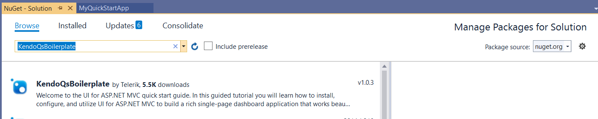

# Build the Team Efficiency Dashboard Project

## Step 1: Getting Up and Running

In this chapter you are going to start with the basics, including starting a new project, adding Telerik UI for MVC to your project, and installing the quick start boilerplate.

### Create a New MVC Project

#### Overview

Telerik UI for ASP.NET MVC can easily be added to an existing ASP.NET MVC project using VisualStudio in just a few clicks. Start by creating a new ASP.NET MVC project. You will use this project throughout the rest of this tutorial to build your application.

#### Exercise: Create a New MVC Project

1. Click **File** > **New Project**.

1. In the **New Project** dialog, choose the **ASP.NET Web Application** template by expanding the **Templates** tree to **Templates** > **Visual C#** > **Web**.

    

1. Give the application a name, for example, **MyQuickStartApp**. Click **OK** to continue.

1. In the **New ASP.NET Project** dialog, choose **MVC** from the template selection.

    

1. Click **OK** to finish.

### Install the Quick Start Boilerplate

#### Overview

With the new project created, it is time to start building your app. For this guide, we have scaffolded out a boilerplate project to act as a starting point for the Team Efficiency Dashboard application.

The boilerplate has an HTML page, a layout, the Northwind database, and some server-side code you may find in a typical MVC project.

#### Exercise: Install the Quick Start Boilerplate

1. Using the package manager console, run the command below.

        PM> Install-Package KendoQsBoilerplate

    Alternatively, you can use the GUI package manager.

1. From the Solution Explorer, right-click **References**, then choose **Manage NuGet Packages**.

    

1. Search for **KendoQsBoilerplate**.

    

1. Click **Install** to continue.
1. When the package installs, you may be prompted to accept a license agreement for the NorthwindDB. Click **I Accept** to continue.
1. It is normal for the quick start boilerplate to overwrite existing files. When prompted with a file conflict, choose **Yes to All**.

    

1. With the boilerplate installed, take a moment to run the application. If all went well, you should see something similar to what is shown below.

    

### Convert to Telerik Applications

#### Overview

At this point, you have the wire frame for a basic MVC application. Next, you will be adding the UI for ASP.NET MVC to the application by using the **Convert to Telerik Application** tooling. When an application is converted to a Telerik application, all required HTML, CSS, JavaScript and `.DLL` libraries are added. This is the first step you would take to upgrade a new or existing MVC project to use Telerik UI for ASP.NET MVC.

#### Exercise: Convert to a Telerik Application

1. Stop the application if it is already running.
1. In the Solution Explorer, right-click the project name and select **Telerik UI for ASP.NET MVC** > **Convert to Telerik Application**. This will launch the **Project Configuration** wizard. From here you can choose settings for your Telerik project.

    

1. For this tutorial your project will use CDN support. This means that all Kendo UI resources are served from Telerik content delivery network (CDN) versus relying on your server for the assets. Verify that the box **Use CDN support** is checked and click **Finish** to continue.

    

1. Since the boilerplate is designed with [Bootstrap](https://getbootstrap.com), choose **Bootstrap** from themes select box so the theme matches the current look of the boilerplate. You'll change the theme later when you're ready to customize the look of the application.

    

1. Open `\Views\Shared\_Layout.cshtml`. Find and remove the `@Scripts.Render("~/bundles/modernizr")` script bundle. This script is included with the Kendo UI assets.
1. Next, find the CSS `@Styles.Render("~/Content/css")` bundle and move it just above the closing head tag `</head>`. This will ensure that the custom styles are applied when you customize the application.
1. The final code of the head section should look like the one shown in the example below.

        <meta charset="utf-8" />
        <meta name="viewport" content="width=device-width, initial-scale=1.0">
        <title>@ViewBag.Title - UI for MVC / Kendo Quick Start Guide</title>
        <link href="https://kendo.cdn.telerik.com/themes/{{ site.themesCdnVersion }}/default/default-ocean-blue.css" rel="stylesheet"  type="text/css" />
        <link href="@Url.Content("~/Content/bootstrap.min.css")" rel="stylesheet" type="text/css" />
        <link href="@Url.Content("~/Content/Site.css")" rel="stylesheet" type="text/css" />
        
        
        
        
        
        
        @Styles.Render("~/Content/css")

> Because the **Convert to Telerik application**, **Upgrade Project**, or **Configure Project** wizards modify the `_Layout.cshtml` file, make sure you check the position of the custom CSS declarations afterwards.

Now that your app is ready for development. Let's add some simple input components to create a nice user experience.
