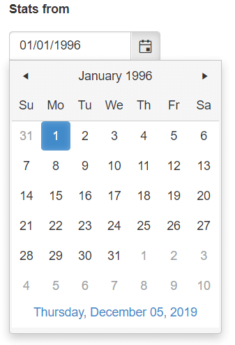

# Build the Team Efficiency Dashboard Project

## Step 2: Input Controls

In this chapter you'll learn how to add Kendo UI widgets to your application. UI for MVC has powerful HTML Helpers that configure and render Kendo UI widgets.

### Kendo UI Helper Overview

#### Server-Side Wrappers

Telerik UI for ASP.NET MVC is a set of server-side wrappers. A server-wrapper does the following:

- Allows the developer to configure a Kendo UI widget via C# or VB.NET code&mdash;set its value, data source, etc.
- Renders the HTML and JavaScript needed to initialize the Kendo UI widget. The widget options propagate to the client side via the widget initialization script.

#### Configuration

The Kendo UI HtmlHelper exposes all Kendo UI server wrappers.

#### Widget Options

The widget options are exposed via a fluent interface.

Below is an example of how a NumericTextBox input is created.

    @(Html.Kendo().NumericTextBox()
        .Name("age") // set the name of the NumericTextBox
        .Value(10) //set the value
        .Spinners(false) // disable the spinners
    )

### Adding a Kendo UI DatePicker

#### Overview

Let's open the `Index.cshtml` page under the folder `~\Views\Home\`. The `Index.cshtml` page is where most of the application's UI lives. This page currently contains basic HTML inputs to collect date input from the user. To provide a better user experience, replace the standard HTML inputs with Kendo UI date picker controls. The Kendo UI date picker controls offer users a flyout calendar to choose a desired date.

> The Kendo UI DatePicker control is touch and mouse friendly. No additional code is necessary to support tablets and phones.

#### Exercise: Replace StatsFrom and StatsTo TextBoxes with Kendo UI Date Pickers

1. Open `~\Views\Home\Index.cshtml` and find the `StatsFrom` text box helper.

        <!-- Stats From Date Picker -->
    	@Html.TextBox("StatsFrom", new DateTime(1996, 1, 1))

1. Replace the text box helper with a Kendo UI date picker. Set the `Name` property to `StatsFrom` and the `Value` with a new `DateTime` of `1996,1,1`.

    	<!-- Stats From Date Picker -->
    	@(Html.Kendo().DatePicker()
               .Name("StatsFrom")
               .Value(new DateTime(1996, 1, 1))
        )

1. Find the `StatsTo` text box helper.

    	<!-- Stats To Date Picker -->
    	@Html.TextBox("StatsTo", new DateTime(1996, 1, 1))

1. Replace the text box helper with a Kendo UI DatePicker. Set the `Name` property to `StatsTo` and the `Value` with a new `DateTime` of `1998,8,1`.

    	<!-- Stats To Date Picker -->
    	@(Html.Kendo().DatePicker()
        		.Name("StatsTo")
    			.Value(new DateTime(1998, 8, 1))
    	)

The Kendo UI HTML helper's fluent interface lets you configure a widget's behavior and appearance. The code you just added uses the following properties:

- `Name`&mdash;The property sets the rendered HTML element's id property.
- `Value`&mdash;Sets a default selected date value for the date picker.

After you run your app with this change, you will see a calendar icon in the **Stats from** field. Click or tap the icon to reveal the date picker.

With the inputs upgraded, let's move on to the extremely robust Kendo UI Grid.