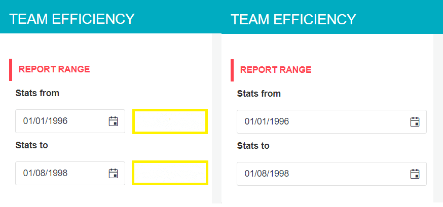
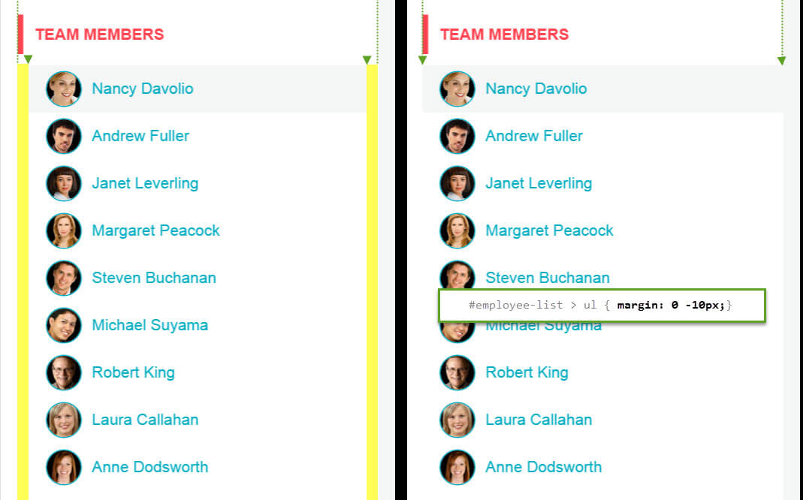
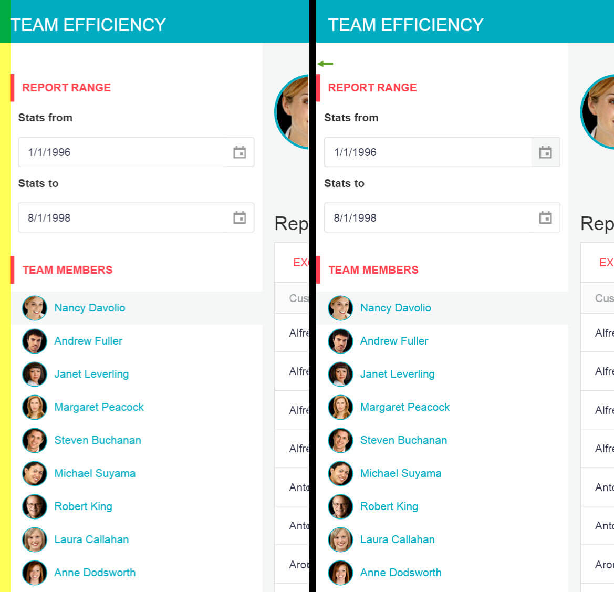
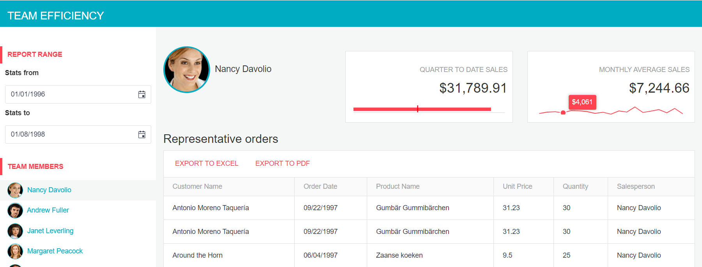

# Build the Team Efficiency Dashboard Project

## Step 10 (Last): Add and Configure the Kendo UI Themes

Kendo UI widgets include a number of predefined themes. In this chapter you'll learn how to make your app look amazing using Kendo UI themes.

### Theme Change

#### Exercise: Theme the Application

1. If running, stop the project.
1. In the Visual Studio's Project Explorer, right-click the project and choose **Telerik UI For MVC** > **Configure Project** from the menu.
1. From the Project Configuration Wizard, choose the Nova theme.
1. Open `Views/Shared/_Layout.cshtml` and move `@Styles.Render("~/Content/css")` just above the closing head tag `</head>`.
1. Run the application to see the theme applied to the Kendo UI widgets.
1. Next, you'll be finishing the theme by adding styles to non-Kendo UI elements creating a completely custom look. A style sheet was installed with the boilerplate to give you a jump-start. Add it to the application by opening `Views/Shared/_Layout.cshtml` and adding a reference to `~/Content/site-nova.css` just above the closing head tag `</head>`.

    > This is CSS, so the order in which the style sheets are added is very important.

        <link href="~/Content/site-nova.css" rel="stylesheet" />
	</head>

1. Refresh the application and notice the look is starting to come together. There's just a few items that could use some fine-tuning. Let's add some additional styles to `site-nova.css` to complete the theme.
1. Open `site-nova.css` and find the `/* Side Panel - Employee List */`. Add a style that sets the date picker widgets inside the `menuPanel` to 100% width of the container.

    The resulting code should be like the one shown in the example below.

    	/* Side Panel - Employee List */
    	#menuPanel .k-widget.k-datepicker {
    	    width: 100%;
    	}

    <!--*-->
    

1. Add a style to offset the employee list so its content lines up with the left edge of its container.

    	#employee-list > ul {
        	margin: 0 -10px;
    	}

    

1. Find `/* Small Devices, Tablets, and Up */`. Here you'll find a media query that will hold some styles that are only applied to scree sizes above `768px`.

    	@media only screen and (min-width : 768px) {

    	}

1. Inside the media query, add a selector for `.app-wrapper` and set a left margin of `-15` and set the `position` to `relative`. This style will align the app with the left hand edge of the screen.

    	/* Small Devices, Tablets, and Up */
    	@media only screen and (min-width : 768px) {
    	    .app-wrapper {
    	        position: relative;
    	        margin-left: -15px;
    	    }
    	}

    <!--*-->
    

1. Finally, set the Kendo UI Chart themes. Open `_MontlySalesByEmployee.cshtml` and set the `Theme` property to `nova` on the `EmployeeAverageSales` chart.

    	@(Html.Kendo().Chart<KendoQsBoilerplate.MonthlySalesByEmployeeViewModel>()
            .Name("EmployeeAverageSales")
            ...
            .AutoBind(false)
           	.Events(e => e.DataBound("onAverageSalesDataBound"))
            .Theme("nova")
    	)

1. Open `_QuarterToDateSales.cshtml` and set the `Theme` property to `nova` on the `EmployeeQuarterSales` chart.

        @(Html.Kendo().Chart<KendoQsBoilerplate.QuarterToDateSalesViewModel>()
            .Name("EmployeeQuarterSales")
            ...
    	    .AutoBind(false)
            .Events(e => e.DataBound("onQuarterSalesDataBound"))
            .Theme("nova")
    	)

And... that's it! You've created an interactive dashboard application using Telerik UI for MVC and Kendo UI. In the process you've mastered scaffolding, Kendo UI templates, charts, server and client-side APIs, responsive web design and themes.

Congratulations!

## Next Steps

Your journey with Telerik is just beginning. Here are some resources to help you figure out where to go from here.

- Follow [@telerik](https://twitter.com/telerik) on Twitter for the latest and greatest news about Telerik UIs.
- Check out the [Telerik UI for ASP.NET MVC roadmap](https://www.telerik.com/support/whats-new/aspnet-mvc) to see what's coming next.
- Find comprehensive [demos of individual widgets and complete applications](https://demos.telerik.com/aspnet-mvc/).
