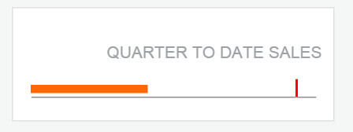
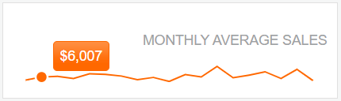
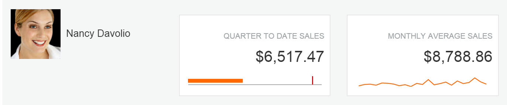

# Build the Team Efficiency Dashboard Project

## Telerik UI Charts

In this chapter you'll learn how to add Telerik UI Chart widgets to your application. The Telerik ASP.NET MVC Chart, powered by Kendo UI, is a powerful data visualization component, which allows you to graphically represent your data. It is useful when you want to utilize modern browser technologies such as SVG or Canvas (with a fallback to VML for older IE versions) for interactive data visualizations.

The component offers a variety of chart types such as area, bar, line, scatter, polar, radar, pie and donut, stock (OHLC) and many more.

### Chart API

The Chart HtmlHelper extension is a server-side wrapper for the Telerik UI Chart widget.

    @(Html.Kendo().Chart(Model) // The chart will be bound to the Model which is the InternetUsers list
        .Name("internetUsersChart") // The name of the chart is mandatory. It specifies the "id" attribute of the widget.
        .Title("Internet Users")
        .Series(series => {
            series.Bar(model => model.Value) // Create a bar chart series bound to the "Value" property
                    .Name("United States");
        })
        .CategoryAxis(axis => axis
            .Categories(model => model.Year)
        )
    )

### Bullet Series Chart

#### Overview

Begin by adding a Bullet chart, a variation of a bar chart. Bullet charts make great dashboard gauges or meters. The bullet graph compares a given quantitative measure against qualitative ranges and a symbol marker.

#### Exercise: Add a Bullet Series Chart

1. Since changes to the controller are necessary, stop the application if it is running.
1. Use partials to keep the markup tidy. Under `Views/Home/`, add a new empty partial view `_QuarterToDateSales.cshtml`.
1. In the new partial `_QuarterToDateSales.cshtml` view, add a new Telerik UI Chart helper of type `QuarterToDateSalesViewModel`. The `QuarterToDateSalesViewModel` is part of the quick start boilerplate.

    	@(Html.Kendo().Chart<KendoQsBoilerplate.QuarterToDateSalesViewModel>()

        )

1. Set the `Name` property to `EmployeeAverageSales`.

        .Name("EmployeeQuarterSales")

1. Using the `.HtmlAttributes` property, set the controls height to `30px`.

        .HtmlAttributes(new { style = "height:30px;" })

1. Next, add and define a `Bullet` chart with the following properties:

    - Set the current value to the `Current` property on the model.
    - Set the target value to the `Target` property on the model.

    ```
     .Series(series =>
     {
         series.Bullet(model => model.Current, model => model.Target);
     })
    ```

1. Next, add and configure the `CategoryAxis`. Since the chart will be a spark line visualization, set the `Visible` and `MajorGridLines` properties to `false`.

         .CategoryAxis(ca => ca.Labels(lab => lab.Visible(false))
             .MajorGridLines(m => m.Visible(false)).Visible(false)
         )

1. Next, add and configure the `ValueAxis` with a Numeric configuration. Since the chart will be a spark line visualization, set the `Labels`, `MajorGridLines`, and `MajorTicks` `Visible` properties to `false` to disable them.

    ```
        .ValueAxis(va => va.Numeric()
            .Labels(lab => lab.Visible(false))
            .MajorGridLines(m => m.Visible(false))
            .MajorTicks(mT => mT.Visible(false))
        )
    ```

1. Also set the `Legend` to `false`.

        .Legend(leg => leg.Visible(false))

1. Configure the `DataSource` by setting `Read` to the action `EmployeeQuarterSales` on the `Home` controller.
1. Using the `Data` property, set the value to `getEmployeeFilter` sending filter data back to the `Read` action.
1. Since the DataSource will be invoked manually, set `AutoBind` to `false`.

        .AutoBind(false)

    The resulting code should be like the one shown in the example below.

        @(Html.Kendo().Chart<KendoQsBoilerplate.QuarterToDateSalesViewModel>()
            .Name("EmployeeQuarterSales")
            .HtmlAttributes(new { style = "height:30px;" })
            .Series(series =>
            {
                series.Bullet(model => model.Current, model => model.Target);
            })
            .CategoryAxis(ca => ca.Labels(lab => lab.Visible(false))
                .MajorGridLines(m => m.Visible(false)).Visible(false)
            )
            .ValueAxis(va => va.Numeric()
                .Labels(lab => lab.Visible(false))
                .MajorGridLines(m => m.Visible(false))
                .MajorTicks(mT => mT.Visible(false))
            )
            .Legend(leg => leg.Visible(false))
            .DataSource(ds => ds
                .Read(read => read.Action("EmployeeQuarterSales", "Home")
                .Data("getEmployeeFilter"))
            )
            .AutoBind(false)
        )

1. Open `controllers/HomeController.cs` and create a controller action named `EmployeeQuarterSales` on the `Home` controller. This action will supply the Chart with data.
1. The boilerplate installed in the **Getting Up and Running** chapter has a function named `EmployeeQuarterSales`. This query will select the data required for the chart. Return the results of `EmployeeQuarterSalesQuery` as JSON.

    	public ActionResult EmployeeQuarterSales(int employeeId, DateTime statsTo)
        {
            DateTime startDate = statsTo.AddMonths(-3);

            var result = EmployeeQuarterSalesQuery(employeeId, statsTo, startDate);

            return Json(result, JsonRequestBehavior.AllowGet);
        }

1. Add the partial view to the main application page.
1. In `Views/Home/Index.cshtm`, find the `<!-- QTD Sales Chart -->` placeholder.

    	<!-- QTD Sales Chart -->
    	@Html.Placehold(430, 120, "Chart")

1. Replace the placeholder with the `_QuarterToDateSales` partial.

    	<!-- QTD Sales Chart -->
        @Html.Partial("_QuarterToDateSales")

<!--_-->
1. Find the scripts section. Add a new function named `refreshEmployeeQuarterSales`, this function will invoke `read` on the chart's DataSource.

    	<script>
    		...
    	</script>

    The resulting code should be like the one shown in the example below.

        function refreshEmployeeQuarterSales() {
            var employeeQuarterSales = $("#EmployeeQuarterSales").data("kendoChart");
            employeeQuarterSales.dataSource.read();
        }

1. Find and modify the `onCriteriaChange` function so it calls `refreshEmployeeQuarterSales` updating the bullet chart's data source when the filter or the employee selection is changed.

        function onCriteriaChange() {
            updateEmployeeAvatar();
            refreshGrid();
            refreshEmployeeQuarterSales();
        }

1. Run the application to see the chart render on the dashboard. Change the filter criteria to see the chart update along with other UI elements.

    

### Line Chart

#### Overview

Next, add a Line chart, a Line chart shows data as continuous lines that pass through points defined by their items' values. It can be useful for showing a trend over time and comparing several sets of similar data. For this example, you'll use a Line chart to show trend data.

#### Exercise: Trigger the Grid DataSource from a DatePicker Event

1. Since changes to the controller are necessary, stop the application if it is running.
1. Use partials to keep the markup tidy. Under `Views/Home`, add a new empty partial view `_MonthlySalesByEmployee.cshtml`.
1. In the new partial `_MonthlySalesByEmployee.cshtml` view, add a new Telerik UI Chart helper.

    	@(Html.Kendo().Chart<KendoQsBoilerplate.MonthlySalesByEmployeeViewModel>()

        )

1. Set the `Name` property to `EmployeeAverageSales`.

        .Name("EmployeeAverageSales")

1. Set the controls height to `30px`.

        .HtmlAttributes(new { style = "height:30px;" })

1. Next, add and define a Series chart with the following properties:

     - Set `Line` to the `EmployeeSales` property on the model.
     - Set the `Width` to `1.5`.
     - Disable markers by setting the `Markers` visible property to `false`.
     - Set the tooltip using a valid [number format](https://docs.telerik.com/kendo-ui/globalization/intl/numberformatting) and enabling its visibility.

    ```
        .Series(series =>
        {
            series.Line(model => model.EmployeeSales)
            .Width(1.5)
            .Markers(m => m.Visible(false))
            .Tooltip(t =>  t.Format("{0:c0}").Visible(true));
        })
    ```

1. Next, add and configure the `CategoryAxis` with a `Date` configuration. Set the Category to the `Date` field of the view model.
1. Since the chart will be a formatted like a [sparkline](https://en.wikipedia.org/wiki/Sparkline), set the `Axis` and `MajorGridLines` `Visible` properties to `false` to disable them.

         .CategoryAxis(ca => ca
             .Date()
             .Categories(model => model.Date)
             .Visible(false)
             .MajorGridLines(m => m.Visible(false))
         )

1. Next, add and configure the `ValueAxis` with a Numeric configuration.
1. Set the `Axis`, `Visible`, and `MajorGridLines` properties to `false` to disable them.

         .ValueAxis(va => va.Numeric()
             .Visible(false)
             .Labels(lab => lab.Visible(false))
             .MajorGridLines(m => m.Visible(false))
          )

1. Also set the `Legend` to `false`.

        .Legend(leg => leg.Visible(false))

1. Configure the `DataSource` by setting `Read` to the action `EmployeeAverageSales` on the `Home` controller.
1. Using the `Data` property, set the value to `getEmployeeFilter` sending filter data back to the `Read` action.
1. Add an `Aggregates` on the DataSource to `Average` the `EmployeeSales`.

        .DataSource(ds => ds
            .Read(read => read.Action("EmployeeAverageSales", "Home")
            .Data("getEmployeeFilter"))
            .Aggregates(a => a.Add(model => model.EmployeeSales).Average())
         )

1. Since the DataSource will be invoked manually, set `AutoBind` to `false`.

        .AutoBind(false)

    The resulting code should be like the one shown in the example below.

        @(Html.Kendo().Chart<KendoQsBoilerplate.MonthlySalesByEmployeeViewModel>()
            .Name("EmployeeAverageSales")
            .HtmlAttributes(new { style = "height:30px;" })
            .Series(series =>
            {
                series.Line(model => model.EmployeeSales)
                .Width(1.5)
                .Markers(m => m.Visible(false))
                .Tooltip(t =>  t.Format("{0:c0}").Visible(true));
            })

            .CategoryAxis(ca => ca
                .Date()
                .Categories(model => model.Date)
                .Visible(false)
                .MajorGridLines(m => m.Visible(false))
            )

            .ValueAxis(va => va.Numeric()
                .Visible(false)
                .Labels(lab => lab.Visible(false))
                .MajorGridLines(m => m.Visible(false))
            )
            .Legend(leg => leg.Visible(false))
            .DataSource(ds => ds
                .Read(read => read.Action("EmployeeAverageSales", "Home")
                .Data("getEmployeeFilter"))
                .Aggregates(a => a.Add(model => model.EmployeeSales).Average())
                )
            .AutoBind(false)
        )

1. Open `controllers/HomeController.cs` and create a controller action named `EmployeeAverageSales` on the `Home` controller. This action will supply the Chart with data.
1. The boilerplate installed in the **Getting Up and Running** chapter has a function named `EmployeeAverageSalesQuery`. This query will select the data required for the chart. Return the results of `EmployeeAverageSalesQuery` as JSON.

    	public ActionResult EmployeeAverageSales(
            int employeeId,
            DateTime statsFrom,
            DateTime statsTo)
        {
            var result = EmployeeAverageSalesQuery(employeeId, statsFrom, statsTo);

            return Json(result, JsonRequestBehavior.AllowGet);
        }

1. Add the partial view to the main application page. In `Views/Home/Index.cshtm` find the `<!-- Montly Sales Chart -->` placeholder.

    	<!-- Montly Sales Chart -->
    	@Html.Placehold(430, 120, "Chart")

1. Replace the placeholder with the `_MonthlySalesByEmployee` partial.

    	<!-- Montly Sales Chart -->
    	@Html.Partial("_MonthlySalesByEmployee")
<!--_-->

1. Find the scripts section and add a new function named `refreshEmployeeAverageSales`. This function will invoke `read` on the chart's data source.

    	<script>
    		...
    	</script>

    The resulting code should be like the one shown in the example below.

    	function refreshEmployeeAverageSales() {
            var employeeAverageSales = $("#EmployeeAverageSales").data("kendoChart");
            employeeAverageSales.dataSource.read();
        }

1. Find and modify the `onCriteriaChange` function so it calls `refreshEmployeeAverageSales` updating the chart's data  when a filter or employee selection is changed.

    	function onCriteriaChange() {
            updateEmployeeAvatar();
            refreshGrid();
            refreshEmployeeQuarterSales();
            refreshEmployeeAverageSales();
        }

1. Run the application to see the chart render on the dashboard. Change the filter criteria to see the chart update along with other UI elements.

    

### Client-Side API

#### Overview

Charts, like other Kendo UI widgets are easy to interact with on the client side. By handling the chart's events additional functionality can be added to the application. Use the `DataBound` event and the `DataSource` to populate values on labels within the Team Efficiency Dashboard.

#### Exercise: Display Chart Values Using Client APIs

1. In `Views/Home/Index.cshtm`, find the scripts section.

    	<script>
    		...
    	</script>

1. Add a function named `onQuarterSalesDataBound`, find the first element of the datasource and displays the Current value in `EmployeeQuarterSalesLabel`.

        function onQuarterSalesDataBound(e) {
            var data = this.dataSource.at(0);
            $("#EmployeeQuarterSalesLabel").text(kendo.toString(data.Current, "c2"));
        }

1. Add a function named `onAverageSalesDataBound` find the `dataSource` aggregates and display the average of `EmployeeSales` in the `EmployeeAverageSalesLabel`.

    	function onAverageSalesDataBound(e) {
            var label = $("#EmployeeAverageSalesLabel"),
                data = this.dataSource.aggregates()

            if (data.EmployeeSales) {
                label.text(kendo.toString(data.EmployeeSales.average, "c2"));
            } else {
                label.text(kendo.toString(0, "c2"));
            }
        }

1. Open the partial view `_MonthlySalesByEmployee.cshtml` and add a `DataBound` event handler to the chart, set the event handler to `onQuarterSalesDataBound`.

        @(Html.Kendo().Chart<KendoQsBoilerplate.MonthlySalesByEmployeeViewModel>()
            ...
    	    .AutoBind(false)
            .Events(e => e.DataBound("onAverageSalesDataBound"))
    	)

1. Open the partial view `_QuarterToDateSales.cshtml` and add a `DataBound` event handler to the chart. Set the event handler to `onQuarterSalesDataBound`.

        @(Html.Kendo().Chart<KendoQsBoilerplate.QuarterToDateSalesViewModel>()
            ...
            .AutoBind(false)
            .Events(e => e.DataBound("onQuarterSalesDataBound"))
        )

    

The Team Efficiency Dashboard is starting to look complete, but it hasn't been tested for devices like mobile phones or tablets yet. In the next chapter you'll use responsive web design techniques to support devices beyond the desktop.
