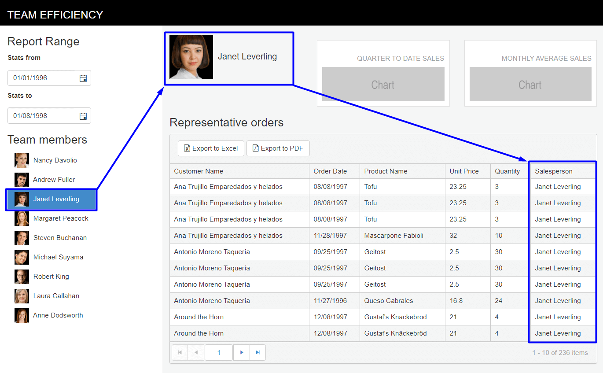
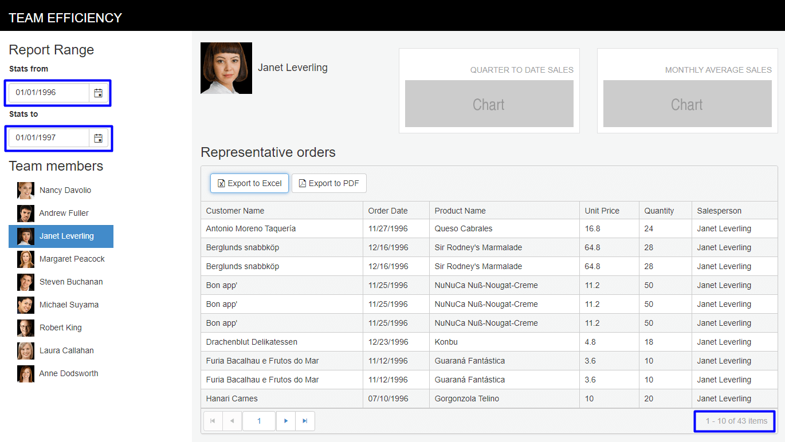

# Build the Team Efficiency Dashboard Project

## Step 7: Telerik UI Datasource

In this chapter you'll learn how to work with Telerik UI datasources.

### Working with the Telerik UI Datasource

#### Overview

The [Kendo UI DataSource component](https://demos.telerik.com/kendo-ui/datasource/index) plays a central role in practically all web applications built with Kendo UI. It is an abstraction for using local data arrays of JavaScript objects or remote data web services returning JSON, JSONP, [OData](http://www.odata.org/) or XML.

The Kendo UI DataSource has many abilities and responsibilities, among which to:

- [Retrieve data from a remote endpoint](https://docs.telerik.com/kendo-ui/framework/datasource/cors).
- Maintain the [structure and type of the data (schema)](https://docs.telerik.com/kendo-ui/framework/datasource/crud#setting-the-schema).
- Process serialization formats to and from a remote endpoint.
- [Synchronize updates, create, update, delete](https://docs.telerik.com/kendo-ui/framework/datasource/crud) to and from a remote endpoint.
- [Maintain an in-memory cache of data, including changes](https://docs.telerik.com/kendo-ui/framework/datasource/offline) for updating to a remote endpoint.
- Calculate and maintain [aggregates](https://docs.telerik.com/kendo-ui/api/javascript/data/datasource/methods/aggregate), [sorting order](https://docs.telerik.com/kendo-ui/api/javascript/data/datasource/methods/sort) and [paging](https://docs.telerik.com/kendo-ui/api/javascript/data/datasource/methods/page).
- Provide a query mechanism via [filter expressions](https://docs.telerik.com/kendo-ui/api/javascript/data/datasource/methods/filter).

For detailed information on the capabilities of the [DataSource](https://docs.telerik.com/kendo-ui/framework/datasource/overview), refer to its [configuration API methods, and events](https://docs.telerik.com/kendo-ui/api/javascript/data/datasource), and [demos](https://demos.telerik.com/kendo-ui/datasource/index).

At this point the dashboard is showing all invoice data. Let's use the `EmployeeList` list view and `StatsFrom`/`StatsTo` date pickers to filter the invoice grid by invoking the grid's datasource.

#### Exercise: Create a Filter

1. In the `/Views/Home/Index.cshtml` view, find the scripts section.

    	

1. Add a function named `getEmployeeFilter` that gets the `employeeId`, `salesPerson`, `statsFrom` and `statsTo` values and returns a JSON object.

    The resulting code should be like the one shown in the example below.

        function getEmployeeFilter() {
            var employee = getSelectedEmployee(),
                statsFrom = $("#StatsFrom").data("kendoDatePicker"),
                statsTo = $("#StatsTo").data("kendoDatePicker");

            var filter = {
                employeeId: employee.EmployeeId,
                salesPerson: employee.FullName,
                statsFrom: statsFrom.value(),
                statsTo: statsTo.value()
            }
            return filter;
        }

1. In the `/Views/Invoice/Index.cshtml` view, find the `EmployeeSales` grid.

    	@(Html.Kendo().Grid<KendoQsBoilerplate.Invoice>()
    	      .Name("EmployeeSales")
    		  ...
    	      .Scrollable(scrollable => scrollable.Enabled(false))
    	      .DataSource(dataSource => dataSource
    	          .Ajax()
    	          .Read(read => read.Action("Invoices_Read", "Invoice"))
    	      )
    	)

1. On the grid's `DataSource` property, set the `Data` property to `getEmployeeFilter`. The `Data` property supplies additional data to the server. In this case the data is our filter parameters.

        .DataSource(dataSource => dataSource
                    .Ajax()
                    .Read(read => read.Action("Invoices_Read", "Invoice")
                    .Data("getEmployeeFilter"))
        )

1. Add the property `AutoBind` to the end of the property chain and set the value to `false`. Setting `AutoBind` to `false` tells the Telerik UI for MVC that the datasource's `Read` action is invoked manually on the client.

    The resulting code should be like the one shown in the example below.

    	@(Html.Kendo().Grid<KendoQsBoilerplate.Invoice>()
    	      .Name("EmployeeSales")
    	      ...
    	      .Scrollable(scrollable => scrollable.Enabled(false))
    	      .DataSource(dataSource => dataSource
    	          .Ajax()
    	          .Read(read => read.Action("Invoices_Read", "Invoice")
    	          .Data("getEmployeeFilter"))
    	      )
    		  .AutoBind(false)
    	)

1. In the `/Views/Home/Index.cshtml` view, add a function named `refreshGrid`. This function will invoke the grid's `Read` action.

    	function refreshGrid() {
            var employeeSales = $("#EmployeeSales").data("kendoGrid");
            employeeSales.dataSource.read();
        }

1. Find the `onCriteriaChange` function and add a call to the `refreshGrid` function. This will cause the Grid's data to refresh whenever the employee selection changes.

    	function onCriteriaChange() {
            updateEmployeeAvatar();
            refreshGrid();
    	}

    Next, we'll need to update the grid's `Read` action to apply the filter using Entity Framework.

1. Open `Controllers/InvoiceController.cs` and find the `Invoices_Read` action.

        public ActionResult Invoices_Read([DataSourceRequest]DataSourceRequest request)
        {
            IQueryable<Invoice> invoices = db.Invoices;
            DataSourceResult result = invoices.ToDataSourceResult(request, invoice => new {
                OrderID = invoice.OrderID,
                CustomerName = invoice.CustomerName,
                OrderDate = invoice.OrderDate,
                ProductName = invoice.ProductName,
                UnitPrice = invoice.UnitPrice,
                Quantity = invoice.Quantity,
                Salesperson = invoice.Salesperson
            });

            return Json(result);
        }

1. Add the `salesPerson`, `statsFrom` and `statsTo` parameters to the action. Note that the additional parameters match the parameters returned by the `getEmployeeFilter` function exactly.

        public ActionResult Invoices_Read([DataSourceRequest]DataSourceRequest request,
            string salesPerson,
            DateTime statsFrom,
            DateTime statsTo)

1. Using the parameter values, filter the invoices using a `Where` LINQ query.

    The resulting code should be like the one shown in the example below.

        public ActionResult Invoices_Read([DataSourceRequest]DataSourceRequest request,
            string salesPerson,
            DateTime statsFrom,
            DateTime statsTo)
        {
            var invoices = db.Invoices.Where(inv => inv.Salesperson == salesPerson)
                .Where(inv => inv.OrderDate >= statsFrom && inv.OrderDate <= statsTo);
            DataSourceResult result = invoices.ToDataSourceResult(request, invoice => new {
                OrderID = invoice.OrderID,
                CustomerName = invoice.CustomerName,
                OrderDate = invoice.OrderDate,
                ProductName = invoice.ProductName,
                UnitPrice = invoice.UnitPrice,
                Quantity = invoice.Quantity,
                Salesperson = invoice.Salesperson
            });

            return Json(result);
        }

1. Run the project to see the behavior. Now the `EmployeeList` and `EmployeeSales` grid are in sync. When an employee is selected, only that employee's data will show in the grid.

    

At this point, the `EmployeeList` is acting as a filter for the `EmployeeSales`. However, the data shown does not reflect the `StatsFrom`/`StatsTo` date range. With the filtering code in place, additional controls are wired up with relative ease. Let's wire up the `StatsFrom`/`StatsTo` DatePickers to `EmployeeSales`.

#### Exercise: Trigger the Grid DataSource from a DatePicker Event

1. In the `/Views/Home/Index.cshtml` view, find the StatsFrom DatePicker.

        @(Html.Kendo().DatePicker()
            .Name("StatsFrom")
            .Value(new DateTime(1996, 1, 1))
    	)

1. Add the `Events` property and set the `Change` event to `onCriteriaChange`.

        @(Html.Kendo().DatePicker()
            .Name("StatsFrom")
            .Value(new DateTime(1996, 1, 1))
            .Events(e => e.Change("onCriteriaChange"))
    	)

1. Find the `StatsTo` DatePicker, set the `Events` property, and set the `Change` event to `onCriteriaChange`.

        @(Html.Kendo().DatePicker()
    		.Name("StatsTo")
    		.Value(new DateTime(1998, 8, 1))
    		.Events(e => e.Change("onCriteriaChange"))
    	)

1. Save the changes and refresh the browser. `StatsFrom`/`StatsTo` and `EmployeeList` will update `EmployeeSales` with data based on the selected dates and employee.

    

Your Team Efficiency Dashboard is now interactive. Users can filter data using dates and employees. Next, you'll enhance the application by adding some data visualizations.