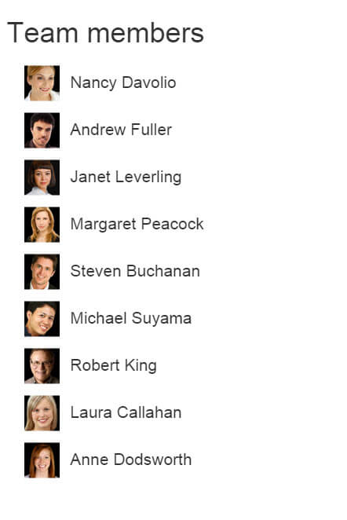

# Build the Team Efficiency Dashboard Project

## Step 5: Telerik UI ListView

In this chapter you will learn about the Telerik UI ListView control and client-side templates. Using the ListView you'll create a list of employees containing the employee's full name and avatar image. This ListView will allow users to interact with the dashboard by filtering the data.

### The ListView Control

#### Overview

The purpose of [Telerik UI ListView](https://docs.telerik.com/kendo-ui/controls/listview/overview) is to display a custom layout of data-bound items through templates. The ListView is ideally suited for scenarios where you wish to display a list of items in a consistent manner.

The ListView is designed to put you back in control when it comes to displaying data. It does not provide a default rendering of data-bound items, but, instead, relies entirely on templates to define how a list of items&mdash;including alternating items and items being edited&mdash;is displayed.

    @(Html.Kendo().ListView<KendoQsBoilerplate.Employee>()//The listview data source will infer the Employee Model properties and their types
        .Name("EmployeesList") // Name is mandatory. It specifies the "id" attribute of the widget.
        .TagName("ul") // TagName is mandatory. It specifies the element which wraps all listview items.
        .ClientTemplateId("EmployeeItemTemplate") // The template is mandatory and will be used for rendering the listview items.
        .DataSource(dataSource => {
            dataSource.Read(read => read.Action("EmployeesList_Read", "Home"));
        }) 
        .Selectable(s => s.Mode(ListViewSelectionMode.Single))
    )

Use a ListView to create a selectable list of employees containing the employee's full name and avatar image.

#### Exercise: Add a ListView to the Dashboard

1. Open `/Views/Home/Index.cshtml` and find the `<!-- Employee List View -->` placeholder.
1. Remove the `<ul>` and its child elements that follow `<!-- Employee List View -->`.
1. Now add a Telerik UI ListView of type `KendoQsBoilerplate.Employee` using the `@(Html.Kendo().ListView<KendoQsBoilerplate.Employee>()` Fluent HTML Helper.
1. Set the `Name` property to `"EmployeesList"`.

        .Name("EmployeesList")

1. Set the `ClientTemplateId` property to `"EmployeeItemTemplate"`. The template `EmployeeItemTemplate` will be created later in the exercise.

        .ClientTemplateId("EmployeeItemTemplate")

1. Set the `TagName` property to `"ul"`. The `TagName` is the element type that will wrap the ListView items when the control is rendered. In this case, we're creating an unordered list element.

        .TagName("ul")

1. Set the `DataSource` read action to `"EmployeeList_Read"` and the controller to `"Home"`. The action will be created later in the exercise.

        .DataSource(dataSource =>
        {
            dataSource.Read(read => read.Action("EmployeesList_Read", "Home"));
        })

1. Set the select mode by setting the `Selectable` property to `ListViewSelectionMode.Single`.

        .Selectable(s => s.Mode(ListViewSelectionMode.Single))

    The resulting code should look like the one in the example below.

    	<!-- Employee List View -->
    	@(Html.Kendo().ListView<KendoQsBoilerplate.Employee>()
            .Name("EmployeesList")
            .ClientTemplateId("EmployeeItemTemplate")
            .TagName("ul")
            .DataSource(dataSource =>
            {
                dataSource.Read(read => read.Action("EmployeesList_Read", "Home"));
            })
            .Selectable(s => s.Mode(ListViewSelectionMode.Single))
        )

Now that the ListView is defined, you'll need to supply the datasource with the employee data by creating the `read` action for the ListView.

#### Exercise: Create the EmployeesList_Read Action

1. Since you will need to update the `HomeController`, stop the project if it is already running.

1. Open `Controllers/HomeController.cs` and add a reference to `Kendo.Mvc.UI` and `Kendo.Mvc.Extensions`. These dependencies are needed for the `DataSourceRequest` object and `.ToDataSourceResult` extension method.

    At the top of the file you should have the statements as shown in the example below.

    	using Kendo.Mvc.UI;
    	using Kendo.Mvc.Extensions;

1. Now, create an `ActionResult` named `EmployeesList_Read` that accepts a `DataSourceRequest` parameter. The parameter of type `DataSourceRequest` will contain the current ListView request information. Decorate that parameter with the `DataSourceRequestAttribute` which is  responsible for populating the `DataSourceRequest` object.

        public ActionResult EmployeesList_Read([DataSourceRequest]DataSourceRequest request)
        {
        }

1. Use entity framework to query a list of employees, ordered by `FirstName` from the database and return the result as `Json` using the `.ToDataSourceResult` extension method. The method will format the data to be consumed by the ListView.

        public ActionResult EmployeesList_Read([DataSourceRequest]DataSourceRequest request)
        {
            var employees = db.Employees.OrderBy(e => e.FirstName);
            return Json(employees.ToDataSourceResult(request, ModelState), JsonRequestBehavior.AllowGet);
        }

The ListView is almost complete. However, the ListView still needs a template to apply to the data when it is rendered to the page. In the previous exercise the `ClientTemplateId` was defined, but was not created. Let's learn about Kendo UI Templating and complete the ListView.

### Kendo UI Templates

### Overview

The [Kendo UI Templates](https://docs.telerik.com/kendo-ui/framework/templates/overview) provide a simple-to-use, high-performance JavaScript templating engine within the Kendo UI framework. Templates offer a way to create HTML chunks that can be automatically merged with JavaScript data. They are a substitute for traditional HTML string building in JavaScript.

Kendo UI Templates use a simple templating syntax called hash templates. With this syntax, the `#` (hash) sign is used to mark areas in a template that should be replaced by data when the template is executed. The `#` character is also used to signify the beginning and end of custom JavaScript code inside the template.

There are three ways to use the hash syntax:

- Render values as HTML: `#= #`.
- Use HTML encoding to display values: `#: #`.
- Execute arbitrary JavaScript code: `# if (true) { # ... non-script content here ... # } #`.

    

#### Exercise: Create the ListView Template for Showing Employees

1. Open `/Views/Home/Index.cshtml` and find the `<!-- Kendo Templates -->` placeholder.
1. After `<!-- Kendo Templates -->`, add a new `
    	<!-- /Kendo Templates -->

1. Inside the template, create a `<li>` and set the class to `employee`.
1. Add a `
` element inside the `<li>`. Inside the `
`, add an image that corresponds to the `EmployeeId` by setting the `src` to `"@(Url.Content("~/content/employees/"))#:EmployeeId#-t.png"` and a `` with the template field `#: FullName #`.

    The resulting code should be like the one shown below.

    	<!-- Kendo Templates -->
    	
    	<!-- /Kendo Templates -->

1. Run the application to see the ListView in action.

If everything was done correctly, the ListView should look like the one shown below.

At this point you can select items from the list, but before the dashboard can become truly interactive you'll need to work with the client-side APIs.