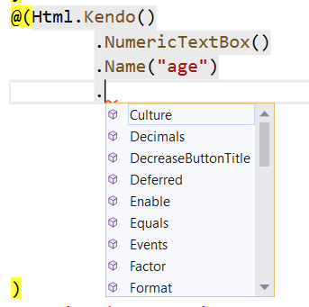
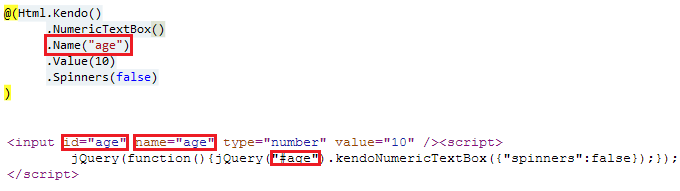
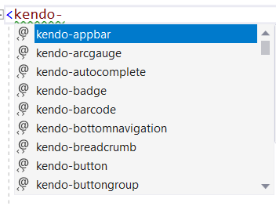

# Fundamentals

Telerik UI for ASP.NET Core is a set of server-side wrappers (HTML and tag helpers) that allow you to use the Kendo UI components in .NET Core.

For more information on the difference between helpers and components, refer to the [Telerik UI for ASP.NET Core introduction article](#widgets-vs-helpers).

As of the jQuery 3.0 release, the [document-ready handlers are called asynchronously](https://api.jquery.com/ready/). As a result, regardless of whether the document is ready at the point of execution or not, the code placed outside a document-ready handler is executed before the code within the handler. This change affects the usage of the Telerik UI for ASP.NET Core components because the components for the MVC helpers are initialized in a document-ready handler. This means that after the jQuery 3.0 release you need to get the reference of a component and its API calls within a document-ready handler.

## Basic Configuration

Telerik UI for ASP.NET Core provides configuration options for setting the supported [HTML Helper](#html-helpers) and [Tag Helper](#tag-helpers) components.

### HTML Helpers

The HTML Helper options are exposed through a [fluent interface](https://en.wikipedia.org/wiki/Fluent_interface).



To set an option for a helper, call the corresponding method and pass the required option value.

    @(Html.Kendo().NumericTextBox()
          .Name("name") // Set the name of the NumericTextBox.
          .Value(10) // Set the value.
          .Spinners(false) // Disable the spinners.
    )

You have to set the `Name` option of the helper. The value will be used as the `id` and `name` HTML attributes&mdash;the `name` attribute is set only for input helpers such as the DatePicker, NumericTextBox, and DropDownList. The `id` attribute is used to initialize the helper. The id (`Name`) of a helper has to meet the requirements for valid HTML `ID` attributes. It must not contain spaces and special characters and has to start with a letter.

> The `Name` options of the helpers have to be always unique in the context of the whole web page. If a partial view is loaded multiple times, each instance of this partial view has to render all helpers with unique `Name` (id) options. If this requirement is not met, the page will render duplicate element IDs and only the helper instance which occurs first in the markup will be initialized and will work properly.



Alternatively, you can use the `NumericTextBoxFor` setting. All Telerik UI helpers which accept a value can be initialized with the `[WidgetName]For` method. For example, to initialize the DatePicker, use `DatePickerFor`. These methods automatically set the `Name` of the helper. In this way, `@Html.Kendo().NumericTextBoxFor(model => model.Age)` is the same as `@Html.Kendo().NumericTextBox().Name("Age").Value(Model.Age)`.

### Tag Helpers

You can configure the Tag Helpers through the predefined strongly typed attributes which also provide IntelliSense. Complex and composite properties, as well as nested configuration tags, are not supported.



To configure an ASP.NET Core project that enables you to use a Telerik UI Tag Helper, add the `@addTagHelper` directive to your `cshtml` file. Also, you can globally add the directive in `Views/_ViewImports.cshtml`.

        @addTagHelper "*, Kendo.Mvc"

Add the desired options as attributes and set their value.

```TagHelper
    <kendo-numerictextbox name="currency" //Ensure that the attribute `name` is unique in the context of the whole web page.
        format="c" min="0" spinners="false" enable="true" max="100" value="10">
    </kendo-numerictextbox>
```

When binding a Tag Helper editor to a Model property, use the attribute `for`. It will automatically set the `name` attribute to the name of the Model property.

```TagHelperFor
    <kendo-numerictextbox for="currency" format="c" min="0" spinners="false" max="200">
    </kendo-numerictextbox>
```

## Referencing Client-Side Objects

You can get a reference to the client-side object that is initialized by the helper through the [`data`](http://api.jquery.com/data/) jQuery method. Use the `Name` of the component in an `ID` jQuery selector, and obtain the reference in a `document.ready` handler which is placed or called after the component is declared. This ensures that the component is already initialized and the client-side object exists. After you get the object reference, use the client-side API of the component.

```HtmlHelper
    @(Html.Kendo().NumericTextBox()
        .Name("age")
    )
```
```TagHelper
    <kendo-numerictextbox name="age" value="10">
    </kendo-numerictextbox>
```
```script
    $(function(){
        var numeric = $("#age").data("kendoNumericTextBox");
        numeric.value(10);
    });

```

If you have deferred the initialization of the component, make sure you get its instance after calling `DeferredScripts`, `DeferredScriptsFor` or `DeferredScriptFile`.

```HtmlHelper
    @(Html.Kendo().NumericTextBox()
        .Name("age")
        .Deferred()
    )

    .....

    @Html.Kendo().DeferredScripts()
```
```TagHelper
    <kendo-numerictextbox name="age" deferred="true">
    </kendo-numerictextbox>

    .....

    @Html.Kendo().DeferredScripts()
```
```script
    $(function(){
        var numeric = $("#age").data("kendoNumericTextBox");
        numeric.value(10);
    });

```

## See Also

* [Deferred Initialization]()
* [Using Client Templates]()
* [JSON Serialization]()
