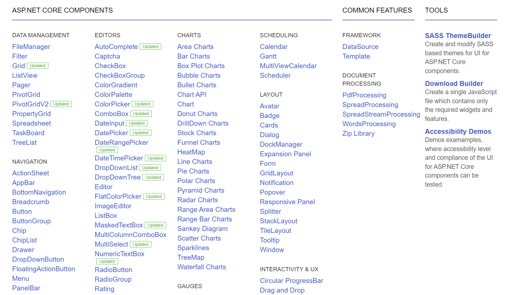
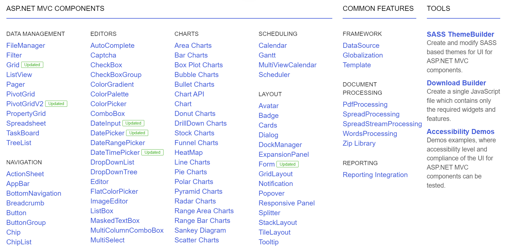

# Sample Application


Telerik UI for ASP.NET Core comes with a sample .NET Core application, which is built with Visual Studio 2022. The application allows you to run the [Demos](https://demos.telerik.com/{{ site.platform }}/) locally, and you can inspect more closely how they are implemented. You can also experiment with them while you get accustomed to the product.

## Running the Sample Application
To run the sample application in Visual Studio 2022:

1. Navigate to the Telerik UI for ASP.NET Core installation directory: `C:\Program Files (x86)\Progress\Telerik UI for ASP.NET Core [...release...]`

1. Open the Visual Studio 2022 sample project: `wrappers\aspnetcore\Examples\AspNet.Core\VS2022\Kendo.Mvc.Examples\Kendo.Mvc.Examples.csproj`.

1. Press `CTRL+F5` to build and run the application.
1. The browser loads the start page of the sample application.

The sample application project for Visual Studio contains the following items:

* `Views`&mdash;The Razor views.
* `Controllers`&mdash;The Controller classes.
* `Models`&mdash;The Model classes.
* `wwwroot`&mdash;The web application root with the `App_Data` folder, which contains the LocalDB sample database and other client resources such as libraries, scripts, styles, and others.


Telerik UI for ASP.NET MVC comes with a sample ASP.NET MVC 5 application. Telerik UI for ASP.NET MVC comes with a sample ASP.NET MVC 5 application. The application allows you to run the [Demos](https://demos.telerik.com/{{ site.platform }}/) locally, and you can inspect more closely how they are implemented. You can also experiment with them while you get accustomed to the product.

To run the sample application:

1. Navigate to the installation directory of Telerik UI for ASP.NET MVC: `C:\Program Files (x86)\Progress\Telerik UI for ASP.NET MVC [...release...]`
1. Open the `wrappers\aspnetmvc\Examples\MVC5\Kendo.Mvc.Examples.sln` solution file in Visual Studio:
1. Install Microsoft .NET Framework version 4.6.2 or later.
1. Press `CTRL+F5` to build and run the application.
1. The browser loads the start page of the sample application.

The sample application Visual Studio Project contains the following items:

* `Views`&mdash;The Razor views.
* `Controllers`&mdash;The Controller classes.
* `Models`&mdash;The Model classes.
* `App_Data`&mdash;The LocalDB sample database.


## See Also


* [First Steps on Visual Studio for Windows (Online Guide)]()

* [First Steps with Telerik UI for ASP.NET MVC]()

* [Getting Started with the Telerik Project Templates]()
