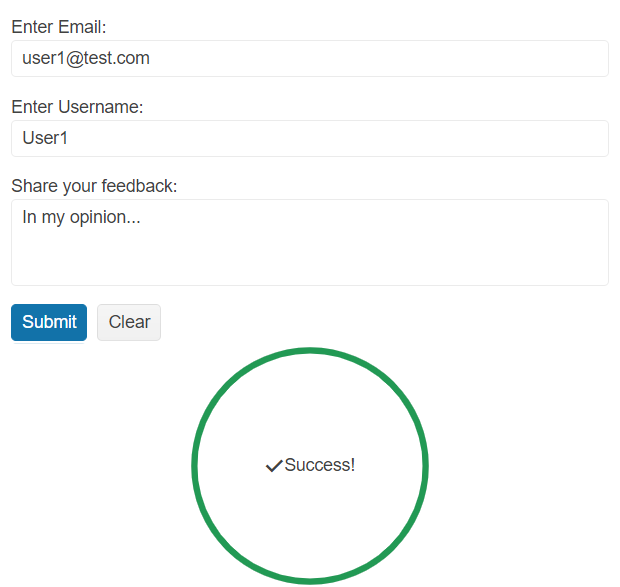

# Getting Started with the Circular ProgressBar

This tutorial explains how to set up a basic Telerik UI for {{ site.framework }} Circular ProgressBar and highlights the major steps in the configuration of the component.

You will initialize a hidden Circular ProgressBar that will be displayed when a [Form]() is completed and validated successfully. Next, you will learn how to reference the client-side instance of the component and control its behavior by using the available API methods. Finally, you can run the sample code in [Telerik REPL](https://netcorerepl.telerik.com/) and continue exploring the components.

 

@[template](/_contentTemplates/core/getting-started-prerequisites.md#repl-component-gs-prerequisites)

## 1. Prepare the CSHTML File

@[template](/_contentTemplates/core/getting-started-directives.md#gs-adding-directives)

Optionally, you can structure the View content by adding the desired HTML elements like headings, divs, paragraphs, and others.

```HtmlHelper
    @using Kendo.Mvc.UI

    <h4>Submit your feedback</h4>
    <div class="main-container">
        <div class="form-container">

        </div>
        <div class="progressbar-container">

        </div>
    </div>
```

```TagHelper
    @addTagHelper *, Kendo.Mvc

    <h4>Submit your feedback</h4>
    <div class="main-container">
        <div class="form-container">

        </div>
        <div class="progressbar-container">

        </div>
    </div>
```


## 2. Initialize the Circular ProgressBar

Use the Circular ProgressBar HtmlHelper or TagHelper to add the component to a page:

* The `Name()` configuration method is mandatory as its value is used for the `id` and the `name` attributes of the Circular ProgressBar element.
* The `Value()` option specifies the initial component value (a number between 0 and 100).

Set `display: none;` to the `div` container that wraps the component to ensure that it is hidden when the page loads.

```HtmlHelper
    @using Kendo.Mvc.UI

    <div class="progressbar-container" style="display: none;">
        @(Html.Kendo().CircularProgressBar()
            .Name("form-progressbar")
            .Value(0)
        )
    </div>
```

```TagHelper
    @addTagHelper *, Kendo.Mvc

    <div class="progressbar-container" style="display: none;">
        <kendo-circularprogressbar name="form-progressbar" value="0">
        </kendo-circularprogressbar>
    </div>
```


## 3. Configure the Form Component

The next step is to create a basic [Form]() component with three required fields and handle the `Submit` and `ValidateField` Form events. For more information on how to subscribe to these events, [refer to the Form Events article](). 

```HtmlHelper
    @using Kendo.Mvc.UI

    <div class="form-container">
        @(Html.Kendo().Form<Kendo.Mvc.Examples.Models.Form.UserViewModel>()
            .Name("formExample")
            .Events(ev => ev.Submit("onSubmit").ValidateField("onValidateField"))
            .HtmlAttributes(new { action = "Index", method = "POST" })
            .Items(i =>
            {
                i.Add()
                    .Field(f => f.Email)
                    .InputHtmlAttributes(new { @type="email", @required="required" })
                    .Label(l => l.Text("Enter Email:"));
                i.Add()
                    .Field(f => f.UserName)
                    .InputHtmlAttributes(new {@required="required" })
                    .Label(l => l.Text("Enter Username:"));
                i.Add()
                    .Field(f => f.Feedback)
                    .InputHtmlAttributes(new { @required="required" })
                    .Label(l => l.Text("Share your feedback:"))
                    .Editor(e => e.TextArea().Rows(3));
            })
        )
    </div>
```

```TagHelper
    @addTagHelper *, Kendo.Mvc

    @model Kendo.Mvc.Examples.Models.Form.UserViewModel

    <div class="form-container">
        <kendo-form name="formExample" form-data="@Model" on-validate-field="onValidateField" on-submit="onSubmit" action="Index" method="POST">
            <form-items>
                <form-item field="Email" html-attributes='new Dictionary<string, object> { { "required", "required" }, { "type", "email" } }'>
                    <item-label text="Enter Email:">
                </form-item>
                <form-item field="UserName" html-attributes='new Dictionary<string, object> { { "required", "required" } }'>
                    <item-label text="Enter Username:">
                </form-item>
                <form-item field="Feedback" html-attributes='new Dictionary<string, object> { { "required", "required" } }'>
                    <item-label text="Share your feedback:">
                    <textarea-editor rows="3"></textarea-editor>
                </form-item>
            </form-items>
        </kendo-form>
    </div>
```

```Script
    <script>
        function onValidateField(e){
            // Form ValidateField event handler.
        }

        function onSubmit(e) {
            // Form Submit event handler.
        }
    </script>
```

## 4. Display the Circular ProgressBar

Now, you can implement the client-side logic that will validate the Form and display the Circular ProgressBar if all fields are completed successfully.

* Prevent the default action of the Form [`Submit`](https://docs.telerik.com/aspnet-core/api/kendo.mvc.ui.fluent/formeventbuilder#submitsystemstring) event and call the [`validate()`](https://docs.telerik.com/kendo-ui/api/javascript/ui/form/methods/validate) method to validate the fields when the Form is submitted. If method returns `true` (the Form is valid), add the following logic:
    1. Use the jQuery [`show()`](http://api.jquery.com/show/) method to show the hidden container that holds the Circular ProgressBar.
    1. Get a reference to the Circular ProgressBar and trigger its [`redraw()`](https://docs.telerik.com/kendo-ui/api/javascript/ui/circularprogressbar/methods/redraw) method to redraw it when it is displayed.
    1. Set the Circular ProgressBar value to `100` through its [`value()`](https://docs.telerik.com/kendo-ui/api/javascript/ui/circularprogressbar/methods/value) method. As a result, the component will indicate the task completion.

    Also, you can set the [`opacity`](https://developer.mozilla.org/en-US/docs/Web/CSS/opacity) CSS property to the Form container during the progress loading for a better look and feel.

    ```Scripts
        <script>
            function onSubmit(e) {
                e.preventDefault();
                $(".form-container").css("opacity", "0.3");
                if(e.sender.validate()) {
                    $(".progressbar-container").show();
                    $("#form-progressbar").data("kendoCircularProgressBar").redraw();
                    $("#form-progressbar").data("kendoCircularProgressBar").value(100);
                }
                setTimeout(function(){
                    $(".form-container").css("opacity", "1");
                },1000);
            }
        </script>
    ```
* In the Form [`ValidateField`](https://docs.telerik.com/aspnet-core/api/kendo.mvc.ui.fluent/formeventbuilder#validatefieldsystemstring) event handler, check the validation state of the field and use the jQuery [`hide()`](http://api.jquery.com/hide/) method to hide the `div` container that holds the Circular ProgressBar if it is `false`. This way, the  Circular ProgressBar will be hidden when any Form field is invalid.

    ```Scripts
        <script>
            function onValidateField(e) {
                if(!e.valid) {
                    $(".progressbar-container").hide();
                }
            }
        </script>
    ```
* Handle the `click` event of the Form `Clear` button and hide the Circular ProgressBar container when the values of the Form fields are cleared.

    ```Scripts
        <script>
            $(document).ready(function(){
                $(".k-form-clear").on("click", function(){
                    $(".progressbar-container").hide();
                });
            });
        </script>
    ```

## 5. Customize the Appearance of the Circular ProgressBar

To enhance the appearance of the Circular ProgressBar, use the `CenterTemplate()` option when using the HtmlHelper version of the component and the `center-template` attribute when using the TagHelper configuration, to specify the desired content that will be displayed in the center of the progress bar. 

```HtmlHelper
    @using Kendo.Mvc.UI

    <div class="progressbar-container" style="display: none;">
        @(Html.Kendo().CircularProgressBar()
            .Name("form-progressbar")
            .Value(0)
            .CenterTemplate("<span class='k-icon k-i-check'></span>Success!")
        )
    </div>
```

```TagHelper
    @addTagHelper *, Kendo.Mvc

    <div class="progressbar-container" style="display: none;">
        <kendo-circularprogressbar name="form-progressbar" value="0" 
            center-template="<span class='k-icon k-i-check'></span>Success!">
        </kendo-circularprogressbar>
    </div>
```


In additon, you can adjust the default Circular ProgressBar color through the `Colors` configuration when using the HtmlHelper component definition and the `<colors>` child tag when using the TagHelper definition.

```HtmlHelper
    @using Kendo.Mvc.UI

    <div class="progressbar-container" style="display: none;">
        @(Html.Kendo().CircularProgressBar()
            .Name("form-progressbar")
            .Value(0)
            .CenterTemplate("<span class='k-icon k-i-check'></span>Success!")
            .Colors(c =>
            {
                c.Add().Color("#229954").From(0).To(100);
            })
        )
    </div>
```

```TagHelper
    @addTagHelper *, Kendo.Mvc

    <div class="progressbar-container" style="display: none;">
        <kendo-circularprogressbar name="form-progressbar" value="0" 
            center-template="<span class='k-icon k-i-check'></span>Success!">
            <colors>
                <color from="0" to="100" color="#229954"/>
            </colors>
        </kendo-circularprogressbar>
    </div>
```


## 6. (Optional) Reference Existing Circular ProgressBar Instances

You can reference the Circular ProgressBar instance that you have created, [as demonstrated in Step 4](#4-display-the-circular-progressbar), and build on top of its existing configuration:

1. Use the `Name()` option of the component to establish a reference.

    ```script
        <script>
            $(document).ready(function() {
                var progressBarReference = $("#form-progressbar").data("kendoCircularProgressBar"); // progressBarReference is a reference to the existing Circular ProgressBar instance of the helper.
            });
        </script>
    ```

1. Use the [Circular ProgressBar client-side API](https://docs.telerik.com/kendo-ui/api/javascript/ui/circularprogressbar#methods) to control the behavior of the widget. In this example, you will use the `setOptions()` method to change the current color of the Circular ProgressBar dynamically (for example, when a button is clicked), and the `redraw()` method to redraw the component with the updated color.

    ```HtmlHelper
        @(Html.Kendo().Button()
            .Name("btn")
            .Content("Update Circular ProgressBar color")
            .Events(ev => ev.Click("onBtnClick")))
    ```
    
    ```TagHelper
        @addTagHelper *, Kendo.Mvc

        <kendo-button name="btn" on-click="onBtnClick">
            Update Circular ProgressBar color
        </kendo-button>
    ```
    
    ```Scripts
        <script>
            function onBtnClick() {
                var progressBarReference = $("#form-progressbar").data("kendoCircularProgressBar");
                progressBarReference.setOptions({color: "#02b8fa"});
                progressBarReference.redraw();
            }
        </script>
    ```

For more information on referencing specific helper instances, see the [Methods and Events]() article.


## Explore this Tutorial in REPL

You can continue experimenting with the code sample above by running it in the Telerik REPL server playground:

* [Sample code with the Circular ProgressBar HtmlHelper](https://netcorerepl.telerik.com/cHEsbQvp429ru6uN50)
* [Sample code with the Circular ProgressBar TagHelper](https://netcorerepl.telerik.com/GHaMPmlf457Jg75U06)



## Next Steps

* [Using the Indeterminate mode of the Circular ProgressBar for {{ site.framework }} (Demo)](https://demos.telerik.com/{{ site.platform }}/circularprogressbar/indeterminate)

## See Also

* [Using the API of the Circular ProgressBar for {{ site.framework }} (Demo)](https://demos.telerik.com/{{ site.platform }}/circularprogressbar/api)
* [Client-Side API of the Circular ProgressBar](https://docs.telerik.com/kendo-ui/api/javascript/ui/circularprogressbar)
* [Server-Side API of the Circular ProgressBar](/api/circularprogressbar)
* [Knowledge Base Section](/knowledge-base)
