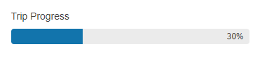

# Getting Started with the ProgressBar

This tutorial explains how to set up the Telerik UI for {{ site.framework }} ProgressBar and goes through the steps in the configuration of the component.

You will declare a ProgressBar component. Next, you will set a default value and configure how the ProgressBar displays the achieved progress. Then, you will learn to handle the JavaScript events of the ProgressBar and to access a client-side reference of the component.

After completing this guide, you will achieve the following results:

 

@[template](/_contentTemplates/core/getting-started-prerequisites.md#component-gs-prerequisites)

## 1. Prepare the CSHTML File

@[template](/_contentTemplates/core/getting-started-directives.md#gs-adding-directives)

Optionally, you can structure the document by adding the desired HTML elements like headings, divs, paragraphs, and others.

## 2. Initialize the ProgressBar

Use the ProgressBar HtmlHelper or TagHelper to configure the component.

* Use the `Name()` configuration method to assign a name to the instance of the helper&mdash;this is mandatory as its value is used for the `id` and the `name` attributes of the ProgressBar element.
* Configure the `Type` of the ProgressBar. The available configurations are `Value`, `Percent`, and `Chunk`.
* Set the initial `Value`.

```HtmlHelper
    @using Kendo.Mvc.UI

    <div id="example">
        <label>Shipment Progress </label>
        @(Html.Kendo().ProgressBar()
            .Name("shipment")
            .Type(ProgressBarType.Percent)
            .Value(30)
        )
    </div>
```

```TagHelper
    @addTagHelper *, Kendo.Mvc

    <div id="example">
        <label>Shipment Progress </label>
        <kendo-progressbar 
            name="shipment"
            enable="true" 
            show-status="true" 
            type="ProgressBarType.Percent" 
            value="30">
        </kendo-progressbar>
    </div>
```


## 3. Handle the ProgressBar Events

The ProgressBar exposes [events](/api/kendo.mvc.ui.fluent/progressbareventbuilder) that you can handle and trigger specific actions. In this tutorial, you will use the [`Complete Event`](/api/kendo.mvc.ui.fluent/progressbareventbuilder#completesystemstring) of the ProgressBar.

```HtmlHelper
    @using Kendo.Mvc.UI

    <div id="example">
        <label>Shipment Progress </label>
        @(Html.Kendo().ProgressBar()
            .Name("shipment")
            .Type(ProgressBarType.Percent)
            .Value(30)
            .Events(e=>e.Complete("onComplete"))
        )
    </div>
```

```TagHelper
    @addTagHelper *, Kendo.Mvc

    <div id="example">
        <label>Shipment Progress </label>
        <kendo-progressbar 
            name="shipment"
            enable="true" 
            show-status="true" 
            type="ProgressBarType.Percent" 
            value="30"
            on-complete="onComplete">
        </kendo-progressbar>
    </div>
```

```JavaScript
    function onComplete(e){
        alert("Your shipment has arrived!")
        // use the e.value property to access the current value of the ProgressBar
    }
```

## (Optional) Reference Existing ProgressBar Instances

Referencing existing component instances allows you to build on top of their configuration. To reference an existing ProgressBar instance, use the [`jQuery.data()`](http://api.jquery.com/jQuery.data/) method. Once a reference is established, use the [ProgressBar client-side API](https://docs.telerik.com/kendo-ui/api/javascript/ui/scheduler#methods) to control its behavior.

1. Use the `id` attribute of the component instance to establish a reference.

    ```script
    <script>
        var progressbarReference = $("#progressbarExample").data("kendoProgressBar"); // progressbarReference is a reference to the existing instance of the helper.
    </script>
    ```

1. Use the [ProgressBar client-side API](https://docs.telerik.com/kendo-ui/api/javascript/ui/progressbar#methods) to control the behavior of the widget. In this example, you will see how to adjust the value of ProgressBar programmatically.

    ```script
        <script>
            var progressbar = $("#shipment").data("kendoProgressBar");		
            progressbar.value(35);
        </script>
    ```


## Explore this Tutorial in REPL

You can continue experimenting with the code sample above by running it in the Telerik REPL server playground:

* [Sample code with the ProgressBar HtmlHelper](https://netcorerepl.telerik.com/GnuqbtaD321Y47WE20)
* [Sample code with the ProgressBar TagHelper](https://netcorerepl.telerik.com/wdaAvXEt32Oi9Wvm05)



## Next Steps

* [ProgressBar Events]()
* [Chunk ProgressBar (Demo)](https://demos.telerik.com/{{ site.platform }}/progressbar/chunk)
* [Vertical ProgressBar (Demo)](https://demos.telerik.com/{{ site.platform }}/progressbar/vertical) 

## See Also

* [Using the API of the ProgressBar for {{ site.framework }} (Demo)](https://demos.telerik.com/{{ site.platform }}/progressbar/api)
* [Client-Side API of the ProgressBar](https://docs.telerik.com/kendo-ui/api/javascript/ui/progressbar)
* [Server-Side API of the ProgressBar](/api/progressbar)
* [Knowledge Base Section](/knowledge-base)
