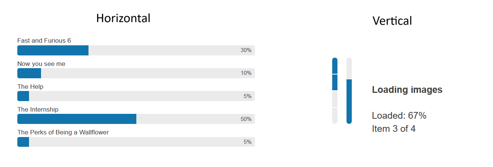

# Orientation

By default, the ProgressBar component displays in a Horizontal state. But it also allows you to set its visualization to appear in Vertical layout as well:

 

This is controlled with with the `Orientation` enumeration property:

```HtmlHelper
 @using Kendo.Mvc.UI

@(Html.Kendo().ProgressBar()
	  .Name("totalProgressBar")
	  .Type(ProgressBarType.Chunk)
	  .ChunkCount(4)
	  .Min(0)
	  .Max(4)
	  .Orientation(ProgressBarOrientation.Vertical)
)
```

```TagHelper
    @addTagHelper *, Kendo.Mvc

    <kendo-progressbar chunk-count="4" enable="true" max="4" min="0" reverse="false" show-status="true" orientation="ProgressBarOrientation.Vertical" type="ProgressBarType.Chunk" name="totalProgressBar">
     </kendo-progressbar>
```


The calculation of the completeness % percents can happen with the `.value()` API method and javascript logic depending on the total count of inputs in the form. Here is an example:
```JavaScript
     $(".forms input").change(function () {
         var completeness = 5;
         $(".forms input").each(function () {
             if (this.value == "") {
                 completeness--;
             }
         });

         pb.value(completeness);
         $("#completed").text((completeness * 20) + "%");
     });
```

## See Also

* [Vertical ProgressBar for {{ site.framework }} (Demo)](https://demos.telerik.com/{{ site.platform }}/progressbar/vertical)
* [Server-Side API of the ProgressBar](/api/progressbar)
* [Client-Side API of the ProgressBar](https://docs.telerik.com/kendo-ui/api/javascript/ui/progressbar)
