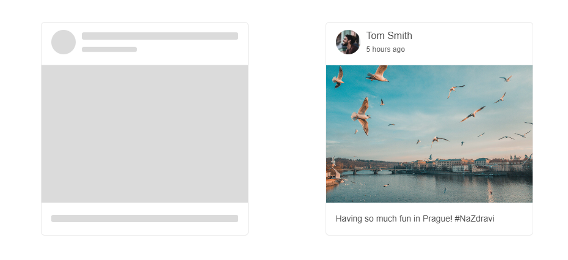

# Getting Started with the SkeletonContainer

This tutorial explains how to set up a basic Telerik UI for {{ site.framework }} SkeletonContainer and highlights the major steps in the configuration of the component.

You will initialize a SkeletonContainer component.

Finally, you can run the sample code in [Telerik REPL](https://netcorerepl.telerik.com/) and continue exploring the component.

 

@[template](/_contentTemplates/core/getting-started-prerequisites.md#repl-component-gs-prerequisites)

## 1. Prepare the CSHTML File

@[template](/_contentTemplates/core/getting-started-directives.md#gs-adding-directives)

Optionally, you can structure the document by adding the desired HTML elements like headings, divs, paragraphs, and others.

```HtmlHelper
@using Kendo.Mvc.UI
<h4>SkeletonContainer</h4>
```

```TagHelper
@addTagHelper *, Kendo.Mvc
<h4>SkeletonContainer</h4>
```


## 2. Initialize the SkeletonContainer

Use the SkeletonContainer HtmlHelper or TagHelper to add the component to a page:

* The `Name()` configuration method is mandatory as its value is used for the `id` and the `name` attributes of the SkeletonContainer element.
* The `Template()` configuration method defines a template that will be used to visualize the skeleton shapes..

```HtmlHelper
<h4>SkeletonContainer</h4>
@section HeadContent
{
    <style>
        .k-card-header {
            display: flex;
            height: 70px;
        }

        .user-info {
            padding-left: 10px;
        }

        .cards-container {
            display: flex;
            flex-wrap: wrap;
            justify-content: center;
        }

            .cards-container > div {
                margin: 5%;
            }

            .cards-container .k-card .k-card-subtitle {
                margin-top: 5px;
            }

        .avatar {
            border-radius: 50%;
            width: 40px;
            height: 40px;
        }

        .k-card {
            width: 340px;
            height: 350px;
        }

        .k-card-footer {
            text-align: center;
        }
    </style>
}

<div class="cards-container">
    @(Html.Kendo().SkeletonContainer()
        .Name("skeleton")
        .Template("<div class='k-card'>" +
                    "<div class='k-card-header'>" +
                        "<div>" +
                            "<span data-shape-circle class='k-card-media avatar'></span>" +
                        "</div>" +
                        "<div class='user-info' style='width: 100%;'>" +
                            "<span data-shape-text class='k-card-title'></span>" +
                            "<span data-shape-text class='k-card-subtitle' style='width: 35%;'></span>" +
                        "</div>" +
                    "</div>" +
                    "<span data-shape-rectangle style='width: 340px; height: 225px; '></span>" +
                      "<div class='k-card-body'>" +
                              "<span data-shape-text></span>" +
                          "</div>" +
                      "</div>")
    )

    <div class="k-card">
        <div class="k-card-header">
            <div style="width:40px; height:40px;">
                
            </div>
            <div class="user-info">
                <h5 class="k-card-title">Tom Smith</h5>
                <h6 class="k-card-subtitle">5 hours ago</h6>
            </div>
        </div>
        
        <div class="k-card-body">
            <p>Having so much fun in Prague! #NaZdravi</p>
        </div>
    </div>
</div>

```

```TagHelper
<h4>SkeletonContainer</h4>
@addTagHelper *, Kendo.Mvc
@section HeadContent
{
    <style>
        .k-card-header {
            display: flex;
            height: 70px;
        }

        .user-info {
            padding-left: 10px;
        }

        .cards-container {
            display: flex;
            flex-wrap: wrap;
            justify-content: center;
        }

            .cards-container > div {
                margin: 5%;
            }

            .cards-container .k-card .k-card-subtitle {
                margin-top: 5px;
            }

        .avatar {
            border-radius: 50%;
            width: 40px;
            height: 40px;
        }

        .k-card {
            width: 340px;
            height: 350px;
        }

        .k-card-footer {
            text-align: center;
        }
    </style>
}

<script id="tmpl" type="text/html">
    <div class='k-card'>
        <div class='k-card-header'>
            <div>
                <span data-shape-circle class='k-card-media avatar'></span>
            </div>
            <div class='user-info' style='width: 100%;'>
                <span data-shape-text class='k-card-title'></span>
                <span data-shape-text class='k-card-subtitle' style='width: 35%;'></span>
            </div>
        </div>
        <span data-shape-rectangle style='width: 340px; height: 225px; '></span>
        <div class='k-card-body'>
            <span data-shape-text></span>
        </div>
    </div>
</script>

<div class="cards-container">
    <kendo-skeletoncontainer name="skeleton" template-id="tmpl">
    </kendo-skeletoncontainer>

    <div class="k-card">
        <div class="k-card-header">
            <div style="width:40px; height:40px;">
                
            </div>
            <div class="user-info">
                <h5 class="k-card-title">Tom Smith</h5>
                <h6 class="k-card-subtitle">5 hours ago</h6>
            </div>
        </div>
        
        <div class="k-card-body">
            <p>Having so much fun in Prague! #NaZdravi</p>
        </div>
    </div>
</div>
```


## 3. Use the Animation Configuration of the SkeletonContainer

The next step is to configure Animation configuration. The `Animation` configuration defines a value determining whether the items will be animated.

```HtmlHelper
@using Kendo.Mvc.UI
<h4>SkeletonContainer</h4>
@section HeadContent
{
    <style>
        .k-card-header {
            display: flex;
            height: 70px;
        }

        .user-info {
            padding-left: 10px;
        }

        .cards-container {
            display: flex;
            flex-wrap: wrap;
            justify-content: center;
        }

            .cards-container > div {
                margin: 5%;
            }

            .cards-container .k-card .k-card-subtitle {
                margin-top: 5px;
            }

        .avatar {
            border-radius: 50%;
            width: 40px;
            height: 40px;
        }

        .k-card {
            width: 340px;
            height: 350px;
        }

        .k-card-footer {
            text-align: center;
        }
    </style>
}

<div class="cards-container">
    @(Html.Kendo().SkeletonContainer()
        .Name("skeleton")
        .Animation(SkeletonContainerAnimation.Pulse)
        .Template("<div class='k-card'>" +
                    "<div class='k-card-header'>" +
                        "<div>" +
                            "<span data-shape-circle class='k-card-media avatar'></span>" +
                        "</div>" +
                        "<div class='user-info' style='width: 100%;'>" +
                            "<span data-shape-text class='k-card-title'></span>" +
                            "<span data-shape-text class='k-card-subtitle' style='width: 35%;'></span>" +
                        "</div>" +
                    "</div>" +
                    "<span data-shape-rectangle style='width: 340px; height: 225px; '></span>" +
                      "<div class='k-card-body'>" +
                              "<span data-shape-text></span>" +
                          "</div>" +
                      "</div>")
    )

    <div class="k-card">
        <div class="k-card-header">
            <div style="width:40px; height:40px;">
                
            </div>
            <div class="user-info">
                <h5 class="k-card-title">Tom Smith</h5>
                <h6 class="k-card-subtitle">5 hours ago</h6>
            </div>
        </div>
        
        <div class="k-card-body">
            <p>Having so much fun in Prague! #NaZdravi</p>
        </div>
    </div>
</div>
```

```TagHelper
@addTagHelper *, Kendo.Mvc
<h4>SkeletonContainer</h4>
@section HeadContent
{
    <style>
        .k-card-header {
            display: flex;
            height: 70px;
        }

        .user-info {
            padding-left: 10px;
        }

        .cards-container {
            display: flex;
            flex-wrap: wrap;
            justify-content: center;
        }

            .cards-container > div {
                margin: 5%;
            }

            .cards-container .k-card .k-card-subtitle {
                margin-top: 5px;
            }

        .avatar {
            border-radius: 50%;
            width: 40px;
            height: 40px;
        }

        .k-card {
            width: 340px;
            height: 350px;
        }

        .k-card-footer {
            text-align: center;
        }
    </style>
}

<div class="cards-container">
    @(Html.Kendo().SkeletonContainer()
        .Name("skeleton")
        .Animation(SkeletonContainerAnimation.Pulse)
        .Template("<div class='k-card'>" +
                    "<div class='k-card-header'>" +
                        "<div>" +
                            "<span data-shape-circle class='k-card-media avatar'></span>" +
                        "</div>" +
                        "<div class='user-info' style='width: 100%;'>" +
                            "<span data-shape-text class='k-card-title'></span>" +
                            "<span data-shape-text class='k-card-subtitle' style='width: 35%;'></span>" +
                        "</div>" +
                    "</div>" +
                    "<span data-shape-rectangle style='width: 340px; height: 225px; '></span>" +
                      "<div class='k-card-body'>" +
                              "<span data-shape-text></span>" +
                          "</div>" +
                      "</div>")
    )

    <div class="k-card">
        <div class="k-card-header">
            <div style="width:40px; height:40px;">
                
            </div>
            <div class="user-info">
                <h5 class="k-card-title">Tom Smith</h5>
                <h6 class="k-card-subtitle">5 hours ago</h6>
            </div>
        </div>
        
        <div class="k-card-body">
            <p>Having so much fun in Prague! #NaZdravi</p>
        </div>
    </div>
</div>
```


## 5. (Optional) Reference Existing SkeletonContainer Instances

You can reference the SkeletonContainer instances that you have created and build on top of their existing configuration:

1. Use the `id` attribute of the component instance to establish a reference.

    ```script
    <script>
        var skeletoncontainer = $("#skeleton").data("kendoSkeletonContainer"); // skeletoncontainer is a reference to the existing skeletoncontainer instance of the helper.
    </script>
    ```

## Explore this Tutorial in REPL
You can continue experimenting with the code sample above by running it in the Telerik REPL server playground:
* [Sample code with the SkeletonContainer HtmlHelper](https://netcorerepl.telerik.com/cRbQbTbJ57PpbZ6H54)

* [Sample code with the SkeletonContainer TagHelper](https://netcorerepl.telerik.com/cxPwFJvf58GRPmOd03)

## Next Steps
* [Configure the Items in SkeletonContainer]()
## See Also
* [Using the API of the SkeletonContainer for {{ site.framework }} (Demo)](https://demos.telerik.com/{{ site.platform }}/skeletoncontainer/api)
* [Client-Side API of the SkeletonContainer](https://docs.telerik.com/kendo-ui/api/javascript/ui/skeletoncontainer)
* [Server-Side API of the SkeletonContainer](/api/skeletoncontainer)
* [Knowledge Base Section](/knowledge-base)