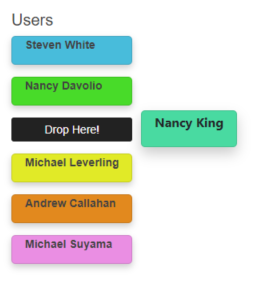

# Getting Started with the Sortable

This tutorial explains how to set up the Telerik UI for {{ site.framework }} Sortable and goes through the steps required to configure the component.

You will create a collection of Model instances and generate a [Card](https://demos.telerik.com/aspnet-core/cards) for each collection item. Next, you will initialize a Sortable for the dynamically populated Cards. Then, you will handle the JavaScript events of the Sortable and access the client-side references of the component. Finally, you can run the sample code in [Telerik REPL](https://netcorerepl.telerik.com/) and continue exploring the components.

 

@[template](/_contentTemplates/core/getting-started-prerequisites.md#component-gs-prerequisites)

## 1. Prepare the CSHTML File

@[template](/_contentTemplates/core/getting-started-directives.md#gs-adding-directives)

Optionally, you can structure the View content by adding the desired HTML elements like headings, divs, paragraphs, and others.

```HtmlHelper
    @using Kendo.Mvc.UI

    <h5>Users</h5>
    <div class="main-container">
        <div id="user-list">
        </div>
    </div>
```

```TagHelper
    @addTagHelper *, Kendo.Mvc

    <h5>Users</h5>
    <div class="main-container">
        <div id="user-list">
        </div>
    </div>

```


## 2. Declare the Model Collection

1. Declare the `UserViewModel` Model.

    ```Model_UserViewModel.cs
        public class UserViewModel {
            public string ID { get; set; }     
            public string FirstName { get; set; }   
            public string LastName { get; set; }
            public string BackgroundColor { get; set; }         
        }
    ```

1. Create a List collection that holds instances of the `UserViewModel`.

    ```Controller_HomeController.cs
        public ActionResult Index()
        {
            var users = new List<UserViewModel>
            {
                new UserViewModel(){ ID = "1", FirstName = "Steven", LastName = "White", BackgroundColor = "#1EBEDC" },
                new UserViewModel(){ ID = "2", FirstName = "Nancy", LastName = "King", BackgroundColor = "#1EDCA1" },
                new UserViewModel(){ ID = "3", FirstName = "Nancy", LastName = "Davolio", BackgroundColor = "#2ADC1E" },
                new UserViewModel(){ ID = "4", FirstName = "Michael", LastName = "Leverling", BackgroundColor = "#E4EA08" },
                new UserViewModel(){ ID = "5", FirstName = "Andrew", LastName = "Callahan", BackgroundColor = "#EA8608" },
                new UserViewModel(){ ID = "6", FirstName = "Michael", LastName = "Suyama", BackgroundColor = "#EF8CE4" }
            };
            return View(users);
        }
    ```
    ```View_Index.cshtml
        @model List<UserViewModel>

        <h5>Users</h5>
        <div class="main-container">
            <div id="user-list">
            </div>
        </div>
    ```

## 3. Generate the Cards

In this step, you will iterate through the List collection and create a Card for each record. The Card's background color will be set based on the Model property `BackgroundColor` Model property.

```View_Index.cshtml
    @model List<UserViewModel>

    <h5>Users</h5>
    <div class="main-container">
        <div id="user-list">
            @{  
                foreach(UserViewModel user in Model)
                {
                    <div class="card" style="background-color: @user.BackgroundColor">
                        <div class="container">
                            <p><b>@user.FirstName @user.LastName</b></p> 
                        </div>
                    </div>
                }
            }
        </div>
    </div>
```

## 4. Initialize the Sortable

Use the Sortable HtmlHelper or TagHelper to add the component to a page:

* The `For()` configuration method is mandatory as its value matches the selector of the DOM element to which the Sortable will be instantiated.
* The `Cursor()` option sets the cursor that will be shown while user drags the sortable item.
* The `PlaceholderHandler()` method accepts the name of the JavaScript function that returns the desired Sortable item placeholder.

```HtmlHelper
    @using Kendo.Mvc.UI

    @(Html.Kendo().Sortable()
        .For("#user-list")
        .Cursor("url('https://demos.telerik.com/kendo-ui//content/web/sortable/grabbing.cur'), default")
        .PlaceholderHandler("placeholder")
    )

    <script>
        function placeholder(element) {
            return $("<li class='list-item' id='placeholder'>Drop Here!</li>");
        }
    </script>

    <style>
        .list-item {
            list-style-type: none;
            margin-bottom: 15px;
            line-height: 30px;
            text-align: center;
            background-color: #222222;
            color: #ffffff;
            border-radius: 3px;
            cursor: url('https://demos.telerik.com/kendo-ui//content/web/sortable/grabbing.cur'), default;
        }
    </style>
```

```TagHelper
    @addTagHelper *, Kendo.Mvc

    <kendo-sortable name="user-list" 
        cursor="url('https://demos.telerik.com/kendo-ui//content/web/sortable/grabbing.cur'), default" 
        placeholder="placeholder">
    </kendo-sortable>

    <script>
        function placeholder(element) {
            return $("<li class='list-item' id='placeholder'>Drop Here!</li>");
        }
    </script>

    <style>
        .list-item {
            list-style-type: none;
            margin-bottom: 15px;
            line-height: 30px;
            text-align: center;
            background-color: #222222;
            color: #ffffff;
            border-radius: 3px;
            cursor: url('https://demos.telerik.com/kendo-ui//content/web/sortable/grabbing.cur'), default;
        }
    </style>
```


## 5. Handle the Sortable Events

The Sortable exposes [events](/api/kendo.mvc.ui.fluent/sortableeventbuilder) that you can handle and implement a custom logic. In this tutorial, you will use the `Change` event that triggers when the item's position is changed and get the indexes of the previous and the new position.

```HtmlHelper
    @using Kendo.Mvc.UI

    @(Html.Kendo().Sortable()
        .For("#user-list")
        .Cursor("url('https://demos.telerik.com/kendo-ui//content/web/sortable/grabbing.cur'), default")
        .PlaceholderHandler("placeholder")
        .Events(events => events.Change("onChange"))
    )

```

```TagHelper
    @addTagHelper *, Kendo.Mvc

    <kendo-sortable name="user-list" on-change="onChange"
        cursor="url('https://demos.telerik.com/kendo-ui//content/web/sortable/grabbing.cur'), default" 
        placeholder="placeholder">
    </kendo-sortable>

```

```Scripts
    <script>
        function onChange(e) {
            var newIndex = e.newIndex;
            var previousIndex = e.oldIndex;
            console.log("newIndex: " + newIndex + " previousIndex: " + previousIndex);
            // Custom logic when the Sortable items are reordered.
        }
    </script>
```

## 6. (Optional) Reference Existing Sortable Instances

You can reference the Sortable instances that you have created and build on top of their existing configuration:

1. Use the `id` attribute of the component instance to get its reference.

    ```script
        <script>
            $(document).ready(function() {
                var sortableReference = $("#user-list").data("kendoSortable"); // sortableReference is a reference to the existing Sortable instance of the helper.
            });
        </script>
    ```

1. Use the [Sortable client-side API](https://docs.telerik.com/kendo-ui/api/javascript/ui/sortable#methods) to control the behavior of the component. In this example, you will use the `items()` method to get all Sortable items when a button is clicked.

    ```HtmlHelper
        @(Html.Kendo().Button()
            .Name("getItemsBtn")
            .Content("Get Sortable items")
            .Events(ev => ev.Click("onBtnClick"))
        )
    ```
    
    ```TagHelper
        @addTagHelper *, Kendo.Mvc

        <kendo-button name="getItemsBtn" on-click="onBtnClick">
            Get Sortable items
        </kendo-button>
    ```
    
    ```Scripts
        <script>
            function onBtnClick() {
                var sortableReference = $("#user-list").data("kendoSortable");
                var sortableItems = sortableReference.items();
                $.each(sortableItems, function(){ // Loop through the Sortable item elements.
                    console.log($(this));
                });
            }
        </script>
    ```

For more information on referencing specific helper instances, see the [Methods and Events]() article.


## Explore this Tutorial in REPL

You can continue experimenting with the code sample above by running it in the Telerik REPL server playground:

* [Sample code with the Sortable HtmlHelper](https://netcorerepl.telerik.com/wIOvaBvz16w7p5l818)
* [Sample code with the Sortable TagHelper](https://netcorerepl.telerik.com/mSkFaLbJ14RpTUs336)



## Next Steps

* [Customizing the Hint of the Sortable]()
* [Handling the Sortable Events]()
* [Common Scenarios with the Sortable]()

## See Also

* [Implementing linked lists by using the Sortable for {{ site.framework }} (Demo)](https://demos.telerik.com/{{ site.platform }}/sortable/linkedlists)
* [Client-Side API of the Sortable](https://docs.telerik.com/kendo-ui/api/javascript/ui/sortable)
* [Server-Side API of the Sortable](/api/sortable)

* [Server-Side API of the Sortable TagHelper](/api/taghelpers/sortable)

* [Knowledge Base Section](/knowledge-base)