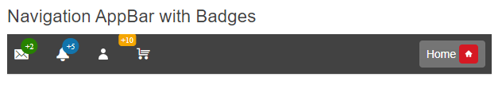

# Getting Started with the Badge

This tutorial explains how to set up a basic Telerik UI for {{ site.framework }} Badge and highlights the major steps in the configuration of the component.

Usually, the Badges are used as labels over buttons and links to provide information about notifications, updates, messages, and more. You will initialize differently styled Badges integrated into the items of a navigation [AppBar]() component. Next, you will learn how to reference the client-side instance of the component and control its behavior by using the available API methods. Finally, you can run the sample code in [Telerik REPL](https://netcorerepl.telerik.com/) and continue exploring the components.

 

@[template](/_contentTemplates/core/getting-started-prerequisites.md#repl-component-gs-prerequisites)

## 1. Prepare the CSHTML File

@[template](/_contentTemplates/core/getting-started-directives.md#gs-adding-directives)

Optionally, you can structure the View content by adding the desired HTML elements like headings, divs, paragraphs, and others.

```HtmlHelper
    @using Kendo.Mvc.UI

    <h4>Navigation AppBar with Badges</h4>
    <div>

    </div>
```

```TagHelper
    @addTagHelper *, Kendo.Mvc

    <h4>Navigation AppBar with Badges</h4>
    <div>

    </div>
```


## 2. Initialize the Badge

Use the Badge HtmlHelper or TagHelper to add the component to a page:

* The `Name()` configuration method is mandatory as its value is used for the `id` and the `name` attributes of the Badge element.
* The `Text()` option specifies the content that will be displayed in the Badge. Alternatively, you can display an icon instead of a text by setting the name for an existing icon in the Kendo UI theme or SVG content through the `Icon()` option.
* The `Position` method lets you define the position of the Badge relative to the edge of the container. 
* The `Align` method allows you to set the position of the Badge relative to its container. 

```HtmlHelper
    @using Kendo.Mvc.UI

    <span class='k-icon k-i-cart'>
        @(Html.Kendo().Badge()
            .Name("shoppingCartBadge")
            .Text("+10")
            .Position(BadgePosition.Outside)
            .Align(BadgeAlign.TopStart)
        )
    </span>
```

```TagHelper
    @addTagHelper *, Kendo.Mvc

    <span class='k-icon k-i-cart'>
        <kendo-badge name="shoppingCartBadge" 
            text="+10" 
            position="BadgePosition.Outside"
            align="BadgeAlign.TopStart">
        </kendo-badge>
    </span>
```


## 3. Integrate Badges into UI Components

The next step is to create an [AppBar]() component and integrate Badges in its items.

* Use the [Template component]() to define an icon and a Badge into the AppBar's items.

    ```HtmlHelper
        @using Kendo.Mvc.UI

        @(Html.Kendo().AppBar()
            .Name("appbar")
            .ThemeColor(AppBarThemeColor.Dark)
            .HtmlAttributes(new { style = "height: 50px;"})
            .Items(items =>
            {
                items.Add().Template(Html.Kendo().Template()
                    .AddHtml("<span class='k-icon k-i-envelop'>")
                    .AddComponent(badge => badge
                        .Badge()
                            .Name("messagesBadge")
                            .Text("+2")
                            .Position(BadgePosition.Edge)
                            .Align(BadgeAlign.TopEnd)
                    )
                    .AddHtml("</span>")
                )
                .Type(AppBarItemType.ContentItem);
                items.Add().Type(AppBarItemType.Spacer).Width("16px");
                items.Add().Template(Html.Kendo().Template()
                    .AddHtml("<span class='k-icon k-i-notification'>")
                    .AddComponent(badge => badge
                        .Badge()
                            .Name("notificationsBadge")
                            .Text("+5")
                            .Position(BadgePosition.Edge)
                            .Align(BadgeAlign.TopEnd)
                    )
                    .AddHtml("</span>")
                )
                .Type(AppBarItemType.ContentItem);
                items.Add().Type(AppBarItemType.Spacer).Width("10px");
                items.Add().Template(Html.Kendo().Template()
                    .AddComponent(ddb => ddb
                        .DropDownButton()
                            .Name("profileDDB")
                            .FillMode(FillMode.Flat)
                            .Icon("user")
                            .Items(items=>{
                                items.Add().Id("user-profile").Text("Profile").Icon("folder").Click(@<text>function() { alert("Enter Profile") }</text>);
                                items.Add().Id("user-settings").Text("Settings").Icon("gear").Click(@<text>function() { alert("Profile Settings") }</text>);
                                items.Add().Id("user-logout").Text("Log out").Icon("x").Click(@<text>function() { alert("Log out") }</text>);
                            })
                    )
                )
                .Type(AppBarItemType.ContentItem);
                items.Add().Type(AppBarItemType.Spacer).Width("10px");
                items.Add().Template(Html.Kendo().Template()
                    .AddHtml("<span class='k-icon k-i-cart'>")
                    .AddComponent(badge => badge
                        .Badge()
                            .Name("shoppingCartBadge")
                            .Text("+10")
                            .Position(BadgePosition.Outside)
                            .Align(BadgeAlign.TopStart)
                    )
                    .AddHtml("</span>")
                )
                .Type(AppBarItemType.ContentItem);
                items.Add().Type(AppBarItemType.Spacer);
            })
        )
    ```
    
    ```TagHelper
        @addTagHelper *, Kendo.Mvc

        <kendo-appbar name="appbar" theme-color="AppBarThemeColor.Dark" style="height: 50px;">
            <items>
                <appbar-item type="AppBarItemType.ContentItem">
                    <template>
                    <span class='k-icon k-i-envelop'>
                        <kendo-badge name="messagesBadge" 
                            text="+2" 
                            position="BadgePosition.Edge"
                            align="BadgeAlign.TopEnd">
                        </kendo-badge>
                    </span>
                    </template>
                </appbar-item>
                <appbar-item width="16px" type="AppBarItemType.Spacer"></appbar-item>
                <appbar-item type="AppBarItemType.ContentItem">
                    <template>
                        <span class='k-icon k-i-notification'>
                            <kendo-badge name="notificationsBadge" 
                                text="+5" 
                                position="BadgePosition.Edge"
                                align="BadgeAlign.TopEnd">
                            </kendo-badge>
                        </span>
                    </template>
                </appbar-item>
                <appbar-item width="10px" type="AppBarItemType.Spacer"></appbar-item>
                <appbar-item type="AppBarItemType.ContentItem">
                    <template>
                        <kendo-dropdownbutton name="profileDDB" icon="user" fill-mode="FillMode.Flat">
                            <dropdownbutton-items>
                                <item id="user-profile" text="Profile" icon="folder"></item>
                                <item id="user-settings" text="Settings" icon="gear"></item>
                                <item id="user-logout" text="Log out" icon="x"></item>
                            </dropdownbutton-items>
                        </kendo-dropdownbutton>
                    </template>
                </appbar-item>
                <appbar-item width="10px" type="AppBarItemType.Spacer"></appbar-item>
                <appbar-item type="AppBarItemType.ContentItem">
                    <template>
                        <span class='k-icon k-i-cart'>
                            <kendo-badge name="shoppingCartBadge" 
                                text="+10" 
                                position="BadgePosition.Outside"
                                align="BadgeAlign.TopStart">
                            </kendo-badge>
                        </span>
                    </template>
                </appbar-item>
                <appbar-item type="AppBarItemType.Spacer"></appbar-item>
            </items>
        </kendo-appbar>
    ```
    

* The [Button component]() provides [built-in Badges](), so you can use the `Badge()` configuration of the Button HtmlHelper or the `badge` tag of the Button TagHelper to decorate a button in the AppBar.

    ```HtmlHelper
        @using Kendo.Mvc.UI

        @(Html.Kendo().AppBar()
            .Name("appbar")
            .ThemeColor(AppBarThemeColor.Dark)
            .HtmlAttributes(new { style = "height: 50px;"})
            .Items(items =>
            {
                items.Add().Template(Html.Kendo().Template()
                    .AddComponent(ddb => ddb
                        .Button()
                        .Name("newsBtn")
                        .Content("Home")
                        .Badge(b => b
                            .Position(BadgePosition.Inline)
                            .Icon("home")
                        )
                    )
                )
                .Type(AppBarItemType.ContentItem);
            })
        )
    ```
    
    ```TagHelper
        @addTagHelper *, Kendo.Mvc

        <kendo-appbar name="appbar" theme-color="AppBarThemeColor.Dark" style="height: 50px;">
            <items>
                <appbar-item type="AppBarItemType.ContentItem">
                    <template>
                        <kendo-button name="newsBtn">
                            <badge
                                icon="home"
                                position="BadgePosition.Inline"/>
                            Home
                        </kendo-button>
                    </template>
                </appbar-item>
            </items>
        </kendo-appbar>
    ```
    

## 4. Customize the Appearance of the Badge

To alter the appearance of the Badges, use the `ThemeColor`, `FillMode`, `Rounded`, and `Size` methods when using the HtmlHelper version of the component and the `theme-color`, `fill-mode`, `rounded`, and `size` attributes when using the TagHelper configuration.

```HtmlHelper
    @using Kendo.Mvc.UI

    @(Html.Kendo().AppBar()
        .Name("appbar")
        .ThemeColor(AppBarThemeColor.Dark)
        .HtmlAttributes(new { style = "height: 50px;"})
        .Items(items =>
        {
            items.Add().Template(Html.Kendo().Template()
                .AddHtml("<span class='k-icon k-i-cart'>")
                .AddComponent(badge => badge
                    .Badge()
                        .Name("shoppingCartBadge")
                        .Text("+10")
                        .Position(BadgePosition.Outside)
                        .Align(BadgeAlign.TopStart)
                        .ThemeColor(BadgeColor.Warning)
                        .FillMode(BadgeFill.Solid)
                        .Rounded(Rounded.Medium)
                        .Size(BadgeSize.Small)
                )
                .AddHtml("</span>")
            )
            .Type(AppBarItemType.ContentItem);
        })
    )
```

```TagHelper
    @addTagHelper *, Kendo.Mvc

    <kendo-appbar name="appbar" theme-color="AppBarThemeColor.Dark" style="height: 50px;">
        <items>
            <appbar-item type="AppBarItemType.ContentItem">
                <template>
                    <span class='k-icon k-i-cart'>
                        <kendo-badge name="shoppingCartBadge" 
                            text="+10" 
                            position="BadgePosition.Outside"
                            align="BadgeAlign.TopStart"
                            theme-color="BadgeColor.Warning"
                            fill-mode="BadgeFill.Solid"
                            rounded="Rounded.Medium"
                            size="BadgeSize.Small">
                        </kendo-badge>
                    </span>
                </template>
            </appbar-item>
        </items>
    </kendo-appbar>
```



## 5. (Optional) Reference Existing Badge Instances

You can reference the Badge instances that you have created and build on top of their existing configuration:

1. Use the `Name()` option of the component to establish a reference.

    ```script
        <script>
            $(document).ready(function() {
                var badgeReference = $("#messagesBadge").data("kendoBadge"); // badgeReference is a reference to the existing Badge instance of the helper.
            });
        </script>
    ```

1. Use the [Badge client-side API](https://docs.telerik.com/kendo-ui/api/javascript/ui/badge#methods) to control the behavior of the widget. In this example, you will use the `text` method to change the text of the Badge dynamically (for example, when a button is clicked).

    ```HtmlHelper
        @(Html.Kendo().Button()
            .Name("btn")
            .Content("Update messages Badge")
            .Events(ev => ev.Click("onBtnClick")))

        <script>
            function onBtnClick() {
                var badgeReference = $("#messagesBadge").data("kendoBadge");
                badgeReference.text("+1");
            }
        </script>
    ```
    
    ```TagHelper
        @addTagHelper *, Kendo.Mvc

        <kendo-button name="btn" on-click="onBtnClick">
            Update messages Badge
        </kendo-button>

        <script>
            function onBtnClick() {
                var badgeReference = $("#messagesBadge").data("kendoBadge");
                badgeReference.text("+1");
            }
        </script>
    ```
    

For more information on referencing specific helper instances, see the [Methods and Events]() article.


## Explore this Tutorial in REPL

You can continue experimenting with the code sample above by running it in the Telerik REPL server playground:

* [Sample code with the Badge HtmlHelper](https://netcorerepl.telerik.com/GxEruSvB56aW4ynk55)
* [Sample code with the Badge TagHelper](https://netcorerepl.telerik.com/mnkhESlM02Nuy8sj09)



## Next Steps

* [Customizing the Appearance of the Badge]()
* [Using the Badge as a Label (Demo)](https://demos.telerik.com/{{ site.platform }}/badge/labels)

## See Also

* [Client-Side API of the Badge](https://docs.telerik.com/kendo-ui/api/javascript/ui/badge)
* [Server-Side API of the Badge](/api/badge)
* [Knowledge Base Section](/knowledge-base)
