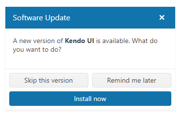

# Getting Started with the Dialog

This tutorial explains how to set up a basic Telerik UI for {{ site.framework }} Dialog and highlights the key steps in the configuration of the component.

You will initialize a Dialog, add action buttons, and configure the handling of the Dialog's events. Finally, you can run the sample code in [Telerik REPL](https://netcorerepl.telerik.com/) and continue exploring the components.

 

@[template](/_contentTemplates/core/getting-started-prerequisites.md#repl-component-gs-prerequisites)

## 1. Prepare the CSHTML File

@[template](/_contentTemplates/core/getting-started-directives.md#gs-adding-directives)

Optionally, you can structure the document by adding the desired HTML elements like headings, divs, paragraphs, and others.

## 2. Initialize the Dialog

Use the Dialog HtmlHelper or TagHelper to add the component to a page:

* The `Name()` configuration method is mandatory as its value is used for the `id` and the name attributes of the Dialog element.
* The `Title()` configuration method sets a title that appears in the Dialog's header.
* The `Content()` configuration specifies the textual content that is rendered within the Dialog.

```HtmlHelper
    @using Kendo.Mvc.UI
        @(Html.Kendo().Dialog()
            .Name("dialog")
            .Title("Software Update")
            .Content("<p>A new version of <strong>Kendo UI</strong> is available. What do you want to do?<p>")
        )
```

```TagHelper
    @addTagHelper *, Kendo.Mvc

        <kendo-dialog name="dialog" title="Software Update">
            <content><p>A new version of <strong>Kendo UI</strong> is available. What do you want to do?<p></content>
        </kendo-dialog>
```


## 3. Configure the Dialog's Dimensions

The next step is to [configure the width]() of the Dialog. Optionally, you can disable the modal overlay, which is enabled by default.

```HtmlHelper
    @using Kendo.Mvc.UI
        @(Html.Kendo().Dialog()
            .Name("dialog")
            .Title("Software Update")
            .Content("<p>A new version of <strong>Kendo UI</strong> is available. What do you want to do?<p>")
            .Width(400)
            .Modal(false)
        )
```

```TagHelper
    @addTagHelper *, Kendo.Mvc
        <kendo-dialog name="dialog" 
            title="Software Update"
            width="400"
            modal="false">
            <content><p>A new version of <strong>Kendo UI</strong> is available. What do you want to do?<p></content>
        </kendo-dialog>
```


## 4. Add Action Buttons

To make the component interactive, you can add [action buttons]() by using the `Actions()` configuration method. To make one of the buttons stand out, set its `Primary()` property to `true`.

```HtmlHelper
    @using Kendo.Mvc.UI
        @(Html.Kendo().Dialog()
            .Name("dialog")
            .Title("Software Update")
            .Content("<p>A new version of <strong>Kendo UI</strong> is available. What do you want to do?<p>")
            .Width(350)
            .Modal(false)
            .Actions(actions =>
            {
                actions.Add().Text("Skip this version");
                actions.Add().Text("Remind me later");
                actions.Add().Text("Install now").Primary(true);
            })
        )
```

```TagHelper
    @addTagHelper *, Kendo.Mvc

        <kendo-dialog name="dialog" 
            title="Software Update"
            width="350"
            modal="false">
            <actions>            
                <action text="Skip this version">
                </action>
                <action text="Remind me later">
                </action>
                <action text="Install now" primary="true">
                </action>
            </actions>
            <content><p>A new version of <strong>Kendo UI</strong> is available. What do you want to do?<p></content>
        </kendo-dialog>  
```


## 5. Handle Dialog Events

The Dialog exposes [several events]() that you can handle to customize the component's functions. In this tutorial, you will:

* Use the `Close()` event to log a new entry in the browser's console whenever the Dialog closes.
* Attach the `Action()` event handler to the **Install now** button.

By default, the last action of each action button is to close the Dialog. As a result, selecting any of the Dialog's buttons will generate the `Close()` event and log an entry in the browser's console.

```HtmlHelper
    @using Kendo.Mvc.UI
        @(Html.Kendo().Dialog()
            .Name("dialog")
            .Title("Software Update")
            .Content("<p>A new version of <strong>Kendo UI</strong> is available. What do you want to do?<p>")
            .Width(350)
            .Modal(false)
            .Actions(actions =>
            {
                actions.Add().Text("Skip this version");
                actions.Add().Text("Remind me later");
                actions.Add().Text("Install now").Primary(true).Action("onInstall");
            })
            .Events(ev => ev.Close("onClose"))
        )

    <script>
        function onClose()  {
            console.log("Dialog closed");
        }
        function onInstall()  {
            console.log("Install now selected");
        }
    </script>
```

```TagHelper
    @addTagHelper *, Kendo.Mvc

        <kendo-dialog name="dialog" 
            title="Software Update"
            width="350"
            modal="false"
            on-close="onClose">
            <actions>            
                <action text="Skip this version">
                </action>
                <action text="Remind me later">
                </action>
                <action text="Install now" primary="true" action="onInstall">
                </action>
            </actions>
            <content><p>A new version of <strong>Kendo UI</strong> is available. What do you want to do?<p></content>
        </kendo-dialog>
    

    <script>
        function onClose()  {
            console.log("Dialog closed");
        }
        function onInstall()  {
            console.log("Install now selected");
        }
    </script>
```


## 6. (Optional) Reference Existing Dialog Instances

You can reference the Dialog instances that you have created and build on top of their existing configuration:

1. Use the `id` attribute of the component instance to establish a reference.

    ```script
    <script>
        var dialogReference = $("#dialog").data("kendoDialog"); // dialogReference is a reference to the existing dialog instance of the helper.
    </script>
    ```

1. Use the [Dialog client-side API](https://docs.telerik.com/kendo-ui/api/javascript/ui/dialog#methods) to control the behavior of the widget. In this example, you will use the `toFront` method to bring the Dialog instance on top of any other open Dialogs.

    ```script
    <script>
        var dialogReference = $("#dialog").data("kendoDialog"); // dialogReference is a reference to the existing dialog instance of the helper.
        dialog.toFront(); // Bring the Dialog instance on top of any other open Dialogs.
    </script>
    ```

For more information on referencing specific helper instances, see the [Methods and Events]() article.


## Explore this Tutorial in REPL

You can continue experimenting with the code sample above by running it in the Telerik REPL server playground:

* [Sample code with the Dialog HtmlHelper](https://netcorerepl.telerik.com/mnOFbEFR27ZJyc8V44)
* [Sample code with the Dialog TagHelper](https://netcorerepl.telerik.com/QRkvbEPd27cz2S3324)



## Next Steps

* [Configure the action buttons in the Dialog]()
* [Set the Dimensions of the Dialog]()
* [Using the Dialog in a Razor Pages scenario]()

## See Also

* [Using the API of the Dialog for {{ site.framework }} (Demo)](https://demos.telerik.com/{{ site.platform }}/dialog/api)
* [Dialog Client-Side API](https://docs.telerik.com/kendo-ui/api/javascript/ui/dialog)
* [Server-Side API of the Dialog](/api/dialog)
* [Knowledge Base Section](/knowledge-base)
