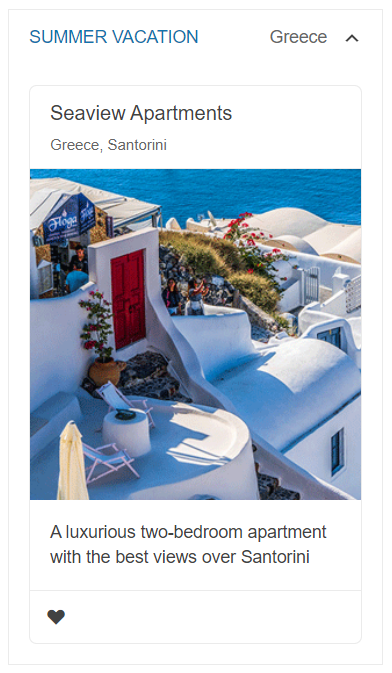

# Getting Started with the ExpansionPanel

This tutorial explains how to set up a basic Telerik UI for {{ site.framework }} ExpansionPanel and highlights the major steps in the configuration of the component.

You will initialize an ExpansionPanel component in expanded mode and integrate a [Card](https://demos.telerik.com/aspnet-core/cards) component into its content. Next, you will handle the ExpansionPanel events to change dynamically the header background color. Finally, you can run the sample code in [Telerik REPL](https://netcorerepl.telerik.com/) and continue exploring the components.

 

@[template](/_contentTemplates/core/getting-started-prerequisites.md#component-gs-prerequisites)

## 1. Prepare the CSHTML File

@[template](/_contentTemplates/core/getting-started-directives.md#gs-adding-directives)

Optionally, you can structure the View content by adding the desired HTML elements like headings, divs, paragraphs, and others.

```HtmlHelper
    @using Kendo.Mvc.UI

    <h4>Review content by expanding the panel</h4>
    <div>

    </div>
```

```TagHelper
    @addTagHelper *, Kendo.Mvc

    <h4>Review content by expanding the panel</h4>
    <div>

    </div>
```


## 2. Initialize the ExpansionPanel

Use the ExpansionPanel HtmlHelper or TagHelper to add the component to a page:

* The `Name()` configuration method is mandatory as its value is used for the `id` and the `name` attributes of the ExpansionPanel element.
* The `Title()` option specifies the title that will be displayed in the panel header.
* The `SubTitle()` option sets a subtitle next to the expand/collapse icon in the header.
* The `Content()` method defines the component content. It can be added as a `string` or as an `HTML.`

```HtmlHelper
    @using Kendo.Mvc.UI

    <h4>Review content by expanding the panel</h4>
    <div>
        @(Html.Kendo().ExpansionPanel()
            .Name("expPanel")
            .Title("Summer vacation")
            .SubTitle("Greece")
            .Content("Include the desired content here")
        )
    </div>
```

```TagHelper
    @addTagHelper *, Kendo.Mvc

    <h4>Review content by expanding the panel</h4>
    <div>
        <kendo-expansionpanel name="expPanel" title="Summer vacation" sub-title="Greece">
            <content>
                Include the desired content here
            </content>
        </kendo-expansionpanel>
    </div>
```


## 3. Configure the Card into the ExpansionPanel

The next step is to add a [Card](https://demos.telerik.com/aspnet-core/cards) as content of the ExpansionPanel. Attach the [`onclick`](https://www.w3schools.com/jsref/event_onclick.asp) event to the Card action and change the icon class to mark the Card as liked.

```HtmlHelper
    @using Kendo.Mvc.UI

    <h4>Review content by expanding the panel</h4>
    <div>
        @(Html.Kendo().ExpansionPanel()
            .Name("expPanel")
            .Title("Summer vacation")
            .SubTitle("Greece")
            .Expanded(true)
            .Content(@"
                <div class='k-card k-card-vertical'>
                    <div class='k-card-header k-hbox k-align-items-center'>
                        <div>
                            <h4 class='k-card-title'>Seaview Apartments</h4>
                            <h5 class='k-card-subtitle'>Greece, Santorini</h5>
                        </div>
                    </div>
                    
                    <div class='k-card-body'><p>A luxurious two-bedroom apartment with the best views over Santorini</p></div>
                    <span class='k-card-separator'></span>
                    <div class='k-actions k-card-actions'>
                        <span class='k-button k-button-flat-base k-button-flat k-button-md k-rounded-md k-icon-button' onclick='favoritesClick(event)'><span class='k-icon k-i-heart-outline'></span></span>
                    </div>
                </div>")
        )
    </div>
```

```TagHelper
    @addTagHelper *, Kendo.Mvc

    <h4>Review content by expanding the panel</h4>
    <div>
        <kendo-expansionpanel name="expPanel" title="Summer vacation" sub-title="Greece" expanded="true">
            <content>
                <div class='k-card k-card-vertical'>
                    <div class='k-card-header k-hbox k-align-items-center'>
                        <div>
                            <h4 class='k-card-title'>Seaview Apartments</h4>
                            <h5 class='k-card-subtitle'>Greece, Santorini</h5>
                        </div>
                    </div>
                    
                    <div class='k-card-body'><p>A luxurious two-bedroom apartment with the best views over Santorini</p></div>
                    <span class='k-card-separator'></span>
                    <div class='k-actions k-card-actions'>
                        <span class='k-button k-button-flat-base k-button-flat k-button-md k-rounded-md k-icon-button' onclick='favoritesClick(event)'><span class='k-icon k-i-heart-outline'></span></span>
                    </div>
                </div>
            </content>
        </kendo-expansionpanel>
    </div>
```

```Scripts
    <script>
        function favoritesClick(event){
            if($(event.target).hasClass("k-i-heart-outline")) {
                $(event.target).removeClass("k-i-heart-outline");
                $(event.target).addClass("k-i-heart");
            } else {
                $(event.target).addClass("k-i-heart-outline");
                $(event.target).removeClass("k-i-heart");
            }
        }
    </script>
```

## 4. Handle the ExpansionPanel Events

The ExpansionPanel exposes [events](/api/kendo.mvc.ui.fluent/expansionpaneleventbuilder) that you can handle and further customize the functionality of the component. In this tutorial, you will use the `Expand` and `Collapse` events to alter the component's header background color when in an expanded state.

```HtmlHelper
    @(Html.Kendo().ExpansionPanel()
        .Name("brazil")
        .Title("Brazil")
        .SubTitle("South America")
        .Events(ev => ev.Expand("onExpand").Collapse("onCollapse"))
        .Content("")
     )

     <script>
        function onExpand() {
            $(".k-expander-header").css("background-color","#c1e2eb");
        }

        function onCollapse() {
            $(".k-expander-header").css("background-color","inherit");
        }
    </script>
```


```TagHelper
	<kendo-expansionpanel name="expPanel" on-expand="onExpand" on-collapse="onCollapse">
        <content>

        </content>
    </kendo-expansionpanel>

     <script>
        function onExpand() {
            $(".k-expander-header").css("background-color","#c1e2eb");
        }

        function onCollapse() {
            $(".k-expander-header").css("background-color","inherit");
        }
    </script>
```


## 5. (Optional) Reference Existing ExpansionPanel Instances

You can reference the ExpansionPanel instances that you have created and build on top of their existing configuration:

1. Use the `id` attribute of the component instance to establish a reference.

    ```script
        <script>
            $(document).ready(function() {
                var expansionPanelReference = $("#expPanel").data("kendoExpansionPanel"); // expansionPanelReference is a reference to the existing ExpansionPanel instance of the helper.
            });
        </script>
    ```

1. Use the [ExpansionPanel client-side API](https://docs.telerik.com/kendo-ui/api/javascript/ui/expansionpanel#methods) to control the behavior of the component. In this example, you will use the `toggle` method to toggle the state of the control dynamically (for example, when a button is clicked).

    ```HtmlHelper
        @(Html.Kendo().Button()
            .Name("btn")
            .Content("Toggle ExpansionPanel")
            .Events(ev => ev.Click("onBtnClick"))
        )
    ```
    
    ```TagHelper
        @addTagHelper *, Kendo.Mvc
        <kendo-button name="btn" on-click="onBtnClick">
            Toggle ExpansionPanel
        </kendo-button>
    ```
    
    ```Scripts
        <script>
            function onBtnClick() {
                var expansionPanelReference = $("#expPanel").data("kendoExpansionPanel");
                expansionPanelReference.toggle();
            }
        </script>
    ```

For more information on referencing specific helper instances, see the [Methods and Events]() article.


## Explore this Tutorial in REPL

You can continue experimenting with the code sample above by running it in the Telerik REPL server playground:

* [Sample code with the ExpansionPanel HtmlHelper](https://netcorerepl.telerik.com/wRkCvTEX30XH3lqL42)
* [Sample code with the ExpansionPanel TagHelper](https://netcorerepl.telerik.com/GRkWbzEN31l5AX5730)



## Next Steps

* [Setting the ExpansionPanel Default State]()
* [Using the Keyboard Navigation of the ExpansionPanel for {{ site.framework }} (Demo)](https://demos.telerik.com/aspnet-core/expansionpanel/keyboard-navigation)
* [Using the Right-To-Left-Feature of the ExpansionPanel for {{ site.framework }} (Demo)](https://demos.telerik.com/aspnet-core/expansionpanel/right-to-left-support)

## See Also

* [Using the API of the ExpansionPanel for {{ site.framework }} (Demo)](https://demos.telerik.com/{{ site.platform }}/expansionpanel/api)
* [Client-Side API of the ExpansionPanel](https://docs.telerik.com/kendo-ui/api/javascript/ui/expansionpanel)
* [Server-Side API of the ExpansionPanel](/api/expansionpanel)
* [Knowledge Base Section](/knowledge-base)
