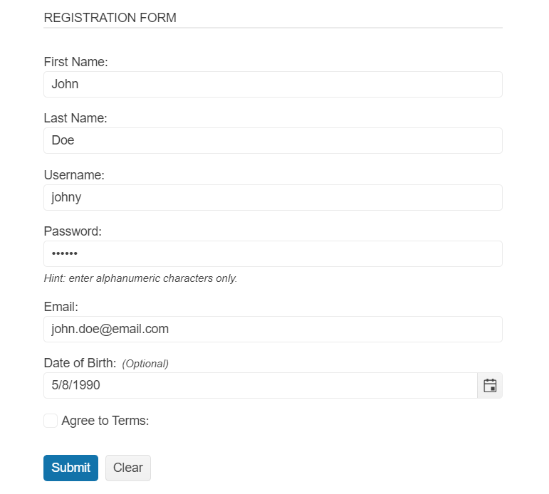

# Getting Started with the Form

This tutorial explains how to set up the Telerik UI for {{ site.framework }} Form and goes through the steps in the configuration of the component.

You will declare a User view model and bind it to an instance of the Form component. Next, you will configure the Form items and the action method for the Form submission. Then, you will enable client-side validation based on the server-side model data annotations. You'll learn to customize the Form fields and handle the JavaScript events of the component.

After completing this guide, you will achieve the following results:

 

@[template](/_contentTemplates/core/getting-started-prerequisites.md#component-gs-prerequisites)

## 1. Prepare the CSHTML File

@[template](/_contentTemplates/core/getting-started-directives.md#gs-adding-directives)

Optionally, you can structure the document by adding the desired HTML elements like headings, divs, paragraphs, and others.

## 2. Declare the View Model

Binding a model to the Form will set the Form items internally to the Telerik Editor components that are suitable for the bound data. In addition, the data annotations of the model fields can be applied to the Form items.

>tip Validate whether user inputs match the common e-mail format with the Regular Expression of the `Email` field. 

```C#
	using System;
    using System.ComponentModel.DataAnnotations;

    public class UserViewModel
    {
        public int UserID
        {
            get;
            set;
        }

        [Required]
        public string UserName
        {
            get;
            set;
        }

        [Required(ErrorMessage = "First Name is Required")]
        public string FirstName
        {
            get; set;
        }

        [Required(ErrorMessage = "Last Name is Required")]
        public string LastName
        {
            get;
            set;
        }


        [RegularExpression(@"^[A-Za-z0-9](([_\.\-]?[a-zA-Z0-9]+)*)@([A-Za-z0-9]+)(([\.\-‌​]?[a-zA-Z0-9]+)*)\.([A-Za-z]{2,})$", ErrorMessage = "Email is not valid")]
        public string Email
        {
            get;
            set;
        }

        [Required]
        public string Password
        {
            get;
            set;
        }

        [Required]
        public bool Agree
        {
            get;
            set;
        }

        public DateTime? DateOfBirth { get; set; }

    }
```

## 3. Initialize the Form

Use the Form HtmlHelper or TagHelper to configure the component.

* Use the `Name()` configuration method to assign a name to the instance of the helper&mdash;this is mandatory as its value is used for the `id` and the `name` attributes of the Form element.
* Add `HtmlAttributes`&mdash;they allow you to configure the request method and the controller's action method that receives the submitted form.
* Configure the `Validatable` options of the component to enable client-side validation.
* Set the `Items` of the Form by specifying the `Field` of the model they bind to and the corresponding `Label`.

```HtmlHelper
@using Kendo.Mvc.UI

<div id="validation-success"></div>
 @(Html.Kendo().Form<Kendo.Mvc.Examples.Models.Form.UserViewModel>()
        .Name("formExample")
        .HtmlAttributes(new { action = "Index", method = "POST" })
        .Validatable(v =>
        {
            v.ValidateOnBlur(true);
            v.ValidationSummary(vs => vs.Enable(false));
        })
        .Items(items =>
        {
            items.AddGroup()
                .Label("Registration Form")
                .Items(i =>
                {
                   i.Add()
                        .Field(f => f.FirstName)
                        .Label(l => l.Text("First Name:"));
                    i.Add()
                        .Field(f => f.LastName)
                        .Label(l => l.Text("Last Name:"));
                    i.Add()
                        .Field(f => f.UserName)
                        .Label(l => l.Text("Username:"));
                    i.Add()
                        .Field(f => f.Password)
                        .Label(l => l.Text("Password:"));
                    i.Add()
                        .Field(f => f.Email)
                        .Label(l => l.Text("Email:"));
                     i.Add()
                        .Field(f => f.DateOfBirth)
                        .Label(l => l.Text("Date of Birth:"));
                    i.Add()
                        .Field(f => f.Agree)
                        .Label(l => l.Text("Agree to Terms:"));
                });
        })
    )
```

```TagHelper
@addTagHelper *, Kendo.Mvc

@model Kendo.Mvc.Examples.Models.Form.UserViewModel

<div id="validation-success"></div>
<kendo-form name="formExample" form-data="@Model" action="Index" method="POST">
        <form-items>
            <form-item type="group">
                <item-label text="Registration Form">
                    <form-items>
                        <form-item field="FirstName">
                            <item-label text="FirstName" />
                        </form-item>
                        <form-item field="LastName">
                            <item-label text="Last Name:">
                        </form-item>
                        <form-item field="UserName">
                            <item-label text="Username:">
                        </form-item>
                        <form-item field="Password">
                            <item-label text="Password:">
                        </form-item>
                        <form-item field="Email">
                            <item-label text="Email:">
                        </form-item>
                        <form-item field="DateOfBirth">
                            <item-label text="Date of Birth:">
                        </form-item>
                        <form-item field="Agree">
                            <item-label text="Agree to Terms:">
                        </form-item>
                    </form-items>
            </form-item>
        </form-items>
        <validatable validate-on-blur="true" />
    </kendo-form>
```


## 4. Configure Editing of Pre-Existing Data

Optionally, you can bind the Form to an already existing instance of the view model. This enables you to save the progress while the user fills in the Form or edit data items that already exist.

```Controller
public IActionResult Index(){
    return View(new UserViewModel()
    {
        FirstName = "John",
        LastName = "Doe",
        Email = "john.doe@email.com",
        UserName = "johny",
        Password = "123456",
        DateOfBirth = new DateTime(1990, 5, 8),
        Agree = false
    });
}
```

## 5. Customize the Form Items and Submission Behavior

* Adapt the Form to the scenario at hand by configuring a `Hint` to inform the user of the expected input or mark optional fields with the `Optional` property of the `Label` configuration.
* Set the `EditorTemplateHandler` to add a [Custom Editor](https://docs.telerik.com/{{ site.platform }}/html-helpers/layout/form/items#custom-editor) to a field on the client-side.
* Subscribe to the [`Events`](https://docs.telerik.com/{{ site.platform }}/api/kendo.mvc.ui.fluent/formeventbuilder) of the Component.
* Use JavaScript to handle the Editor template and the `Events`.  

```HtmlHelper
@using Kendo.Mvc.UI

<div id="validation-success"></div>
@(Html.Kendo().Form<Kendo.Mvc.Examples.Models.Form.UserViewModel>()
    .Name("formExample")
    .HtmlAttributes(new { action = "Index", method = "POST" })
    .Validatable(v =>
    {
        v.ValidateOnBlur(true);
        v.ValidationSummary(vs => vs.Enable(false));
    })
    .Items(items =>
    {
        items.AddGroup()
            .Label("Registration Form")
            .Items(i =>
            {
               i.Add()
                    .Field(f => f.FirstName)
                    .Label(l => l.Text("First Name:"));
                i.Add()
                    .Field(f => f.LastName)
                    .Label(l => l.Text("Last Name:"));
                i.Add()
                    .Field(f => f.UserName)
                    .Label(l => l.Text("Username:"));
                i.Add()
                    .Field(f => f.Password)
                    .Label(l => l.Text("Password:"))
                    .Hint("Hint: enter alphanumeric characters only.")
                    .EditorTemplateHandler("setPasswordEditor");
                i.Add()
                    .Field(f => f.Email)
                    .Label(l => l.Text("Email:"));
                 i.Add()
                    .Field(f => f.DateOfBirth)
                    .Label(l => l.Text("Date of Birth:").Optional(true));
                i.Add()
                    .Field(f => f.Agree)
                    .Label(l => l.Text("Agree to Terms:"));
            });
    })
    .Events(ev => ev.ValidateField("onFormValidateField").Submit("onFormSubmit").Clear("onFormClear"))
)

```

```TagHelper
@addTagHelper *, Kendo.Mvc
@model Kendo.Mvc.Examples.Models.Form.UserViewModel

<div id="validation-success"></div>
<kendo-form name="formExample" form-data="@Model" on-validate-field="onFormValidateField" on-submit="onFormSubmit" on-clear="onFormClear" action="Index" method="POST">
    <form-items>
        <form-item type="group">
            <item-label text="Registration Form">
                <form-items>
                    <form-item field="FirstName">
                        <item-label text="FirstName" />
                    </form-item>
                    <form-item field="LastName">
                        <item-label text="Last Name:">
                    </form-item>
                    <form-item field="UserName">
                        <item-label text="Username:">
                    </form-item>
                    <form-item field="Password" hint="Hint: enter alphanumeric characters only." editor-handler="setPasswordEditor">
                        <item-label text="Password:">
                    </form-item>
                    <form-item field="Email">
                        <item-label text="Email:">
                    </form-item>
                    <form-item field="DateOfBirth">
                        <item-label text="Date of Birth:" optional="true">
                    </form-item>
                    <form-item field="Agree">
                        <item-label text="Agree to Terms:">
                    </form-item>
                </form-items>
        </form-item>
    </form-items>
    <validatable validate-on-blur="true" />
</kendo-form>


```JavaScript
    function setPasswordEditor(container, options) {
        $('<input type="password" id="Password" name="' + options.field + '" title="Password" required="required" autocomplete="off" aria-labelledby="Password-form-label" data-bind="value: Password" aria-describedby="Password-form-hint"/>')
            .appendTo(container)
            .kendoTextBox();
    }

    function onFormValidateField(e) {
        $("#validation-success").html("");
    }

    function onFormSubmit(e) {
        e.preventDefault();
        $("#validation-success").html("<div class='k-messagebox k-messagebox-success'>Form data is valid!</div>");
    }

    function onFormClear(e) {
        $("#validation-success").html("");
    }
```

## (Optional) Reference Existing Form Instances

Referencing existing component instances allows you to build on top of their configuration. To reference an existing Form instance, use the [`jQuery.data()`](http://api.jquery.com/jQuery.data/) method. Once a reference is established, use the [Form client-side API](https://docs.telerik.com/kendo-ui/api/javascript/ui/form#methods) to control its behavior.

1. Use the `id` attribute of the component instance to establish a reference.

    ```script
    <script>
        var formReference = $("#formExample").data("kendoForm"); // formReference is a reference to the existing instance of the helper.
    </script>
    ```

1. Use the [Form client-side API](https://docs.telerik.com/kendo-ui/api/javascript/ui/form#methods) to control the behavior of the widget. In this example, you will see how to clear the form programmatically.

    ```script
        <script>
            var formReference = $("#formExample").data("kendoForm");
            formReference.clear(); // Programmatically clear the inputs of the Form.
        </script>
    ```

## Next Steps

* [Configuring the Form Items]()
* [Handling JavaScript Events of the User Interactions]() 
* [Configuring the Grouping in the Form]()
* [Setting the Orientation of the Labels]()

## See Also

* [Using the API of the Form for {{ site.framework }} (Demo)](https://demos.telerik.com/{{ site.platform }}/form/api)
* [Client-Side API of the Form](https://docs.telerik.com/kendo-ui/api/javascript/ui/form)
* [Server-Side API of the Form](/api/form)
* [Knowledge Base Section](/knowledge-base)
