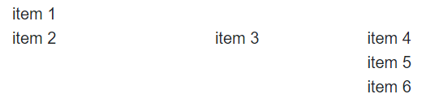

# Items

You can control the positioning of the GridLayout items and create a [complex layout](#complex-layouts) by setting the configuration options for each item:

* [Row](#row)
* [Column](#column)
* [RowSpan](#rowspan)
* [ColumnSpan](#columnspan)

## Row

The `Row` configuration controls in which row the GridLayoutItem will reside. The row indexes in the component are `1-based`. If you don't define rows, the items will be displayed by using the formula `r = i / c`, where:

* `r` is the number of rows;
* `i` is the number of items;
* `c` is the number of columns;

```HTMLHelper
    @(Html.Kendo().GridLayout()
        .Name("gridlayout")
        .Rows(r=>{
            r.Add();
            r.Add();
            r.Add();
        })
        .Items(i=>{
            i.Add().Row(1).Content("Item 1");
            i.Add().Row(2).Content("Item 2");
            i.Add().Row(2).Content("Item 3");
            i.Add().Row(3).Content("Item 4");
            i.Add().Row(3).Content("Item 5");
            i.Add().Row(3).Content("Item 6");
        })
    )
```

```TagHelper
    <kendo-gridlayout name="gridlayout">
        <gridlayout-rows>
            <gridlayout-row />
            <gridlayout-row />
            <gridlayout-row />
        </gridlayout-rows>
        <gridlayout-items>
            <gridlayout-item row=1>Item 1</gridlayout-item>
            <gridlayout-item row=2>Item 2</gridlayout-item>
            <gridlayout-item row=2>Item 3</gridlayout-item>
            <gridlayout-item row=3>Item 4</gridlayout-item>
            <gridlayout-item row=3>Item 5</gridlayout-item>
            <gridlayout-item row=3>Item 6</gridlayout-item>
        </gridlayout-items>
    </kendo-gridlayout>
```


The above configuration of the GridLayout will produce the following rendering:


## Column

The `Column` configuration controls in which column the GridLayoutItem will reside. The column indexes in the component are `1-based`. If don't define any columns, the GridLayout items will be displayed in one column.

```HTMLHelper
    @(Html.Kendo().GridLayout()
        .Name("gridlayout")
        .Columns(c=>{
            c.Add();
            c.Add();
            c.Add();
        })
        .Items(i=>{
            i.Add().Column(1).Content("Item 1");
            i.Add().Column(1).Content("Item 2");
            i.Add().Column(2).Content("Item 3");
            i.Add().Column(3).Content("Item 4");
            i.Add().Column(3).Content("Item 5");
            i.Add().Column(3).Content("Item 6");
        })
    )
```

```TagHelper
    <kendo-gridlayout name="gridlayout">
        <gridlayout-columns>
            <gridlayout-column />
            <gridlayout-column />
            <gridlayout-column />
        </gridlayout-columns>
        <gridlayout-items>
            <gridlayout-item column=1>Item 1</gridlayout-item>
            <gridlayout-item column=1>Item 2</gridlayout-item>
            <gridlayout-item column=2>Item 3</gridlayout-item>
            <gridlayout-item column=3>Item 4</gridlayout-item>
            <gridlayout-item column=3>Item 5</gridlayout-item>
            <gridlayout-item column=3>Item 6</gridlayout-item>
        </gridlayout-items>
    </kendo-gridlayout>
```


The above configuration of the GridLayout will produce the following rendering:



## RowSpan

The `RowSpan` configuration defines how many rows the item will occupy.

```HTMLHelper
    @(Html.Kendo().GridLayout()
        .Name("gridlayout")
        .Rows(r=>{
            r.Add().Height("50px");
            r.Add().Height("50px");
            r.Add().Height("50px");
            r.Add().Height("50px");
        })
        .Columns(c =>
        {
            c.Add().Width("50px");
            c.Add().Width("50px");
            c.Add().Width("50px");
            c.Add().Width("50px");
        })
        .Items(i=>{
            i.Add().Row(1).Column(1).RowSpan(4).Content("Item 1");
            i.Add().Row(2).Column(1).Content("Item 2");
            i.Add().Row(2).Column(2).Content("Item 3");
            i.Add().Row(4).Column(4).Content("Item 4");
        })
    )
```

```TagHelper
    <kendo-gridlayout name="gridlayout">
        <gridlayout-rows>
            <gridlayout-row height="50px" />
            <gridlayout-row height="50px" />
            <gridlayout-row height="50px" />
            <gridlayout-row height="50px" />
        </gridlayout-rows>
        <gridlayout-columns>
            <gridlayout-column width="50px" />
            <gridlayout-column width="50px" />
            <gridlayout-column width="50px" />
            <gridlayout-column width="50px" />
        </gridlayout-columns>
        <gridlayout-items>
            <gridlayout-item row=1 column=1 row-span=4>Item 1</gridlayout-item>
            <gridlayout-item row=2 column=1>Item 2</gridlayout-item>
            <gridlayout-item row=2 column=2>Item 3</gridlayout-item>
            <gridlayout-item row=4 column=4>Item 4</gridlayout-item>
        </gridlayout-items>
    </kendo-gridlayout>
```


## ColumnSpan

The `ColumnSpan` configuration defines how many columns the item will occupy.

```HTMLHelper
    @(Html.Kendo().GridLayout()
        .Name("gridlayout")
        .Rows(r=>{
            r.Add().Height("50px");
            r.Add().Height("50px");
            r.Add().Height("50px");
            r.Add().Height("50px");
        })
        .Columns(c =>
        {
            c.Add().Width("50px");
            c.Add().Width("50px");
            c.Add().Width("50px");
            c.Add().Width("50px");
        })
        .Items(i=>{
            i.Add().Row(1).Column(1).ColumnSpan(4).Content("Header");
            i.Add().Row(2).Column(1).Content("Item 1");
            i.Add().Row(3).Column(2).Content("Item 2");
            i.Add().Row(4).Column(4).Content("Item 3");
        })
    )
```

```TagHelper
    <kendo-gridlayout name="gridlayout">
        <gridlayout-rows>
            <gridlayout-row height="50px" />
            <gridlayout-row height="50px" />
            <gridlayout-row height="50px" />
            <gridlayout-row height="50px" />
        </gridlayout-rows>
        <gridlayout-columns>
            <gridlayout-column width="50px" />
            <gridlayout-column width="50px" />
            <gridlayout-column width="50px" />
            <gridlayout-column width="50px" />
        </gridlayout-columns>
        <gridlayout-items>
            <gridlayout-item row=1 column=1 column-span=4>Header</gridlayout-item>
            <gridlayout-item row=2 column=1>Item 1</gridlayout-item>
            <gridlayout-item row=2 column=2>Item 2</gridlayout-item>
            <gridlayout-item row=4 column=4>Item 3</gridlayout-item>
        </gridlayout-items>
    </kendo-gridlayout>
```


## Complex Layouts

To create a complex layout, you can combine all listed configuration options—[Row](#row), [Column](#column), [RowSpan](#rowspan), [ColumnSpan](#columnspan).

```HTMLHelper
    @(Html.Kendo().GridLayout()
        .HtmlAttributes(new { @class = "grid-layout" })
        .Name("spans")
        .Rows(r=>{
            r.Add().Height("50px");
            r.Add().Height("50px");
            r.Add().Height("50px");
            r.Add().Height("50px");
        })
        .Columns(c =>
        {
            c.Add().Width("50px");
            c.Add().Width("50px");
            c.Add().Width("50px");
            c.Add().Width("50px");
        })
        .Items(i=>{
            i.Add().Row(1).Column(1).ColumnSpan(4).Content("Item 1");
            i.Add().Row(2).Column(1).RowSpan(3).Content("Item 2");
            i.Add().Row(2).Column(2).RowSpan(2).ColumnSpan(2).Content("Item 3");
            i.Add().Row(4).Column(4).Content("Item 4");
        })
    )

    <style>
        .k-grid-layout > div {
            border-color: gray;
            border-width: 1px;
            border-style: dashed;
        }
    </style>
```

```TagHelper
    <kendo-gridlayout name="gridlayout">
        <gridlayout-rows>
            <gridlayout-row height="50px" />
            <gridlayout-row height="50px" />
            <gridlayout-row height="50px" />
            <gridlayout-row height="50px" />
        </gridlayout-rows>
        <gridlayout-columns>
            <gridlayout-column width="50px" />
            <gridlayout-column width="50px" />
            <gridlayout-column width="50px" />
            <gridlayout-column width="50px" />
        </gridlayout-columns>
        <gridlayout-items>
            <gridlayout-item row=1 column=1 column-span=4>Item 1</gridlayout-item>
            <gridlayout-item row=2 column=1 row-span=3>Item 2</gridlayout-item>
            <gridlayout-item row=2 column=2 row-span=2 column-span=2>Item 3</gridlayout-item>
            <gridlayout-item row=4 column=4>Item 4</gridlayout-item>
        </gridlayout-items>
    </kendo-gridlayout>

    <style>
        .k-grid-layout > div {
            border-color: gray;
            border-width: 1px;
            border-style: dashed;
        }
    </style>
```


The above example will produce the following rendering:


The {{ site.framework }} GridLayout is based on the [CSS Grid Layout](https://developer.mozilla.org/en-US/docs/Web/CSS/CSS_Grid_Layout). You can therefore use [media queries](https://developer.mozilla.org/en-US/docs/Web/CSS/Media_Queries/Using_media_queries) to create [responsive layouts for different sized screens](https://demos.telerik.com/{{ site.platform }}/gridlayout/adaptive).

## See Also

* [Overview of the GridLayout (Demo)](https://demos.telerik.com/{{ site.platform }}/gridlayout/index)
* [Adaptive Rendering of the GridLayout (Demo)](https://demos.telerik.com/{{ site.platform }}/gridlayout/adaptive)
