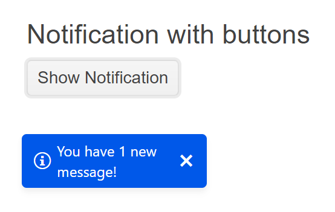

# Getting Started with the Notification

This tutorial explains how to set up a basic Telerik UI for {{ site.framework }} Notification component and highlights the major steps in the configuration of the component.

You will initialize a Notification component with basic content and an action button. Then, you will use the events of the UI component. Finally, you can run the sample code in [Telerik REPL](https://netcorerepl.telerik.com/) and continue exploring the components.

 

@[template](/_contentTemplates/core/getting-started-prerequisites.md#repl-component-gs-prerequisites)

## 1. Prepare the CSHTML File

@[template](/_contentTemplates/core/getting-started-directives.md#gs-adding-directives)

Optionally, you can structure the document by adding the desired HTML elements like headings, divs, paragraphs, and others.

```HtmlHelper
    @using Kendo.Mvc.UI

    <h4>Notification with a Hide Button</h4>
    <div>

    </div>
```

```TagHelper
    @addTagHelper *, Kendo.Mvc

    <h4>Notification with a Hide Button</h4>
    <div>

    </div>
```


## 2. Initialize the Notification

Use the Notification HtmlHelper or TagHelper to add the component to a page:

* The `Name()` configuration method is mandatory as its value is used for the `id` and the `name` attributes of the Notification element.
* The `Position()` setting allows you to declare offsets that change the position of the component.

This tutorial uses a separate `Kendo().Button()` component with an event handler to display the Notification. In your scenarios, you could have another user action or event handler that displays the Notification component.

```HtmlHelper
@using Kendo.Mvc.UI

<h4>Notification with a Hide Button</h4>
<div>
@(Html.Kendo().Notification()
    .Name("notification")
    .Position(p=>p.Top(120).Left(20))
)
@(Html.Kendo().Button()
    .Name("button")
    .Content("Show Notification")
    .Events(e=>e.Click("buttonClick"))
)

<script>
    function buttonClick(e) {
        var notification = $("#notification").data("kendoNotification");
        notification.show("You have 1 new message!", "info");
    }
</script>
</div>
```

```TagHelper
@addTagHelper *, Kendo.Mvc

<h4>Notification with a Hide Button</h4>
<div>
<kendo-notification name="notification">
  <position top="120" left="20"></position>
</kendo-notification>

<kendo-button name="button" on-click="buttonClick">
    Show Notification
</kendo-button>

<script>
    function buttonClick(e) {
        var notification = $("#notification").data("kendoNotification");
        notification.show("You have 1 new message!", "info");
    }
</script>
</div>
```


## 3. Hide with a Button

The next step is to make the Notification hide only on manual button click action initiated by the user.

By default, the Notification disappears automatically after a couple of seconds or when the user clicks it. Alternatively, you can use the built-in close button that is controlled by the following properties:

* The `Button()` property determines whether the notifications will include a hide button. This setting works only with the built-in templates.
* The `HideOnClick()` setting determines whether notifications can be hidden by clicking anywhere on their content.

```HtmlHelper
@using Kendo.Mvc.UI

<h4>Notification with a Hide Button</h4>
<div>
@(Html.Kendo().Notification()
    .Name("notification")
    .Position(p=>p.Top(120).Left(20))
    .Button(true)
    .HideOnClick(false)
)
@(Html.Kendo().Button()
    .Name("button")
    .Content("Show Notification")
    .Events(e=>e.Click("buttonClick"))
)

<script>
    function buttonClick(e) {
        var notification = $("#notification").data("kendoNotification");
        notification.show("You have 1 new message!", "info");
    }
</script>
</div>
```

```TagHelper
@addTagHelper *, Kendo.Mvc

<h4>Notification with a Hide Button</h4>
<div>
<kendo-notification name="notification" 
button="true" hide-on-click="false">
  <position top="120" left="20"></position>
</kendo-notification>

<kendo-button name="button" on-click="buttonClick">
    Show Notification
</kendo-button>

<script>
    function buttonClick(e) {
        var notification = $("#notification").data("kendoNotification");
        notification.show("You have 1 new message!", "info");
    }
</script>
</div>
```


## 4. Handle a Notification Event

The Notification component provides convenient events for implementing your desired logic. In this tutorial, you will use the exposed `Show()` event to log a new entry in the browser's console.

```HtmlHelper
@using Kendo.Mvc.UI

<h4>Notification with a Hide Button</h4>
<div>
@(Html.Kendo().Notification()
    .Name("notification")
    .Position(p=>p.Top(120).Left(20))
    .Button(true)
    .HideOnClick(false)
    // Configure the client-side events.
    .Events(e => e.Show("show")
     )
)
@(Html.Kendo().Button()
    .Name("button")
    .Content("Show Notification")
    .Events(e=>e.Click("buttonClick"))
)

<script>
    function buttonClick(e) {
        var notification = $("#notification").data("kendoNotification");
        notification.show("You have 1 new message!", "info");
    }

    function show(e) {
        console.log("Message Shown");
    }
</script>
</div>
```

```TagHelper
@addTagHelper *, Kendo.Mvc

<h4>Notification with a Hide Button</h4>
<div>
<script>
    function buttonClick(e) {
        var notification = $("#notification").data("kendoNotification");
        notification.show("You have 1 new message!", "info");
    }

    function show(e) {
        console.log("Message Shown");
    }
</script>
<kendo-notification name="notification" 
button="true" hide-on-click="false"
on-show="show">
  <position top="120" left="20"></position>
</kendo-notification>

<kendo-button name="button" on-click="buttonClick">
    Show Notification
</kendo-button>
</div>
```



## 5. (Optional) Reference Existing Notification Instances

You can reference the Notification instances that you have created and build on top of their existing configuration:

1. Use the `id` attribute of the component instance to establish a reference.

    ```script
    <script>
        var notificationReference = $("#notification").data("kendoNotification"); // notificationReference is a reference to the existing Notification instance of the helper.
    </script>
    ```

1. Use the [Notification client-side API](https://docs.telerik.com/kendo-ui/api/javascript/ui/notification#methods) to control the behavior of the widget. In this example, you will use the `hide` method to close the Notification.

    ```script
    <script>
        var notificationReference = $("#notification").data("kendoNotification"); // notificationReference is a reference to the existing Notification instance of the helper.
        notificationReference.hide(); 
    </script>
    ```


## Explore this Tutorial in REPL

You can continue experimenting with the code sample above by running it in the Telerik REPL server playground:

* [Sample code with the Notification HtmlHelper](https://netcorerepl.telerik.com/wRuIPavd53fb9mr015)
* [Sample code with the Notification TagHelper](https://netcorerepl.telerik.com/QxOyFald53QG982P44)



## Next Steps

* [Customize the Positioning of the Notification]()
* [Use Templates to Control the Notification Appearance]()

## See Also

* [Using the API of the Notification for {{ site.framework }} (Demo)](https://demos.telerik.com/{{ site.platform }}/notification/api)
* [Client-Side API of the Notification](https://docs.telerik.com/kendo-ui/api/javascript/ui/notification)
* [Server-Side API of the Notification](/api/notification)
* [Knowledge Base Section](/knowledge-base)
