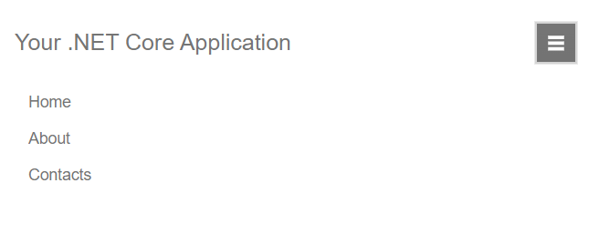

# Getting Started with the Responsive Panel

This tutorial explains how to set up a basic Telerik UI for {{ site.framework }} Responsive Panel and highlights the major steps in the configuration of the component.

You will initialize a Responsive Panel component that collapses a [Menu]() when the screen is less than 768 pixels in width, and the Menu is then expanded or collapsed by a button. Next, you will handle the `Open` event of the component and disable a specified Menu item. Finally, you can run the sample code in [Telerik REPL](https://netcorerepl.telerik.com/) and continue exploring the components.

 

@[template](/_contentTemplates/core/getting-started-prerequisites.md#component-gs-prerequisites)

## 1. Prepare the CSHTML File

@[template](/_contentTemplates/core/getting-started-directives.md#gs-adding-directives)

Optionally, you can structure the View content by adding the desired HTML elements like headings, divs, paragraphs, and others.

```HtmlHelper
    @using Kendo.Mvc.UI

    <div class="main-container">
        <a class="app-header">Your .NET Core Application</a>
    </div>
```

```TagHelper
    @addTagHelper *, Kendo.Mvc

    <div class="main-container">
        <a class="app-header">Your .NET Core Application</a>
    </div>
```


## 2. Initialize the Responsive Panel

Use the Responsive Panel HtmlHelper or TagHelper to add the component to a page:

* The `Name()` configuration method is mandatory as its value is used for the `id` and the `name` attributes of the Responsive Panel element.
* The `Breakpoint()` option specifies the page width at which the Responsive Panel will hide, and its toggle button will be visible.
* The `Orientation()` method sets the direction from which the hidden element will open when the toggle button is activated.
* The `Content()` method contains the HTML content of the Responsive Panel.

```HtmlHelper
    @using Kendo.Mvc.UI

    <div class="main-container">
        <a class="app-header">Your .NET Core Application</a>
    </div>
    <div class="responsive-panel-container">
        @(Html.Kendo().ResponsivePanel()
            .Name("responsive-panel")
            .Breakpoint(768)
            .Orientation(ResponsivePanelOrientation.Top)
            .Content("<ul id='MainMenu'><li>Home</li><li>About</li><li>Contacts</li></ul>")
        )
    </div>
```

```TagHelper
    @addTagHelper *, Kendo.Mvc

    <div class="main-container">
        <a class="app-header">Your .NET Core Application</a>
    </div>
    <div class="responsive-panel-container">
        <kendo-responsivepanel name="responsive-panel" breakpoint="768" orientation="top">
            <ul id='MainMenu'>
                <li>Home</li>
                <li>About</li>
                <li>Contacts</li>
            </ul>
        </kendo-responsivepanel>
    </div>
```


## 3. Configure the Menu and the Toggle Button

The next step is to define the Menu as a content of the Responsive Panel and the toggle button that will be displayed when the screen width is less than 768 pixels.

When using the Responsive Panel HtmlHelper configuration, you can initialize the [Menu component as Kendo UI for jQuery widget](https://docs.telerik.com/kendo-ui/controls/menu/overview) since the `Content()` method accepts only HTML.

Also, hide the toggle button with CSS and define a media query to show it when the 768 pixels breakpoint is reached.

```HtmlHelper
    @using Kendo.Mvc.UI

    <div class="main-container">
        <a class="app-header">Your .NET Core Application</a>
        <button id="menu-button" class="k-rpanel-toggle k-button k-button-md k-button-rectangle k-button-solid-secondary btn-toggle">
            <span class="menu-icon"></span>
        </button>
    </div>
    <div class="responsive-panel-container">
        @(Html.Kendo().ResponsivePanel()
            .Name("responsive-panel")
            .Breakpoint(768)
            .Orientation(ResponsivePanelOrientation.Top)
            .Content("<ul id='MainMenu'><li>Home</li><li>About</li><li>Contacts</li></ul>")
        )
    </div>

    <script>
        $(document).ready(function () {
            $("#MainMenu").kendoMenu();
        });
    </script>
```

```TagHelper
    @addTagHelper *, Kendo.Mvc

    <div class="main-container">
        <a class="app-header">Your .NET Core Application</a>
        <button id="menu-button" class="k-rpanel-toggle k-button k-button-md k-button-rectangle k-button-solid-secondary btn-toggle">
            <span class="menu-icon"></span>
        </button>
    </div>
    <div class="responsive-panel-container">
        <kendo-responsivepanel name="responsive-panel" breakpoint="768" orientation="top">
            <kendo-menu name="MainMenu">
                <items>
                    <menu-item text="Home"></menu-item>
                    <menu-item text="About"></menu-item>
                    <menu-item text="Contacts"></menu-item>
                </items>
            </kendo-menu>
        </kendo-responsivepanel>
    </div>
```

```Styles
    <style>
        #menu-button {
            display: none;
        }

        @@media (max-width: 767px) {
            #responsive-panel {
                transition: all linear .1s;
            }

            #menu-button {
                display: block;
                float: right;
            }
            
            .k-rpanel-expanded ul {
                flex-direction: column;
            }
        }
    </style>
```

## 4. Handle the Responsive Panel Events

The Responsive Panel exposes [events](/api/kendo.mvc.ui.fluent/responsivepaneleventbuilder) that you can handle and implement a custom logic. In this tutorial, you will use the `Open` event that triggers before the Responsive Panel is opened, get a reference to the nested Menu, and disable the second Menu item.

```HtmlHelper
    @using Kendo.Mvc.UI

    @(Html.Kendo().Responsive Panel()
        .Name("responsive-panel")
        .Events(e => e.Open("onOpen"))
        .Content("<ul id='MainMenu'><li>Home</li><li>About</li><li>Contacts</li></ul>")
        ... // Other configuration.
    )

    <script>
        $(document).ready(function () {
            $("#MainMenu").kendoMenu();
        });
    </script>
```

```TagHelper
    @addTagHelper *, Kendo.Mvc

    <kendo-responsivepanel name="responsive-panel" on-open="onOpen">
        <kendo-menu name="MainMenu">
            <items>
                <menu-item text="Home"></menu-item>
                <menu-item text="About"></menu-item>
                <menu-item text="Contacts"></menu-item>
            </items>
        </kendo-menu>
    </kendo-responsivepanel>
```

```Scripts
    <script>
        function onOpen(e) {
            // Custom logic when the Responsive Panel opens.
            $("#MainMenu").data("kendoMenu").enable(".k-menu-item:nth-child(2)", false);
        }
    </script>
```

## 5. (Optional) Reference Existing Responsive Panel Instances

You can reference the Responsive Panel instances that you have created and build on top of their existing configuration:

1. Use the `id` attribute of the component instance to get its reference.

    ```script
        <script>
            $(document).ready(function() {
                var responsivePanelReference = $("#responsive-panel").data("kendoResponsivePanel"); // responsivePanelReference is a reference to the existing Responsive Panel instance of the helper.
            });
        </script>
    ```

1. Use the [Responsive Panel client-side API](https://docs.telerik.com/kendo-ui/api/javascript/ui/responsivepanel#methods) to control the behavior of the component. In this example, you will use the `open()` and `close()` methods to programmatically toggle the Responsive Panel when a button is clicked.

    ```HtmlHelper
        @(Html.Kendo().Button()
            .Name("menu-button")
            .Content("Toggle ResponsivePanel")
            .Events(ev => ev.Click("onBtnClick"))
        )
    ```
    
    ```TagHelper
        @addTagHelper *, Kendo.Mvc
        <kendo-button name="menu-button" on-click="onBtnClick">
            Toggle ResponsivePanel
        </kendo-button>
    ```
    
    ```Scripts
        <script>
            function onBtnClick(e) {
                e.stopPropagation();
                var responsivePanelReference = $("#responsive-panel").data("kendoResponsivePanel");
                if($("#responsive-panel").hasClass("k-rpanel-expanded")) {
                    $("#responsive-panel").data("kendoResponsivePanel").close();
                } else {
                    $("#responsive-panel").data("kendoResponsivePanel").open();
                }
            }
        </script>
    ```

For more information on referencing specific helper instances, see the [Methods and Events]() article.


## Explore this Tutorial in REPL

You can continue experimenting with the code sample above by running it in the Telerik REPL server playground:

* [Sample code with the Responsive Panel HtmlHelper](https://netcorerepl.telerik.com/mdPmQIPo54uv4sjX21)
* [Sample code with the Responsive Panel TagHelper](https://netcorerepl.telerik.com/cRbmcybo55v3JLGC13)



## Next Steps

* [Handling the Responsive Panel Events]()

## See Also

* [Client-Side API of the Responsive Panel](https://docs.telerik.com/kendo-ui/api/javascript/ui/responsivepanel)
* [Server-Side API of the Responsive Panel HtmlHelper](/api/responsivepanel)

* [Server-Side API of the Responsive Panel TagHelper](/api/taghelpers/responsivepanel)

* [Knowledge Base Section](/knowledge-base)
