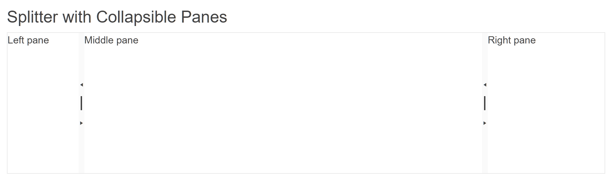

# Getting Started with the Splitter

This tutorial explains how to set up a basic Telerik UI for {{ site.framework }} Splitter component and highlights the major steps in the configuration of the component.

You will initialize a Splitter component with basic content and enable the collapsing of the panes. Then, you will use the events of the UI component. Finally, you can run the sample code in [Telerik REPL](https://netcorerepl.telerik.com/) and continue exploring the components.

 

@[template](/_contentTemplates/core/getting-started-prerequisites.md#repl-component-gs-prerequisites)

## 1. Prepare the CSHTML File

@[template](/_contentTemplates/core/getting-started-directives.md#gs-adding-directives)

Optionally, you can structure the document by adding the desired HTML elements like headings, divs, paragraphs, and others.

```HtmlHelper
    @using Kendo.Mvc.UI

    <h4>Splitter with Collapsible Panes</h4>
    <div>

    </div>
```

```TagHelper
    @addTagHelper *, Kendo.Mvc

    <h4>Splitter with Collapsible Panes</h4>
    <div>

    </div>
```


## 2. Initialize the Splitter

Use the Splitter HtmlHelper or TagHelper to add the component to a page:

* The `Name()` configuration method is mandatory as its value is used for the `id` and the `name` attributes of the Splitter element.
* The `HtmlAttributes()` object accepts a collection with attributes for the rendering of the DOM element.
* The `Panes()` collection contains a list with the pane items.
* The `.Collapsible(true)` setting will enable the collapsing functionality of the individual panes.

```HtmlHelper
 @using Kendo.Mvc.UI

<h4>Splitter with Collapsible Panes</h4>
<div>
@(Html.Kendo().Splitter()
      .Name("splitter")
      .HtmlAttributes(new { style = "height: 200px;" })
      .Panes(panes =>
      {
          panes.Add()
              .HtmlAttributes(new { id = "left_pane" })
              .Collapsible(true)
              .Size("100px")
              .Content(@<p>
                            Left pane
                        </p>);
    
          panes.Add()
              .HtmlAttributes(new { id = "middle_pane" })
              .Collapsible(true)
              .Content(@<p>
                            Middle pane
                        </p>);
    
          panes.Add()
              .HtmlAttributes(new { id = "right_pane" })
              .Size("20%")
              .Collapsible(true)
              .Content(@<p>
                           Right pane
                        </p>);
      }))
</div>
```

```TagHelper
@addTagHelper *, Kendo.Mvc

<h4>Splitter with Collapsible Panes</h4>
<div>
<kendo-splitter name="splitter" style="height: 200px;">
       <pane size="100px" id="left_pane" collapsible="true">
           <p>Left pane</p>
       </pane>
       <pane id="middle_pane" collapsible="true">
            <p>Middle pane</p>
       </pane>
       <pane size="20%" id="right_pane" collapsible="true">
            <p>Right pane</p>
       </pane>
</kendo-splitter>
</div>
```


## 3. Handle a Splitter Event

The Splitter component provides convenient events for implementing your desired logic. In this tutorial, you will use the exposed `Collapse()` event to log a new entry in the browser's console.

```HtmlHelper
 @using Kendo.Mvc.UI

<script>
    function onCollapse(e) {
        console.log("Collapsed :: Pane <b>#" + e.pane.id + "</b> from splitter <b>#" + this.element[0].id + "</b> collapsed");
    }
</script>

<h4>Splitter with Collapsible Panes</h4>
<div>
@(Html.Kendo().Splitter()
      .Name("splitter")
      .Events(e => e.Collapse("onCollapse"))
      .HtmlAttributes(new { style = "height: 200px;" })
      .Panes(panes =>
      {
          panes.Add()
              .HtmlAttributes(new { id = "left_pane" })
              .Collapsible(true)
              .Size("100px")
              .Content(@<p>
                            Left pane
                        </p>);
    
          panes.Add()
              .HtmlAttributes(new { id = "middle_pane" })
              .Collapsible(true)
              .Content(@<p>
                            Middle pane
                        </p>);
    
          panes.Add()
              .HtmlAttributes(new { id = "right_pane" })
              .Size("20%")
              .Collapsible(true)
              .Content(@<p>
                           Right pane
                        </p>);
      }))
</div>
```

```TagHelper
@addTagHelper *, Kendo.Mvc

<script>
    function onCollapse(e) {
        console.log("Collapsed :: Pane <b>#" + e.pane.id + "</b> from splitter <b>#" + this.element[0].id + "</b> collapsed");
    }
</script>

<h4>Splitter with Collapsible Panes</h4>
<div>
<kendo-splitter name="splitter" style="height: 200px;" on-collapse="onCollapse">
       <pane size="100px" id="left_pane" collapsible="true">
           <p>Left pane</p>
       </pane>
       <pane id="middle_pane" collapsible="true">
            <p>Middle pane</p>
       </pane>
       <pane size="20%" id="right_pane" collapsible="true">
            <p>Right pane</p>
       </pane>
</kendo-splitter>
</div>
```



## 5. (Optional) Reference Existing Splitter Instances

You can reference the Splitter instances that you have created and build on top of their existing configuration:

1. Use the `id` attribute of the component instance to establish a reference.

    ```script
    <script>
        var splitterReference = $("#splitter").data("kendoSplitter"); // splitterReference is a reference to the existing Splitter instance of the helper.
    </script>
    ```

1. Use the [Splitter client-side API](https://docs.telerik.com/kendo-ui/api/javascript/ui/splitter#methods) to control the behavior of the widget. In this example, you will use the `collapse` method to close a pane of the Splitter.

    ```script
    <script>
        var splitterReference = $("#splitter").data("kendoSplitter"); // splitterReference is a reference to the existing Splitter instance of the helper.
        splitterReference.collapse(".k-pane:first");
    </script>
    ```


## Explore this Tutorial in REPL

You can continue experimenting with the code sample above by running it in the Telerik REPL server playground:

* [Sample code with the Splitter HtmlHelper](https://netcorerepl.telerik.com/cdupwnaH38624OtU24)
* [Sample code with the Splitter TagHelper](https://netcorerepl.telerik.com/GxuJwRud38uF4w2L17)



## Next Steps

* [Customize the Positioning of the Splitter]()
* [Use Templates to Control the Splitter Appearance]()

## See Also

* [Using the API of the Splitter for {{ site.framework }} (Demo)](https://demos.telerik.com/{{ site.platform }}/splitter/api)
* [Client-Side API of the Splitter](https://docs.telerik.com/kendo-ui/api/javascript/ui/splitter)
* [Server-Side API of the Splitter](/api/splitter)
* [Knowledge Base Section](/knowledge-base)
