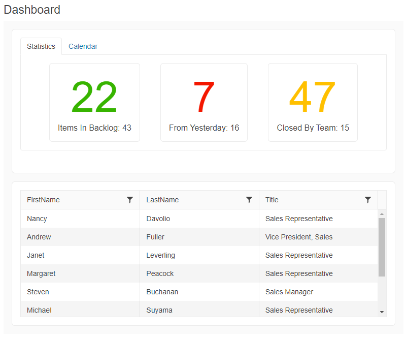

# Getting Started with the TileLayout

This tutorial explains how to set up a basic Telerik UI for {{ site.framework }} TileLayout and highlights the major steps in the configuration of the component.

You will initialize a TileLayout component that contains two containers&mdash;a [TabStrip]() component with integrated [Cards](https://demos.telerik.com/aspnet-core/cards) and [Calendar]() and a [Data Grid]() component. Next, you will handle the TileLayout events and display the event data in the browser console. Also, you will learn how to reference the client-side instance of the component. Finally, you can run the sample code in [Telerik REPL](https://netcorerepl.telerik.com/) and continue exploring the component.

 

@[template](/_contentTemplates/core/getting-started-prerequisites.md#repl-component-gs-prerequisites)

## 1. Prepare the CSHTML File

@[template](/_contentTemplates/core/getting-started-directives.md#gs-adding-directives)

Optionally, you can structure the View content by adding the desired HTML elements like headings, divs, paragraphs, and others.

```HtmlHelper
    @using Kendo.Mvc.UI

    <h4>Dashboard</h4>
    <div>

    </div>
```

```TagHelper
    @addTagHelper *, Kendo.Mvc

    <h4>Dashboard</h4>
    <div>

    </div>
```


## 2. Initialize the TileLayout

Use the TileLayout HtmlHelper or TagHelper to add the component to a page:

* The `Name()` configuration method is mandatory as its value is used for the `id` and the `name` attributes of the TileLayout element.
* The `Containers()` configuration specifies the tile containers. Each container has a header and body.
* The `Columns()` method lets you set the desired number of columns. The number of rows in which the tiles will be displayed will adjust automatically.

```HtmlHelper
    @using Kendo.Mvc.UI

    @(Html.Kendo().TileLayout()
        .Name("tilelayout")
        .Columns(2)
        .Containers(c => {
            c.Add().Header(h => h.Text("Title 1")).BodyTemplate("Container 1");
            c.Add().Header(h => h.Text("Title 2")).BodyTemplate("Container 2");
            c.Add().Header(h => h.Text("Title 3")).BodyTemplate("Container 3");
        })
    )

```

```TagHelper
    @addTagHelper *, Kendo.Mvc

    <kendo-tilelayout name="tilelayout" columns="2">
        <containers>
            <container>
                <container-body-template>Container 1</container-body-template>
                <container-header text="Title 1"/>
            </container>
            <container>
                <container-body-template>Container 2</container-body-template>
                <container-header text="Title 2"/>
            </container>
            <container>
                <container-body-template>Container 3</container-body-template>
                <container-header text="Title 3"/>
            </container>
        </containers>
    </kendo-tilelayout>
```


## 3. Integrate UI Components into the TileLayout

The next step is to integrate a [TabStrip]() component with two tabs and a [Data Grid]() component. Each component that is incorporated into the TileLayout will have the all the functionalities and options available in the stand-alone nested component. You can integrate any Telerik UI for {{ site.framework }} component into the TileLayout.

* Include the TabStrip component by creating an [external Kendo UI template](#external-client-templates) and setting the name of the template in the `BodyTemplateId()` method of the TileLayout HtmlHelper or the `body-template-id` attribute of the TileLayout TagHelper.

    ```HtmlHelper
        @using Kendo.Mvc.UI

        <script id="tabStripContainer" type="text/x-kendo-template">
            @(Html.Kendo().TabStrip()
            .Name("tabstrip")
            .Items(tabstrip =>
            {
                tabstrip.Add().Text("Dashboard Information")
                    .Selected(true)
                    .Content(@<text>
                        <div class="status-cards">
                            <div class="k-card">
                                <div class="k-card-body">
                                    <div class="k-card-result on-track-tasks">22</div>
                                    <div class="k-card-title">Items in Backlog: 43</div>
                                </div>
                            </div>
                            <div class="k-card">
                                <div class="k-card-body">
                                    <div class="k-card-result overdue-tasks">7</div>
                                    <div class="k-card-title">From Yesterday: 16</div>
                                </div>
                            </div> 
                            <div class="k-card">
                                <div class="k-card-body">
                                    <div class="k-card-result issues">47</div>
                                    <div class="k-card-title">Closed By Team: 15</div>
                                </div>
                            </div> 
                        </div>
                    </text>);

                    tabstrip.Add().Text("Calendar")
                    .Content(@<text>
                        <div class="calendar-widget">
                            @(Html.Kendo().Calendar()
                                .Name("calendar")
                                .ComponentType("modern")
                                .ToClientTemplate()
                            )
                        </div>
                    </text>);
            })
            .ToClientTemplate()
            )
        </script>

        @(Html.Kendo().TileLayout()
            .Name("tilelayout")
            .Columns(1)
            .Containers(c => {
                c.Add().Header(h => h.Text("Tools")).BodyTemplateId("tabStripContainer");
            })
        )

    ```
    
    ```TagHelper
        @addTagHelper *, Kendo.Mvc

        <script id="tabStripContainer" type="text/html">
            <kendo-tabstrip name="tabstrip" is-in-client-template="true">
                <items>
                    <tabstrip-item text="Dashboard Information" selected="true">
                        <content>
                            <div class="status-cards">
                                <div class="k-card">
                                    <div class="k-card-body">
                                        <div class="k-card-result on-track-tasks">22</div>
                                        <div class="k-card-title">Items in Backlog: 43</div>
                                    </div>
                                </div>
                                <div class="k-card">
                                    <div class="k-card-body">
                                        <div class="k-card-result overdue-tasks">7</div>
                                        <div class="k-card-title">From Yesterday: 16</div>
                                    </div>
                                </div> 
                                <div class="k-card">
                                    <div class="k-card-body">
                                        <div class="k-card-result issues">47</div>
                                        <div class="k-card-title">Closed By Team: 15</div>
                                    </div>
                                </div> 
                            </div>
                        </content>
                    </tabstrip-item>
                    <tabstrip-item text="Calendar">
                        <content>
                            <div class="calendar-widget">
                                <kendo-calendar name="calendar" component-type="modern" is-in-client-template="true"></kendo-calendar>
                            </div>
                        </content>
                    </tabstrip-item>
                </items>
            </kendo-tabstrip>
        </script>


        <kendo-tilelayout name="tilelayout" columns="1">
            <containers>
                    <container body-template-id="tabStripContainer"></container>
            </containers>
        </kendo-tilelayout>
    ```
    

* Include the Grid component as a separate TileLayout container.

    ```HtmlHelper
        @using Kendo.Mvc.UI

        <script id="gridContainer" type="text/x-kendo-template">
            @(Html.Kendo().Grid<Kendo.Mvc.Examples.Models.EmployeeViewModel>()
                .Name("grid")
                .Columns(columns => {
                    columns.Bound(e => e.FirstName);
                    columns.Bound(e => e.LastName);
                    columns.Bound(e => e.Title);
                })
                .DataSource(dataSource => dataSource
                    .Ajax()
                    .Read(read => read.Action("CustomCommand_Read", "Grid"))
                )
                .Sortable()
                .Filterable()
                .Scrollable()
                .HtmlAttributes(new { style = "height:250px;" })
                .ToClientTemplate()
            )
        </script>

        @(Html.Kendo().TileLayout()
            .Name("tilelayout")
            .Columns(1)
            .Containers(c => {
                c.Add().Header(h => h.Text("Tools")).BodyTemplateId("tabStripContainer");
                c.Add().Header(h => h.Text("All Employees")).BodyTemplateId("gridContainer");
            })
        )
    ```
    
    ```TagHelper
        @addTagHelper *, Kendo.Mvc

        <script id="gridContainer" type="text/html">
            <kendo-grid name="grid" is-in-client-template="true" height="250">
                <datasource type="DataSourceTagHelperType.Ajax">
                    <transport>
                        <read url="@Url.Action("CustomCommand_Read", "Grid")"/>
                    </transport>
                </datasource>
                <columns>
                    <column field="FirstName"/>
                    <column field="LastName"/>
                    <column field="Title"/>
                </columns>
                <sortable enabled="true"/>
                <scrollable enabled="true"/>
                <filterable enabled="true"/>
            </kendo-grid>
        </script>

        <kendo-tilelayout name="tilelayout" columns="1">
            <containers>
                <container body-template-id="tabStripContainer"></container>
                <container body-template-id="gridContainer"></container>
            </containers>
        </kendo-tilelayout>
    ```
    
    ```Model
        public class EmployeeViewModel
        {
            public string FirstName { get; set; }

            public string LastName { get; set; }

            public string Title { get; set; }
        }

    ```
    ```C# GridController
        public ActionResult CustomCommand_Read([DataSourceRequest] DataSourceRequest request)
        {
            return Json(GetEmployees().ToDataSourceResult(request));
        }  
    ```

## 4. Handle a TileLayout Event

The TileLayout exposes convenient events for implementing your desired logic. In this example, you will use the [`Reorder`](/api/Kendo.Mvc.UI.Fluent/tilelayouteventbuilder#reordersystemstring) event to log the title, previous, and new position of the reordered item in the browser's console.

```HtmlHelper
@using Kendo.Mvc.UI

    <script id="card1" type="text/x-kendo-template">
        <div class="k-card">
            <div class="k-card-header">
                <h5 class="k-card-title">Rome</h5>
                <h6 class="k-card-subtitle">Capital of Italy</h6>
            </div>
            <div class="k-card-body">
                <p>Rome is a sprawling, cosmopolitan city with nearly 3,000 years of globally influential art, architecture and culture on display.</p>
                <p>Ancient ruins such as the Forum and the Colosseum evoke the power of the former Roman Empire. </p>
            </div>
            <div class="k-card-footer">
                <a class="k-button k-button-flat-base k-button-flat k-button-md k-rounded-md k-icon-button"><span class="k-icon k-i-facebook"></span></a>
                <a class="k-button k-button-flat-base k-button-flat k-button-md k-rounded-md k-icon-button"><span class="k-icon k-i-pinterest"></span></a>
                <a class="k-button k-button-flat-base k-button-flat k-button-md k-rounded-md k-icon-button"><span class="k-icon k-i-twitter"></span></a>
            </div>
        </div>
    </script>

    <script id="card2" type="text/x-kendo-template">
        <div class="k-card">
            <div class="k-card-header">
                <h5 class="k-card-title">Barcelona</h5>
            </div>
            <div class="k-card-body">
                <p>Barcelona, the cosmopolitan capital of Spain's Catalonia region, is known for its art and architecture.</p>
                <p>The fantastical Sagrada Família church and other modernist landmarks designed by Antoni Gaudí dot the city.</p>
            </div>
            <div class="k-card-footer">
                <a class="k-button k-button-flat-base k-button-flat k-button-md k-rounded-md k-icon-button"><span class="k-icon k-i-facebook"></span></a>
                <a class="k-button k-button-flat-base k-button-flat k-button-md k-rounded-md k-icon-button"><span class="k-icon k-i-pinterest"></span></a>
                <a class="k-button k-button-flat-base k-button-flat k-button-md k-rounded-md k-icon-button"><span class="k-icon k-i-twitter"></span></a>
            </div>
        </div>
    </script>

    <script id="card3" type="text/x-kendo-template">
        <div class="k-card">
            <div class="k-card-header">
                <h5 class="k-card-title">San Francisco</h5>
                <h6 class="k-card-subtitle">City in California</h6>
            </div>
            <div class="k-card-body">
                <p>San Francisco, officially City and County of San Francisco and colloquially known as SF, San Fran or "The City", is the cultural, commercial, and financial center of Northern California.</p>
            </div>
            <div class="k-card-footer">
                <a class="k-button k-button-flat-base k-button-flat k-button-md k-rounded-md k-icon-button"><span class="k-icon k-i-facebook"></span></a>
                <a class="k-button k-button-flat-base k-button-flat k-button-md k-rounded-md k-icon-button"><span class="k-icon k-i-pinterest"></span></a>
                <a class="k-button k-button-flat-base k-button-flat k-button-md k-rounded-md k-icon-button"><span class="k-icon k-i-twitter"></span></a>
            </div>
        </div>
    </script>

    @(Html.Kendo().TileLayout()
        .Name("tilelayout")
        .Columns(3)
        .Containers(c => {
            c.Add().Header(h => h.Text("Rome")).BodyTemplateId("card1").ColSpan(1);
            c.Add().Header(h => h.Text("Barcelona")).BodyTemplateId("card2").ColSpan(1);
            c.Add().Header(h => h.Text("San Francisco")).BodyTemplateId("card3").ColSpan(1);
        })
        .Reorderable()
        .Events(e=>e.Reorder("onTileReorder"))
    )

    <script>
        function onTileReorder(e) {
            let reorderedItem = $(e.container).find(".k-card .k-card-title").text();
            let newPosition = (e.newIndex) + 1;
            let oldPostition = (e.oldIndex) + 1;
            console.log("Card '" + reorderedItem + "' has been moved from position " + oldPostition + " to position " + newPosition);
        }
    </script>
```

```TagHelper
   @addTagHelper *, Kendo.Mvc

    <script id="card1" type="text/x-kendo-template">
        <div class="k-card">
            <div class="k-card-header">
                <h5 class="k-card-title">Rome</h5>
                <h6 class="k-card-subtitle">Capital of Italy</h6>
            </div>
            <div class="k-card-body">
                <p>Rome is a sprawling, cosmopolitan city with nearly 3,000 years of globally influential art, architecture and culture on display.</p>
                <p>Ancient ruins such as the Forum and the Colosseum evoke the power of the former Roman Empire. </p>
            </div>
            <div class="k-card-footer">
                <a class="k-button k-button-flat-base k-button-flat k-button-md k-rounded-md k-icon-button"><span class="k-icon k-i-facebook"></span></a>
                <a class="k-button k-button-flat-base k-button-flat k-button-md k-rounded-md k-icon-button"><span class="k-icon k-i-pinterest"></span></a>
                <a class="k-button k-button-flat-base k-button-flat k-button-md k-rounded-md k-icon-button"><span class="k-icon k-i-twitter"></span></a>
            </div>
        </div>
    </script>

    <script id="card2" type="text/x-kendo-template">
        <div class="k-card">
            <div class="k-card-header">
                <h5 class="k-card-title">Barcelona</h5>
            </div>
            <div class="k-card-body">
                <p>Barcelona, the cosmopolitan capital of Spain's Catalonia region, is known for its art and architecture.</p>
                <p>The fantastical Sagrada Família church and other modernist landmarks designed by Antoni Gaudí dot the city.</p>
            </div>
            <div class="k-card-footer">
                <a class="k-button k-button-flat-base k-button-flat k-button-md k-rounded-md k-icon-button"><span class="k-icon k-i-facebook"></span></a>
                <a class="k-button k-button-flat-base k-button-flat k-button-md k-rounded-md k-icon-button"><span class="k-icon k-i-pinterest"></span></a>
                <a class="k-button k-button-flat-base k-button-flat k-button-md k-rounded-md k-icon-button"><span class="k-icon k-i-twitter"></span></a>
            </div>
        </div>
    </script>

    <script id="card3" type="text/x-kendo-template">
        <div class="k-card">
            <div class="k-card-header">
                <h5 class="k-card-title">San Francisco</h5>
                <h6 class="k-card-subtitle">City in California</h6>
            </div>
            <div class="k-card-body">
                <p>San Francisco, officially City and County of San Francisco and colloquially known as SF, San Fran or "The City", is the cultural, commercial, and financial center of Northern California.</p>
            </div>
            <div class="k-card-footer">
                <a class="k-button k-button-flat-base k-button-flat k-button-md k-rounded-md k-icon-button"><span class="k-icon k-i-facebook"></span></a>
                <a class="k-button k-button-flat-base k-button-flat k-button-md k-rounded-md k-icon-button"><span class="k-icon k-i-pinterest"></span></a>
                <a class="k-button k-button-flat-base k-button-flat k-button-md k-rounded-md k-icon-button"><span class="k-icon k-i-twitter"></span></a>
            </div>
        </div>
    </script>

    <kendo-tilelayout name="tilelayout" columns="3" reorderable="true" on-reorder="onTileReorder">
        <containers>
            <container body-template-id="card1" col-span="1">
                <container-header text="Rome" />
            </container>
            <container body-template-id="card2" col-span="1">
                <container-header text="Barcelona" />
            </container>
            <container body-template-id="card3" col-span="1">
                <container-header text="San Francisco" />
            </container>
    `   </containers>
    </kendo-tilelayout>

    <script>
        function onTileReorder(e) {
            let reorderedItem = $(e.container).find(".k-card .k-card-title").text();
            let newPosition = (e.newIndex) + 1;
            let oldPostition = (e.oldIndex) + 1;
            console.log("Card '" + reorderedItem + "' has been moved from position " + oldPostition + " to position " + newPosition);
        }
    </script>
```


## 5. (Optional) Reference Existing TileLayout Instances

You can reference the TileLayout instances that you have created and build on top of their existing configuration:

Use the value of the `Name()` option of the component to establish a reference.

   ```JS script
        <script>
            $(document).ready(function() {
                var tileLayoutReference = $("#tilelayout").data("kendoTileLayout"); // tileLayoutReference is a reference to the existing TileLayout instance of the helper.
            });
        </script>
   ```

For more information on referencing specific helper instances, see the [Methods and Events]() article.


## Explore this Tutorial in REPL

You can continue experimenting with the code sample above by running it in the Telerik REPL server playground:

* [Sample code with the TileLayout HtmlHelper](https://netcorerepl.telerik.com/GnaVEQFV43446A8W12)
* [Sample code with the TileLayout TagHelper](https://netcorerepl.telerik.com/GdEBEGlL46fPsHKM57)



## Next Steps

* [Reordering the TileLayout containers]()
* [Resizing the TileLayout containers]()
* [Configuring the layout of the TileLayout containers]()

## See Also

* [Using the Events of the TileLayout for {{ site.framework }} (Demo)](https://demos.telerik.com/{{ site.platform }}/tilelayout/events)
* [Client-Side API of the TileLayout](https://docs.telerik.com/kendo-ui/api/javascript/ui/tilelayout)
* [Server-Side API of the TileLayout](/api/tilelayout)
* [Knowledge Base Section](/knowledge-base)
