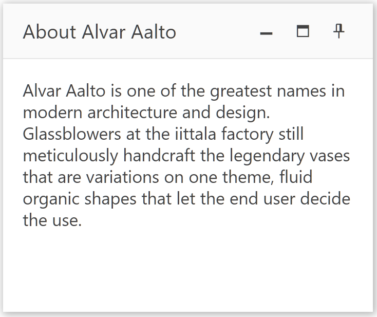

# Getting Started with the Window

This tutorial explains how to set up a basic Telerik UI for {{ site.framework }} Window and highlights the major steps in the configuration of the component.

You will initialize a Window component with basic content and several action buttons. Finally, you can run the sample code in [Telerik REPL](https://netcorerepl.telerik.com/) and continue exploring the components.

 

@[template](/_contentTemplates/core/getting-started-prerequisites.md#repl-component-gs-prerequisites)

## 1. Prepare the CSHTML File

@[template](/_contentTemplates/core/getting-started-directives.md#gs-adding-directives)

You will also control the dragging of the Window. Optionally, you can structure the document by adding the desired HTML elements like headings, divs, paragraphs, and others.

```HtmlHelper
    @using Kendo.Mvc.UI

    <h4>Window with buttons</h4>
    <div>

    </div>
```

```TagHelper
    @addTagHelper *, Kendo.Mvc

    <h4>Window with buttons</h4>
    <div>

    </div>
```


## 2. Initialize the Window

Use the Window HtmlHelper or TagHelper to add the component to a page:

* The `Name()` configuration method is mandatory as its value is used for the `id` and the name attributes of the Window element.
* The `Title()` configuration specifies the text that is shown in the header of the Window.
* The `Content()` setting contains the inner structure of the component. 

```HtmlHelper
@using Kendo.Mvc.UI

<h4>Window with buttons</h4>
<div>
@(Html.Kendo().Window()
    .Name("window")
    .Title("About Alvar Aalto")
    .Content(@<text>
        <p>
            Alvar Aalto is one of the greatest names in modern architecture and design.
            Glassblowers at the iittala factory still meticulously handcraft the legendary vases
            that are variations on one theme, fluid organic shapes that let the end user decide the use.
        </p>
    </text>)
    .Width(300)
    .Height(250)
)
</div>
```

```TagHelper
@addTagHelper *, Kendo.Mvc

<h4>Window with buttons</h4>
<div>
<kendo-window name="window"
    title="About Alvar Aalto"
    height="250"
    width="300">
    <content>
        <p>
            Alvar Aalto is one of the greatest names in modern architecture and design.
            Glassblowers at the iittala factory still meticulously handcraft the legendary vases
            that are variations on one theme, fluid organic shapes that let the end user decide the use.
        </p>
    </content>
</kendo-window>
</div>
```


## 3. Enable Dragging and Buttons

The next step is to switch on the dragging feature of the Window and include more action buttons.

```HtmlHelper
@using Kendo.Mvc.UI

<h4>Window with buttons</h4>
<div>
@(Html.Kendo().Window()
    .Name("window")
    .Title("About Alvar Aalto")
    .Draggable()
    .Actions(actions => actions
        .Minimize()
        .Maximize()
        .Pin()
    )
    .Content(@<text>
        <p>
            Alvar Aalto is one of the greatest names in modern architecture and design.
            Glassblowers at the iittala factory still meticulously handcraft the legendary vases
            that are variations on one theme, fluid organic shapes that let the end user decide the use.
        </p>
    </text>)
    .Width(300)
    .Height(250)
)
</div>
```

```TagHelper
@addTagHelper *, Kendo.Mvc

@{
    string[] actions = new string[] { "Minimize", "Maximize", "Pin" };
}

<h4>Window with buttons</h4>
<div>
<kendo-window name="window"
    title="About Alvar Aalto"
    height="250"
    width="300"
    draggable="true"
    actions="actions">
    <content>
        <p>
            Alvar Aalto is one of the greatest names in modern architecture and design.
            Glassblowers at the iittala factory still meticulously handcraft the legendary vases
            that are variations on one theme, fluid organic shapes that let the end user decide the use.
        </p>
    </content>
</kendo-window>
</div>
```


## 4. Handle a Window Event

The Window component provides convenient events for implementing your desired logic. In this tutorial, you will use the exposed `Minimize()` and `Maximize()` events to log a new entry in the browser's console.

```HtmlHelper
@using Kendo.Mvc.UI

<h4>Window with buttons</h4>
<div>
<script>
    function minimize(e) {
        console.log("Minimized");
    }

    function maximize(e) {
        console.log("Maximized");
    }
</script>

@(Html.Kendo().Window()
    .Name("window")
    .Title("About Alvar Aalto")
    .Draggable()
    .Actions(actions => actions
        .Minimize()
        .Maximize()
        .Pin()
    )
    .Content(@<text>
        <p>
            Alvar Aalto is one of the greatest names in modern architecture and design.
            Glassblowers at the iittala factory still meticulously handcraft the legendary vases
            that are variations on one theme, fluid organic shapes that let the end user decide the use.
        </p>
    </text>)
    .Events(e => e // Configure the client-side events.
        .Minimize("minimize")
        .Maximize("maximize")
     )
    .Width(300)
    .Height(250)
)
</div>


```

```TagHelper
@addTagHelper *, Kendo.Mvc

@{
    string[] actions = new string[] { "Minimize", "Maximize", "Pin" };
}

<h4>Window with buttons</h4>
<div>
<script>
    function minimize(e) {
        console.log("Minimized");
    }

    function maximize(e) {
        console.log("Maximized");
    }
</script>

<kendo-window name="window"
    title="About Alvar Aalto"
    height="250"
    width="300"
    draggable="true"
    actions="actions"
    on-minimize="minimize"
    on-maximize="maximize">
    <content>
        <p>
            Alvar Aalto is one of the greatest names in modern architecture and design.
            Glassblowers at the iittala factory still meticulously handcraft the legendary vases
            that are variations on one theme, fluid organic shapes that let the end user decide the use.
        </p>
    </content>
</kendo-window>
</div>
```



## 5. (Optional) Reference Existing Window Instances

You can reference the Window instances that you have created and build on top of their existing configuration:

1. Use the `id` attribute of the component instance to establish a reference.

    ```script
    <script>
        var windowReference = $("#window").data("kendoWindow"); // windowReference is a reference to the existing Window instance of the helper.
    </script>
    ```

1. Use the [Window client-side API](https://docs.telerik.com/kendo-ui/api/javascript/ui/window#methods) to control the behavior of the widget. In this example, you will use the `close` method to close the window.

    ```script
    <script>
        var windowReference = $("#window").data("kendoWindow"); // windowReference is a reference to the existing Window instance of the helper.
        windowReference.close(); 
    </script>
    ```


## Explore this Tutorial in REPL

You can continue experimenting with the code sample above by running it in the Telerik REPL server playground:

* [Sample code with the Window HtmlHelper](https://netcorerepl.telerik.com/mxOPFKEE51nZ6jVk25)
* [Sample code with the Window TagHelper](https://netcorerepl.telerik.com/mHallUuu51BSPJZu39)



## Next Steps

* [Configuring the Animations]()
* [Customize the Positioning of the Window]()
* [Restrict the Draggable Area]()

## See Also

* [Using the API of the Window for {{ site.framework }} (Demo)](https://demos.telerik.com/{{ site.platform }}/window/api)
* [Window Client-Side API](https://docs.telerik.com/kendo-ui/api/javascript/ui/window)
* [Server-Side API of the Window](/api/window)
* [Knowledge Base Section](/knowledge-base)
