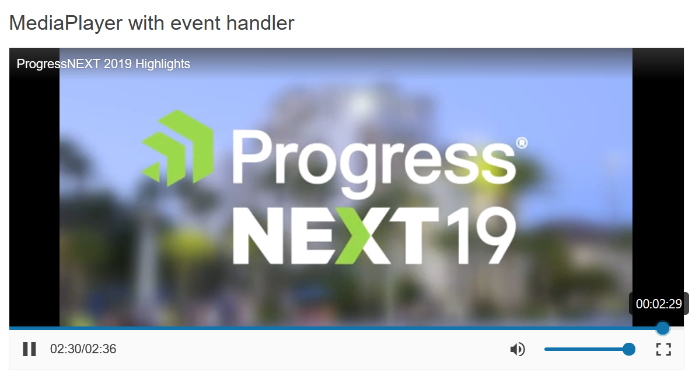

# Getting Started with the MediaPlayer

This tutorial explains how to set up a basic Telerik UI for {{ site.framework }} MediaPlayer and highlights the major steps in the configuration of the component.

You will initialize a MediaPlayer and learn how to play the source initially by default. Then, you will see how to attach an event handler to the component. Finally, you can run the sample code in [Telerik REPL](https://netcorerepl.telerik.com/) and continue exploring the component.

 

@[template](/_contentTemplates/core/getting-started-prerequisites.md#repl-component-gs-prerequisites)

## 1. Prepare the CSHTML File

@[template](/_contentTemplates/core/getting-started-directives.md#gs-adding-directives)

Optionally, you can structure the document by adding the desired HTML elements like headings, divs, paragraphs, and others.

```HtmlHelper
@using Kendo.Mvc.UI

<h4>MediaPlayer with event handler</h4>

<p>

</p>
```

```TagHelper
@addTagHelper *, Kendo.Mvc

<h4>MediaPlayer with event handler</h4>

<p>

</p>
``` 


## 2. Initialize the MediaPlayer

Use the MediaPlayer HtmlHelper or TagHelper to add the component to a page:

* The `Name()` configuration method is mandatory as its value is used for the `id` and the `name` attributes of the MediaPlayer element.
* The `Media()` is used to provide the component with the required media file or URL to play.
* The `AutoPlay()` configuration allows whether the video or audio should start playing on initial load.

```HtmlHelper
@using Kendo.Mvc.UI

<h4>MediaPlayer with event handler</h4>

<p>
    @(Html.Kendo().MediaPlayer()
        .Name("mediaplayer")
        .Media(m => m
            .Title("ProgressNEXT 2019 Highlights")
            .Source("https://youtu.be/2OvvwWShNWo")
        )
    )
</p>
```

```TagHelper
@addTagHelper *, Kendo.Mvc

<h4>MediaPlayer with event handler</h4>

<p>
    <kendo-mediaplayer name="mediaplayer">
    </kendo-mediaplayer>
</p>
```


## 3. Enable Initial Play

The next step is to configure the MediaPlayer to play its source automatically on initial load. You can do that by using the `AutoPlay()` configuration.

```HtmlHelper
@using Kendo.Mvc.UI

<h4>MediaPlayer with event handler</h4>

<p>
    @(Html.Kendo().MediaPlayer()
        .Name("mediaplayer")
        .AutoPlay(true)
        .Media(m => m
            .Title("ProgressNEXT 2019 Highlights")
            .Source("https://youtu.be/2OvvwWShNWo")
        )
    )
</p>
```

```TagHelper
@addTagHelper *, Kendo.Mvc

<h4>MediaPlayer with event handler</h4>

<p>
    <kendo-mediaplayer name="mediaplayer"  
           auto-play="true">
    </kendo-mediaplayer>
</p>
```


## 4. Handle a MediaPlayer Event

The MediaPlayer exposes a `Pause()` event that you can handle and assign specific functions to the component. In this tutorial, you will use the `Pause()` event to display a message when the user stops the media.

```HtmlHelper
@using Kendo.Mvc.UI

<script>
   function onPause(e) {
       console.log("Playing paused."); // displays a message in the browser console
   }
</script>

<h4>MediaPlayer with event handler</h4>

<p>
    @(Html.Kendo().MediaPlayer()
        .Name("mediaplayer")
        .AutoPlay(true)
        .Media(m => m
            .Title("ProgressNEXT 2019 Highlights")
            .Source("https://youtu.be/2OvvwWShNWo")
        )
        .Events(e => e.Pause("onPause"))
    )
</p>
```

```TagHelper
@addTagHelper *, Kendo.Mvc

<script>
   function onPause(e) {
       console.log("Playing paused."); // displays a message in the browser console
   }
</script>

<h4>MediaPlayer with event handler</h4>

<p>
    <kendo-mediaplayer name="mediaplayer" 
           auto-play="true" on-pause="onPause">
    </kendo-mediaplayer>
</p>
```


For more examples, refer to the [demo on using the events of the MediaPlayer](https://demos.telerik.com/{{ site.platform }}/mediaplayer/events).

## 5. (Optional) Reference Existing MediaPlayer Instances

You can reference the MediaPlayer instances that you have created and build on top of their existing configuration:

1. Use the `id` attribute of the component instance to establish a reference.

    ```script
    <script>
        var mediaplayerReference = $("#mediaplayer").data("kendoMediaPlayer"); // mediaplayerReference is a reference to the existing mediaplayer instance of the helper.
    </script>
    ```

1. Use the [MediaPlayer client-side API](https://docs.telerik.com/kendo-ui/api/javascript/ui/mediaplayer#methods) to control the behavior of the widget. In this example, you will use the `mute` method to silence the media source.

    ```script
    <script>
        var mediaplayerReference = $("#mediaplayer").data("kendoMediaPlayer"); // mediaplayerReference is a reference to the existing timeMediaPlayer instance of the helper.
        mediaplayerReference.mute(); // Mutes the currently playing file.
    </script>
    ```

For more information on referencing specific helper instances, see the [Methods and Events]() article.


## Explore this Tutorial in REPL

You can continue experimenting with the code sample above by running it in the Telerik REPL server playground:

* [Sample code with the MediaPlayer HtmlHelper](https://netcorerepl.telerik.com/cdlvnYkL01bNFM4T40)
* [Sample code with the MediaPlayer TagHelper](https://netcorerepl.telerik.com/GxPPxaaB069F4cSu33)



## Next Steps

* [Playlists]()
* [Razor Page]()

## See Also

* [Using the API of the MediaPlayer for {{ site.framework }} (Demo)](https://demos.telerik.com/{{ site.platform }}/mediaplayer/api)
* [Client-Side API of the MediaPlayer](https://docs.telerik.com/kendo-ui/api/javascript/ui/mediaplayer)
* [Server-Side API of the MediaPlayer](/api/mediaplayer)
* [Knowledge Base Section](/knowledge-base)
