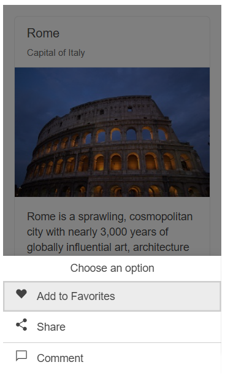

# Getting Started with the ActionSheet

This tutorial explains how to set up a basic Telerik UI for {{ site.framework }} ActionSheet and highlights the major steps in the configuration of the component.

You will initialize an ActionSheet component with three items and show it over a [Card](https://demos.telerik.com/aspnet-core/cards) when a [Button]() is clicked. Finally, you can run the sample code in [Telerik REPL](https://netcorerepl.telerik.com/) and continue exploring the components.

 

@[template](/_contentTemplates/core/getting-started-prerequisites.md#component-gs-prerequisites)

## 1. Prepare the CSHTML File

@[template](/_contentTemplates/core/getting-started-directives.md#gs-adding-directives)

Optionally, you can structure the View content by adding the desired HTML elements like headings, divs, paragraphs, and others.

```HtmlHelper
    @using Kendo.Mvc.UI

    <div id="city" class="demo-view">
    </div>
```

```TagHelper
    @addTagHelper *, Kendo.Mvc

    <div id="city" class="demo-view">
    </div>
```


## 2. Initialize the ActionSheet

Use the ActionSheet HtmlHelper or TagHelper to add the component to a page:

* The `Name()` configuration method is mandatory as its value is used for the `id` and the `name` attributes of the ActionSheet element.
* The `Title()` option specifies the title that will be displayed in the header.
* The `Items()` method configures the component items.

```HtmlHelper
    @using Kendo.Mvc.UI

    <div id="city" class="demo-view">
        @(Html.Kendo().ActionSheet()
            .Name("actionsheet")
            .Title("Choose an option")
            .Items(items =>
            {
                items.Add().Text("Add to favorites").IconClass("k-i-heart").Click("onItemClick");
                items.Add().Text("Share").IconClass("k-i-share").Click("onItemClick");
                items.Add().Text("Comment").IconClass("k-i-comment").Click("onItemClick");
            })
        )
    </div>
```

```TagHelper
    @addTagHelper *, Kendo.Mvc

    <div id="city" class="demo-view">
        <kendo-actionsheet name="actionsheet" title="Choose an option">
            <items>
                <item text="Add to Favorites" icon-class="k-i-heart" click="onItemClick" />
                <item text="Share" icon-class="k-i-share" click="onItemClick" />
                <item text="Comment" icon-class="k-i-comment" click="onItemClick" />
            </items>
        </kendo-actionsheet>
    </div>
```


## 3. Configure the Card and the Button

The next step is to define the Card and the Button components—the ActionSheet will be displayed on top of the Card when the Button is clicked. 

```HtmlHelper
    @using Kendo.Mvc.UI

    <div id="city" class="demo-view">
        <div class="cards-container">
            <div class="k-card">
                <div class="k-card-header">
                    <h5 class="k-card-title">Rome</h5>
                    <h6 class="k-card-subtitle">Capital of Italy</h6>
                </div>
                
                <div class="k-card-body">
                    <p>Rome is a sprawling, cosmopolitan city with nearly 3,000 years of globally influential art, architecture and culture on display.</p>
                    <p>Ancient ruins such as the Forum and the Colosseum evoke the power of the former Roman Empire. </p>
                </div>
            </div>
        </div>
        @(Html.Kendo().Button()
            .Name("moreOptionsBtn")
            .ThemeColor(ThemeColor.Primary)
            .Content("More options")
            .Events(ev => ev.Click("moreOptionsClick"))
        )
        @(Html.Kendo().ActionSheet()
            .Name("actionsheet")
            .Title("Choose an option")
            .Items(items =>
            {
                items.Add().Text("Add to favorites").IconClass("k-i-heart").Click("onItemClick");
                items.Add().Text("Share").IconClass("k-i-share").Click("onItemClick");
                items.Add().Text("Comment").IconClass("k-i-comment").Click("onItemClick");
            })
        )
    </div>
```

```TagHelper
    @addTagHelper *, Kendo.Mvc

    <div id="city" class="demo-view">
        <div class="cards-container">
            <div class="k-card">
                <div class="k-card-header">
                    <h5 class="k-card-title">Rome</h5>
                    <h6 class="k-card-subtitle">Capital of Italy</h6>
                </div>
                
                <div class="k-card-body">
                    <p>Rome is a sprawling, cosmopolitan city with nearly 3,000 years of globally influential art, architecture and culture on display.</p>
                    <p>Ancient ruins such as the Forum and the Colosseum evoke the power of the former Roman Empire. </p>
                </div>
            </div>
        </div>
        <kendo-button name="moreOptionsBtn" theme-color="ThemeColor.Primary" on-click="moreOptionsClick">
            More options
        </kendo-button>
        <kendo-actionsheet name="actionsheet" title="Choose an option">
            <items>
                <item text="Add to Favorites" icon-class="k-i-heart" click="onItemClick" />
                <item text="Share" icon-class="k-i-share" click="onItemClick" />
                <item text="Comment" icon-class="k-i-comment" click="onItemClick" />
            </items>
        </kendo-actionsheet>
    </div>
```


Handle the `Click` event of the Button and call the [`open()`](https://docs.telerik.com/kendo-ui/api/javascript/ui/actionsheet/methods/open) client-side method to open the ActionSheet.

```Scripts
    <script>
        function moreOptionsClick() {
            var actionsheet = $("#actionsheet").data("kendoActionSheet");
            actionsheet.open()
        }
    </script>
```

Handle the `Click` event of each ActionSheet item and call the [`close()`](https://docs.telerik.com/kendo-ui/api/javascript/ui/actionsheet/methods/close) client-side method to close the ActionSheet when an item is selected.

```Scripts
    <script>
        function onItemClick() {
            var actionsheet = $("#actionsheet").data("kendoActionSheet");
            actionsheet.close();
        }
    </script>
```

## 4. Handle the ActionSheet Events

The ActionSheet exposes [events](/api/kendo.mvc.ui.fluent/actionsheeteventbuilder) that you can handle and further customize the functionality of the component. In this tutorial, you will use the `Activate` event to disable the <b>Share</b> ActionSheet item based on a specified condition (for example, depending on the user permissions).

```HtmlHelper
    @using Kendo.Mvc.UI

    @(Html.Kendo().ActionSheet()
        .Name("actionsheet")
        .Title("Choose an option")
        .Items(items =>
        {
            items.Add().Text("Add to favorites").IconClass("k-i-heart").Click("onItemClick");
            items.Add().Text("Share").IconClass("k-i-share").Click("onItemClick");
            items.Add().Text("Comment").IconClass("k-i-comment").Click("onItemClick");
        })
        .Events(e => e.Activate("onActivate"))
    )
```

```TagHelper
    @addTagHelper *, Kendo.Mvc

    <kendo-actionsheet name="actionsheet" title="Choose an option" on-activate="onActivate">
        <items>
            <item text="Add to Favorites" icon-class="k-i-heart" click="onItemClick" />
            <item text="Share" icon-class="k-i-share" click="onItemClick" />
            <item text="Comment" icon-class="k-i-comment" click="onItemClick" />
        </items>
    </kendo-actionsheet>
```

```Scripts
    <script>
        var isAdmin = false;
        function onActivate() {
            if(!isAdmin) {
                $(".k-actionsheet-content .k-actionsheet-item").eq(1).addClass("k-disabled"); // Disable the second item.
            }
        }
    </script>
```

## 5. (Optional) Reference Existing ActionSheet Instances

You can reference the ActionSheet instances that you have created and build on top of their existing configuration:

1. Use the `id` attribute of the component instance to get its reference.

    ```script
        <script>
            $(document).ready(function() {
                var actionSheetReference = $("#actionsheet").data("kendoActionSheet"); // actionSheetReference is a reference to the existing ActionSheet instance of the helper.
            });
        </script>
    ```

1. Use the [ActionSheet client-side API](https://docs.telerik.com/kendo-ui/api/javascript/ui/actionsheet#methods) to control the behavior of the component. In this example, you will enable the adaptive mode of the ActionSheet through the [`Adaptive()`](api/kendo.mvc.ui.fluent/actionsheetbuilder#adaptive) option and use the `fullscreen()` method to set the ActionSheet in full-screen mode dynamically (for example, when a button is clicked).


    ```HtmlHelper
        @(Html.Kendo().Button()
            .Name("btn")
            .Content("Open in full-screen mode")
            .Events(ev => ev.Click("onBtnClick"))
        )

        @(Html.Kendo().ActionSheet()
            .Name("actionsheet")
            .Title("Choose an option")
            .Adaptive(true)
            .Items(items =>
            {
                items.Add().Text("Add to favorites").IconClass("k-i-heart").Click("onItemClick");
                items.Add().Text("Share").IconClass("k-i-share").Click("onItemClick");
                items.Add().Text("Comment").IconClass("k-i-comment").Click("onItemClick");
            })
        )
    ```
    
    ```TagHelper
        @addTagHelper *, Kendo.Mvc

        <kendo-button name="btn" on-click="onBtnClick">
            Open in full-screen mode
        </kendo-button>

        <kendo-actionsheet name="actionsheet" title="Choose an option" adaptive="true">
            <items>
                <item text="Add to Favorites" icon-class="k-i-heart" click="onItemClick" />
                <item text="Share" icon-class="k-i-share" click="onItemClick" />
                <item text="Comment" icon-class="k-i-comment" click="onItemClick" />
            </items>
        </kendo-actionsheet>
    ```
    
    ```Scripts
        <script>
            function onBtnClick() {
                var actionSheetReference = $("#actionsheet").data("kendoActionSheet");
                actionSheetReference.fullscreen(true);
                actionSheetReference.open();
            }
        </script>
    ```

For more information on referencing specific helper instances, see the [Methods and Events]() article.


## Explore this Tutorial in REPL

You can continue experimenting with the code sample above by running it in the Telerik REPL server playground:

* [Sample code with the ActionSheet HtmlHelper](https://netcorerepl.telerik.com/QHvbbHQu27Xz7SvT04)
* [Sample code with the ActionSheet TagHelper](https://netcorerepl.telerik.com/GdllFHma315X63Gz21)



## Next Steps

* [Setting the ActionSheet Items]()
* [Using the Keyboard Navigation of the ActionSheet for {{ site.framework }} (Demo)](https://demos.telerik.com/aspnet-core/actionsheet/keyboard-navigation)

## See Also

* [Using the API of the ActionSheet for {{ site.framework }} (Demo)](https://demos.telerik.com/{{ site.platform }}/actionsheet/api)
* [Client-Side API of the ActionSheet](https://docs.telerik.com/kendo-ui/api/javascript/ui/actionsheet)
* [Server-Side API of the ActionSheet HtmlHelper](/api/actionsheet)

* [Server-Side API of the ActionSheet TagHelper](/api/taghelpers/actionsheet)

* [Knowledge Base Section](/knowledge-base)
