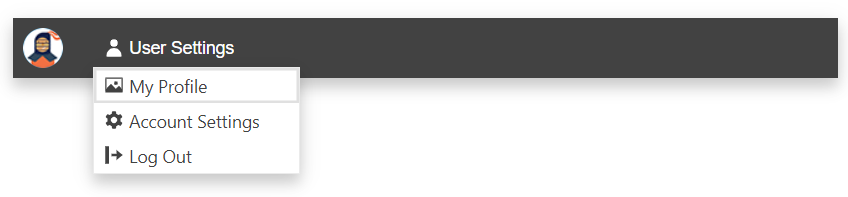

# Getting Started with the AppBar

This tutorial explains how to set up a basic Telerik UI for {{ site.framework }} AppBar and highlights the major steps in the configuration of the component.

You will initialize an AppBar component with two content items—an [Avatar]() and a [DropDownButton]() components. Finally, you can run the sample code in [Telerik REPL](https://netcorerepl.telerik.com/) and continue exploring the components.

 

@[template](/_contentTemplates/core/getting-started-prerequisites.md#component-gs-prerequisites)

## 1. Prepare the CSHTML File

@[template](/_contentTemplates/core/getting-started-directives.md#gs-adding-directives)

Optionally, you can structure the View content by adding the desired HTML elements like headings, divs, paragraphs, and others.

```HtmlHelper
    @using Kendo.Mvc.UI

    <div class="appbar-container">

    </div>
```

```TagHelper
    @addTagHelper *, Kendo.Mvc

    <div class="appbar-container">

    </div>
```


## 2. Initialize the AppBar

Use the AppBar HtmlHelper or TagHelper to add the component to a page:

* The `Name()` configuration method is mandatory as its value is used for the `id` and the `name` attributes of the AppBar element.
* The `Position()` option defines the AppBar position on the page.
* The `PositionMode()` option sets the position type—`Static`, `Sticky`, or `Fixed`.
* The `Items()` method defines the component items.

```HtmlHelper
    @using Kendo.Mvc.UI

    <div class="appbar-container">
        @(Html.Kendo().AppBar()
            .Name("appbar")
            .Position(AppBarPosition.Top)
            .PositionMode(AppBarPositionMode.Sticky)
            .Items(items=> {
                items.Add().Template("Item 1")Type(AppBarItemType.ContentItem);
                items.Add().Type(AppBarItemType.Spacer).Width("8px");
                items.Add().Template("Item 2").Type(AppBarItemType.ContentItem);
            })
        )
    </div>
```

```TagHelper
    @addTagHelper *, Kendo.Mvc

    <div class="appbar-container">
        <kendo-appbar name="appbar" position="AppBarPosition.Top" 
        position-mode="AppBarPositionMode.Sticky">
            <items>
                <appbar-item type="AppBarItemType.ContentItem">
                    <template>
                        Item 1
                    </template>
                </appbar-item>
                <appbar-item width="8px" type="AppBarItemType.Spacer">
                </appbar-item>
                <appbar-item type="AppBarItemType.ContentItem">
                    <template>
                        Item 2
                    </template>
                </appbar-item>
            </items>
        </kendo-appbar>
    </div>
```


## 3. Configure the Avatar and DropDownButton Items

The next step is to integrate the Avatar and DropDownButton components by using the [`Template`]() component.


```HtmlHelper
    @using Kendo.Mvc.UI

    <div class="appbar-container">
        @(Html.Kendo().AppBar()
            .Name("appbar")
            .Position(AppBarPosition.Top)
            .PositionMode(AppBarPositionMode.Sticky)
            .ThemeColor(AppBarThemeColor.Dark)
            .Items(items=> {
                items.Add().Template(Html.Kendo().Template().AddComponent(avatar => avatar
                    .Avatar()
                    .Name("avatar")
                    .Type(AvatarType.Image)
                    .Size(ComponentSize.Medium)
                    .Rounded(Rounded.Full)
                    .Image(@Url.Content("~/shared/web/Kendoka-32.png"))
                )).Type(AppBarItemType.ContentItem);
                items.Add().Type(AppBarItemType.Spacer).Width("8px");
                items.Add().Template(Html.Kendo().Template().AddComponent(ddlbtn => ddlbtn
                    .DropDownButton()
                    .Name("userSettings")
                    .Text("User Settings")
                    .Icon("user")
                    .FillMode(FillMode.Flat)
                    .Rounded(Rounded.Full)
                    .Items(items=>{
                        items.Add().Id("profile").Text("My Profile").Icon("image");
                        items.Add().Id("settings").Text("Account Settings").Icon("gear");
                        items.Add().Id("logout").Text("Log Out").Icon("logout");
                    })
                )).Type(AppBarItemType.ContentItem);
            })
        )
    </div>
```

```TagHelper
    @addTagHelper *, Kendo.Mvc

    <div class="appbar-container">
        <kendo-appbar name="appbar" position="AppBarPosition.Top" 
        position-mode="AppBarPositionMode.Sticky" 
        theme-color="AppBarThemeColor.Dark">
            <items>
                <appbar-item type="AppBarItemType.ContentItem">
                    <template>
                        <kendo-avatar name="avatar"
                            type="AvatarType.Image"
                            size="ComponentSize.Medium"
                            rounded="Rounded.Full"
                            image=@Url.Content("~/shared/web/Kendoka-32.png")>
                        </kendo-avatar>
                    </template>
                </appbar-item>
                <appbar-item width="8px" type="AppBarItemType.Spacer">
                </appbar-item>
                <appbar-item type="AppBarItemType.ContentItem">
                    <template>
                        <kendo-dropdownbutton name="userSettings" text="User Settings" icon="user" rounded="Rounded.Full" fill-mode="FillMode.Flat">
                            <dropdownbutton-items>
                                <item id="profile" text="My Profile" icon="image"></item>
                                <item id="settings" text="Account Settings" icon="gear"></item>
                                <item id="logout" text="Log Out" icon="logout"></item>
                            </dropdownbutton-items>
                        </kendo-dropdownbutton>
                    </template>
                </appbar-item>
            </items>
        </kendo-appbar>
    </div>
```


## 4. Handle the AppBar Events

The AppBar exposes the [`Resize`](/api/kendo.mvc.ui.fluent/appbareventbuilder) event that you can handle and further customize the functionality of the component during its resizing. In this tutorial, you will use the `Resize` event to capture when the AppBar is resized and the viewport is less or equal to 400 pixels wide.

```HtmlHelper
    @using Kendo.Mvc.UI

    <div class="appbar-container">
        @(Html.Kendo().AppBar()
            .Name("appbar")
            .Position(AppBarPosition.Top)
            .PositionMode(AppBarPositionMode.Sticky)
            .ThemeColor(AppBarThemeColor.Dark)
            .Events(ev => ev.Resize("oResize"))
            .Items(items=> {
                items.Add().Template(Html.Kendo().Template().AddComponent(avatar => avatar
                    .Avatar()
                    .Name("avatar")
                    .Type(AvatarType.Image)
                    .Size(ComponentSize.Medium)
                    .Rounded(Rounded.Full)
                    .Image(@Url.Content("~/shared/web/Kendoka-32.png"))
                )).Type(AppBarItemType.ContentItem);
                items.Add().Type(AppBarItemType.Spacer).Width("8px");
                items.Add().Template(Html.Kendo().Template().AddComponent(ddlbtn => ddlbtn
                    .DropDownButton()
                    .Name("userSettings")
                    .Text("User Settings")
                    .Icon("user")
                    .FillMode(FillMode.Flat)
                    .Rounded(Rounded.Full)
                    .Items(items=>{
                        items.Add().Id("profile").Text("My Profile").Icon("image");
                        items.Add().Id("settings").Text("Account Settings").Icon("gear");
                        items.Add().Id("logout").Text("Log Out").Icon("logout");
                    })
                )).Type(AppBarItemType.ContentItem);
            })
        )
    </div>
```

```TagHelper
    @addTagHelper *, Kendo.Mvc

    <div class="appbar-container">
        <kendo-appbar name="appbar" position="AppBarPosition.Top" on-resize="onResize"
        position-mode="AppBarPositionMode.Sticky" 
        theme-color="AppBarThemeColor.Dark">
            <items>
                <appbar-item type="AppBarItemType.ContentItem">
                    <template>
                        <kendo-avatar name="avatar"
                            type="AvatarType.Image"
                            size="ComponentSize.Medium"
                            rounded="Rounded.Full"
                            image=@Url.Content("~/shared/web/Kendoka-32.png")>
                        </kendo-avatar>
                    </template>
                </appbar-item>
                <appbar-item width="8px" type="AppBarItemType.Spacer">
                </appbar-item>
                <appbar-item type="AppBarItemType.ContentItem">
                    <template>
                        <kendo-dropdownbutton name="userSettings" text="User Settings" icon="user" rounded="Rounded.Full" fill-mode="FillMode.Flat">
                            <dropdownbutton-items>
                                <item id="profile" text="My Profile" icon="image"></item>
                                <item id="settings" text="Account Settings" icon="gear"></item>
                                <item id="logout" text="Log Out" icon="logout"></item>
                            </dropdownbutton-items>
                        </kendo-dropdownbutton>
                    </template>
                </appbar-item>
            </items>
        </kendo-appbar>
    </div>
```

```Scripts
    <script>
        function onReszie() {
            if (window.matchMedia("(max-width: 400px)").matches) {
                // Trigger custom JavaScript logic when the AppBar is resized and the viewport id up to 400px wide.
            }
        }
     </script>
```


## 5. (Optional) Reference Existing AppBar Instances

You can reference the AppBar instances that you have created and build on top of their existing configuration:

Use the `id` attribute of the component instance to get its reference.

```script
    <script>
        $(document).ready(function() {
            var appBarReference = $("#appbar").data("kendoAppBar"); // appBarReference is a reference to the existing AppBar instance of the helper.
        });
    </script>
```

For more information on referencing specific helper instances, see the [Methods and Events]() article.


## Explore this Tutorial in REPL

You can continue experimenting with the code sample above by running it in the Telerik REPL server playground:

* [Sample code with the AppBar HtmlHelper](https://netcorerepl.telerik.com/mHvlPXbJ34H0xx2M51)
* [Sample code with the AppBar TagHelper](https://netcorerepl.telerik.com/QxFllZbJ42UU0j9139)



## Next Steps

* [Setting the AppBar Items]()
* [Positioning the AppBar]()

## See Also

* [Client-Side API of the AppBar](https://docs.telerik.com/kendo-ui/api/javascript/ui/appbar)
* [Server-Side API of the AppBar HtmlHelper](/api/appbar)

* [Server-Side API of the AppBar TagHelper](/api/taghelpers/appbar)

* [Knowledge Base Section](/knowledge-base)
