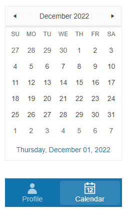

# Getting Started with the BottomNavigation

This tutorial explains how to set up a basic Telerik UI for {{ site.framework }} BottomNavigation and highlights the major steps in the configuration of the component.

You will initialize a BottomNavigation control and configure two items. Next, you will handle the `Select()` event and allow the user to switch between the content of the items. Finally, you can run the sample code in [Telerik REPL](https://netcorerepl.telerik.com/) and continue exploring the components.

 

@[template](/_contentTemplates/core/getting-started-prerequisites.md#repl-component-gs-prerequisites)

## 1. Prepare the CSHTML File

@[template](/_contentTemplates/core/getting-started-directives.md#gs-adding-directives)

Optionally, you can structure the document by adding the desired HTML elements like headings, divs, paragraphs, and apply some basic styles.

```HtmlHelper
    @using Kendo.Mvc.UI

    <div class="demo-app" style="position:relative">
    
    </div>

    <style>
        .demo-app {
            margin: auto;
            width: 234px;
            height: 400px;
        }
    </style>
```

```TagHelper
    @addTagHelper *, Kendo.Mvc

    <div class="demo-app" style="position:relative">
    
    </div>

    <style>
        .demo-app {
            margin: auto;
            width: 234px;
            height: 400px;
        }
    </style>
```


## 2. Initialize the BottomNavigation

Use the BottomNavigation HtmlHelper or TagHelper to add the component to a page:

* The `Name()` configuration method is mandatory as its value is used for the `id` and the name attributes of the BottomNavigation element.
* The `PositionMode` defines the position of the BottomNavigation component.
* The [`Items()` configuration]() specifies the items that will be rendered in the BottomNavigation and allows you to:
  * Set their `Text` and `Icon` attributes.
  * Add classes for the individual items.
  * Set the `Selected` and `Enabled` state of the items.

```HtmlHelper
    @using Kendo.Mvc.UI

    <div class="demo-app" style="position:relative">
        @(Html.Kendo().BottomNavigation()
            .Name("bottomNavigation")
            .PositionMode(BottomNavigationPositionMode.Absolute)
            .Items(i=> {
                i.Add().Text("Profile").Icon("user").Selected(true);
                i.Add().Text("Calendar").Icon("calendar-date");
            })
        )
    </div>

    <style>
        .demo-app {
            margin: auto;
            width: 234px;
            height: 400px;
        }
    </style>
```

```TagHelper
    @addTagHelper *, Kendo.Mvc
    @{
        var calendar = new { view = "calendar" }; // Declare the variables for the BottomNavigation items.
        var profile = new { view = "profile" };
    }

    <div class="demo-app" style="position:relative">
        <kendo-bottomnavigation name="bottomNavigation" position-mode="BottomNavigationPositionMode.Absolute">
            <bottomnavigation-items>
                <bottomnavigation-item context-data="@profile" text="Profile" icon="user" selected="true"></bottomnavigation-item>
                <bottomnavigation-item context-data="@calendar" text="Calendar" icon="calendar-date"></bottomnavigation-item>
            </bottomnavigation-items>
        </kendo-bottomnavigation>
    </div>

    <style>
        .demo-app {
            margin: auto;
            width: 234px;
            height: 400px;
        }
    </style>
```


## 3. Configure the Appearance

To alter the [appearance]() of the component, use the [ThemeColor](https://docs.telerik.com/{{ site.platform }}/api/Kendo.Mvc.UI.Fluent/BottomNavigationBuilder#themecolorkendomvcuibottomnavigationthemecolor) and [Fill](https://docs.telerik.com/{{ site.platform }}/api/Kendo.Mvc.UI.Fluent/BottomNavigationBuilder#fillkendomvcuibottomnavigationfill) options. Additionally, you can set the desired HTML attributes.

```HtmlHelper
    @using Kendo.Mvc.UI

    <div class="demo-app" style="position:relative">
        @(Html.Kendo().BottomNavigation()
            .Name("bottomNavigation")
            .PositionMode(BottomNavigationPositionMode.Absolute)
            .HtmlAttributes( new { style="bottom:0;"})
            .Fill(BottomNavigationFill.Solid)
            .ThemeColor( BottomNavigationThemeColor.Primary)
            .Items(i=> {
                i.Add().Text("Profile").Icon("user").Selected(true);
                i.Add().Text("Calendar").Icon("calendar-date");
            })
        )
    </div>

    <style>
        .demo-app {
            margin: auto;
            width: 234px;
            height: 400px;
        }
    </style>
```

```TagHelper
    @addTagHelper *, Kendo.Mvc
    @{
        var calendar = new { view = "calendar" }; // Declare the variables for the BottomNavigation items.
        var profile = new { view = "profile" };
    }

    <div class="demo-app" style="position:relative">
        <kendo-bottomnavigation name="bottomNavigation" position-mode="BottomNavigationPositionMode.Absolute" style="bottom:0;"
            fill="BottomNavigationFill.Solid"
            theme-color="BottomNavigationThemeColor.Primary">
            <bottomnavigation-items>
                <bottomnavigation-item context-data="@profile" text="Profile" icon="user" selected="true"></bottomnavigation-item>
                <bottomnavigation-item context-data="@calendar" text="Calendar" icon="calendar-date"></bottomnavigation-item>
            </bottomnavigation-items>
        </kendo-bottomnavigation>
    </div>

    <style>
        .demo-app {
            margin: auto;
            width: 234px;
            height: 400px;
        }
    </style>
```


## 4. Add Content to the BottomNavigation Items

The next step is to add some basic content that will be displayed when the user selects each item:

1. Add an avatar that will appear when the user selects the **Profile** BottomNavigation item.
1. Initialize a [Calendar]() component that will appear when the user selects the **Calendar** BottomNavigation item.

>To navigate between the content of the two items, you must configure the event handling as described in the [next step](#5-handle-bottomnavigation-events).

```HtmlHelper
    @using Kendo.Mvc.UI

    <div class="demo-app" style="position:relative">
        @(Html.Kendo().BottomNavigation()
            .Name("bottomNavigation")
            .PositionMode(BottomNavigationPositionMode.Absolute)
            .HtmlAttributes( new { style="bottom:0;"})
            .Fill(BottomNavigationFill.Solid)
            .ThemeColor( BottomNavigationThemeColor.Primary)
            .Items(i=> {
                i.Add().Text("Profile").Icon("user").Selected(true);
                i.Add().Text("Calendar").Icon("calendar-date");
            })
        )
        <div id="profile" class="demo-view" style="display: initial;position:absolute;">
            
        </div>
        <div id="calendar" style="display: none;position:absolute" class="demo-view">
            @(Html.Kendo().Calendar().Name("calendar-widget"))
        </div>
    </div>

    <style>
        .demo-app {
            margin: auto;
            width: 234px;
            height: 400px;
        }
    </style>
```

```TagHelper
    @addTagHelper *, Kendo.Mvc
    @{
        var calendar = new { view = "calendar" }; // Declare the variables for the BottomNavigation items.
        var profile = new { view = "profile" };
    }

    <div class="demo-app" style="position:relative">
        <kendo-bottomnavigation name="bottomNavigation" position-mode="BottomNavigationPositionMode.Absolute" style="bottom:0;"
            fill="BottomNavigationFill.Solid"
            theme-color="BottomNavigationThemeColor.Primary">
            <bottomnavigation-items>
                <bottomnavigation-item context-data="@profile" text="Profile" icon="user" selected="true"></bottomnavigation-item>
                <bottomnavigation-item context-data="@calendar" text="Calendar" icon="calendar-date"></bottomnavigation-item>
            </bottomnavigation-items>
        </kendo-bottomnavigation>
        <div id="profile" class="demo-view" style="display: initial;position:absolute;">
            
        </div>
        <div id="calendar" style="display: none;position:absolute" class="demo-view">
            @(Html.Kendo().Calendar().Name("calendar-widget"))
        </div>
    </div>

    <style>
        .demo-app {
            margin: auto;
            width: 234px;
            height: 400px;
        }
    </style>
```


## 5. Handle BottomNavigation Events

The BottomNavigation component exposes the `Select()` event that you can handle and further customize the functionality of the component.

```HtmlHelper
    @using Kendo.Mvc.UI

    <div class="demo-app" style="position:relative">
        @(Html.Kendo().BottomNavigation()
            .Name("bottomNavigation")
            .PositionMode(BottomNavigationPositionMode.Absolute)
            .HtmlAttributes( new { style="bottom:0;"})
            .Fill(BottomNavigationFill.Solid)
            .ThemeColor( BottomNavigationThemeColor.Primary)
            .Items(i=> {
                i.Add().Text("Profile").Data(new { view = "profile" }).Icon("user").Selected(true);
                i.Add().Text("Calendar").Data(new { view = "calendar" }).Icon("calendar-date");
            })
            .Events(e => e.Select("onSelect"))
        )
        <div id="profile" class="demo-view" style="display: initial;position:absolute;">
            
        </div>
        <div id="calendar" style="display: none;position:absolute" class="demo-view">
            @(Html.Kendo().Calendar().Name("calendar-widget"))
        </div>
    </div>
    <script>
        function onSelect(e) {
            var id = e.data.view
            $(".demo-view").hide();
            $("#" + id).show();
        }
    </script>
    <style>
        .demo-app {
            margin: auto;
            width: 234px;
            height: 400px;
        }
    </style>
```

```TagHelper
    @addTagHelper *, Kendo.Mvc
    @{
        var calendar = new { view = "calendar" };
        var profile = new { view = "profile" };
    }  

    <div class="demo-app" style="position:relative">

        <kendo-bottomnavigation name="bottomNavigation" on-select="onSelect"position-mode="BottomNavigationPositionMode.Absolute" style="bottom:0;"
            fill="BottomNavigationFill.Solid"
            theme-color="BottomNavigationThemeColor.Primary">
            <bottomnavigation-items>
                <bottomnavigation-item context-data="@profile" text="Profile" icon="user" selected="true"></bottomnavigation-item>
                <bottomnavigation-item context-data="@calendar" text="Calendar" icon="calendar-date"></bottomnavigation-item>
            </bottomnavigation-items>
        </kendo-bottomnavigation>

        <div id="profile" class="demo-view" style="display: initial;position:absolute;">
            
        </div>
        <div id="calendar" style="display: none;position:absolute" class="demo-view">
            <kendo-calendar name="calendar-widget"></kendo-calendar>
        </div>

    </div>

    <script>
    function onSelect(e) {
        var id = e.data.view
        $(".demo-view").hide();
        $("#" + id).show();
    }
    </script>
    <style>
    .demo-app {
        margin: auto;
        width: 234px;
        height: 400px;
    }
    </style>
```


For more examples, refer to the [demo on using the events of the BottomNavigation](https://demos.telerik.com/{{ site.platform }}/bottomnavigation/events).

## 6. (Optional) Reference Existing BottomNavigation Instances

You can reference the BottomNavigation instances that you have created and build on top of their existing configuration:

1. Use the `id` attribute of the component instance to establish a reference.

    ```script
    <script>
        var bottomNavigationReference = $("#bottomNavigation").data("kendoBottomNavigation"); // bottomNavigationReference is a reference to the existing instance of the helper.
    </script>
    ```

1. Use the [BottomNavigation client-side API](https://docs.telerik.com/kendo-ui/api/javascript/ui/bottomnavigation#methods) to control the behavior of the widget. In this example, you will use the `enable` method to control the state of the BottomNavigation items.

    ```script
    <script>
        var bottomNavigationReference = $("#bottomNavigation").data("kendoBottomNavigation"); // bottomNavigationReference is a reference to the existing instance of the helper.
        bottomNavigationReference.enable($("#calendar"), false); // Disable the calendar item.
    </script>
    ```

For more information on referencing specific helper instances, see the [Methods and Events]() article.


## Explore this Tutorial in REPL

You can continue experimenting with the code sample above by running it in the Telerik REPL server playground:

* [Sample code with the BottomNavigation HtmlHelper](https://netcorerepl.telerik.com/wcbmOPPJ07xHbxCw16)
* [Sample code with the BottomNavigation TagHelper](https://netcorerepl.telerik.com/QwvwYvvT07bfA7pf57)



## Next Steps

* [Using the BottomNavigation Templates]()
* [Configuring the Items of the BottomNavigation]()
* [Configuring BottomNavigation Appearance]()

## See Also

* [Using the API of the BottomNavigation for {{ site.framework }} (Demo)](https://demos.telerik.com/{{ site.platform }}/bottomnavigation/api)
* [BottomNavigation Client-Side API](https://docs.telerik.com/kendo-ui/api/javascript/ui/bottomnavigation)
* [Server-Side API of the BottomNavigation](/api/bottomnavigation)
* [Knowledge Base Section](/knowledge-base)
