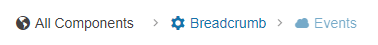

# Getting Started with the Breadcrumb

This tutorial explains how to set up a basic Telerik UI for {{ site.framework }} Breadcrumb and highlights the major steps in the configuration of the component.

You will initialize a Breadcrumb control, configure its icons, and handle its events. Finally, you can run the sample code in [Telerik REPL](https://netcorerepl.telerik.com/) and continue exploring the components.

 

@[template](/_contentTemplates/core/getting-started-prerequisites.md#repl-component-gs-prerequisites)

## 1. Prepare the CSHTML File

@[template](/_contentTemplates/core/getting-started-directives.md#gs-adding-directives)

## 2. Initialize the Breadcrumb

Use the Breadcrumb HtmlHelper or TagHelper to add the component to a page. The `Name()` configuration method is mandatory as its value is used for the `id` and the name attributes of the Breadcrumb element.

```HtmlHelper
    @using Kendo.Mvc.UI

    @(Html.Kendo().Breadcrumb()
            .Name("breadcrumb")
    )
```

```TagHelper
    @addTagHelper *, Kendo.Mvc

    <kendo-breadcrumb name="breadcrumb"> 
    </kendo-breadcrumb>
```


## 3. Add Breadcrumb Items

The next step is to use the `Items()` configuration and add the [Breadcrumb items](). To configure the items:

1. Use the `Type()` property to define the type of the added item&mdash;`RootItem` or `Item`.

1. Use the `Text()` property to define the textual content for the Breadcrumb item.

1. Use the `Href()` property to set the navigation URL of the item.

1. Use the `ShowText()` property to render the textual content for the `RootItem`:

   * The default value for `RootItem` is `false`.
   * The default value for `Item` is `true`.

```HtmlHelper
    @(Html.Kendo().Breadcrumb()
            .Name("breadcrumb")
            .Items(items =>
            {
                items.Add()
                        .Type(BreadcrumbItemType.RootItem)
                        .Href("https://demos.telerik.com/aspnet-core/")
                        .Text("All Components")
                        .ShowText(true);
                items.Add()
                        .Type(BreadcrumbItemType.Item)
                        .Href("/breadcrumb")
                        .Text("Breadcrumb");
                items.Add()
                        .Type(BreadcrumbItemType.Item)
                        .Href("/events")
                        .Text("Events");
            })
    )
```

```TagHelper
    @addTagHelper *, Kendo.Mvc

    <kendo-breadcrumb name="breadcrumb">
        <kendo-breadcrumb-items>
            <kendo-breadcrumb-item type="BreadcrumbItemType.RootItem" text="All Components" href="https://demos.telerik.com/aspnet-core/" show-text="true" ></kendo-breadcrumb-item>
            <kendo-breadcrumb-item type="BreadcrumbItemType.Item" text="Breadcrumb" href="/breadcrumb"></kendo-breadcrumb-item>
            <kendo-breadcrumb-item type="BreadcrumbItemType.Item" text="Events" href="/events"></kendo-breadcrumb-item>
        </kendo-breadcrumb-items>
    </kendo-breadcrumb>
```


## 4. Add Icons

You can configure the [icons for the Breadcrumb items]() by using the `Icon()` property. By default, the Breadcrumb renders an icon only for the `RootItem` type. To display icons for the `Item` type, set the `ShowIcon()` property to `true`. Additionally, you can also change the [icons that separate the Breadcrumb items](#delimiter-icon).

```HtmlHelper
    @(Html.Kendo().Breadcrumb()
            .Name("breadcrumb")
            .Items(items =>
            {
                items.Add()
                        .Type(BreadcrumbItemType.RootItem)
                        .Href("https://demos.telerik.com/aspnet-core/")
                        .Text("All Components")
                        .ShowText(true)
                        .Icon("globe");
                items.Add()
                        .Type(BreadcrumbItemType.Item)
                        .Href("/breadcrumb")
                        .Text("Breadcrumb")
                        .Icon("gear")
                        .ShowIcon(true);
                items.Add()
                        .Type(BreadcrumbItemType.Item)
                        .Href("/events")
                        .Text("Events")
                        .Icon("cloud")
                        .ShowIcon(true);
            })
    )
```

```TagHelper
    @addTagHelper *, Kendo.Mvc

    <kendo-breadcrumb name="breadcrumb">
        <kendo-breadcrumb-items>
            <kendo-breadcrumb-item type="BreadcrumbItemType.RootItem" text="All Components" href="https://demos.telerik.com/aspnet-core/" show-text="true" icon="globe"></kendo-breadcrumb-item>
            <kendo-breadcrumb-item type="BreadcrumbItemType.Item" text="Breadcrumb" href="/breadcrumb" icon="gear" show-icon="true"></kendo-breadcrumb-item>
            <kendo-breadcrumb-item type="BreadcrumbItemType.Item" text="Events" href="/events" icon="cloud" show-icon="true"></kendo-breadcrumb-item>
        </kendo-breadcrumb-items>
</kendo-breadcrumb>
```


## 5. Handle Breadcrumb Events

The Breadcrumb component exposes the `Change()` and `Click()` events that you can handle and further customize the functionality of the component.

```HtmlHelper
    @(Html.Kendo().Breadcrumb()
            .Name("breadcrumb")
            .Events(e => 
                e.Click("onClick")
                .Change("onChange"))
            .Items(items =>
            {
                items.Add()
                        .Type(BreadcrumbItemType.RootItem)
                        .Href("https://demos.telerik.com/aspnet-core/")
                        .Text("All Components")
                        .ShowText(true)
                        .Icon("globe");
                items.Add()
                        .Type(BreadcrumbItemType.Item)
                        .Href("/breadcrumb")
                        .Text("Breadcrumb")
                        .Icon("gear")
                        .ShowIcon(true);
                items.Add()
                        .Type(BreadcrumbItemType.Item)
                        .Href("/events")
                        .Text("Events")
                        .Icon("cloud")
                        .ShowIcon(true);
            })
    )

    <script>
        function onClick(e) {
            console.log("Clicked. :: target: " + e.item.text + ". Type :: " + e.item.type);
        }
        function onChange(e) {
            console.log("Changed. New Value :: " + e.value);
        }
    </script>
```

```TagHelper
    @addTagHelper *, Kendo.Mvc

    <kendo-breadcrumb name="breadcrumb"
        on-change="onChange"
        on-click="onClick">
        <kendo-breadcrumb-items>
            <kendo-breadcrumb-item type="BreadcrumbItemType.RootItem" text="All Components" href="https://demos.telerik.com/aspnet-core/" show-text="true" icon="globe"></kendo-breadcrumb-item>
            <kendo-breadcrumb-item type="BreadcrumbItemType.Item" text="Breadcrumb" href="/breadcrumb" icon="gear" show-icon="true"></kendo-breadcrumb-item>
            <kendo-breadcrumb-item type="BreadcrumbItemType.Item" text="Events" href="/events" icon="cloud" show-icon="true"></kendo-breadcrumb-item>
        </kendo-breadcrumb-items>
    </kendo-breadcrumb>

    <script>
        function onClick(e) {
            console.log("Clicked. :: target: " + e.item.text + ". Type :: " + e.item.type);
        }
        function onChange(e) {
            console.log("Changed. New Value :: " + e.value);
        }
    </script>
```


For more examples, refer to the [demo on using the events of the Breadcrumb](https://demos.telerik.com/{{ site.platform }}/breadcrumb/events).

## 6. (Optional) Reference Existing Breadcrumb Instances

You can reference the Breadcrumb instances that you have created and build on top of their existing configuration:

1. Use the `id` attribute of the component instance to establish a reference.

    ```script
    <script>
        var breadcrumbReference = $("#breadcrumb").data("kendoBreadcrumb"); // breadcrumbReference is a reference to the existing instance of the helper.
    </script>
    ```

1. Use the [Breadcrumb client-side API](https://docs.telerik.com/kendo-ui/api/javascript/ui/breadcrumb#methods) to control the behavior of the widget. In this example, you will use the `value` method to change Breadcrumb value.

    ```script
    <script>
        var breadcrumbReference = $("#breadcrumb").data("kendoBreadcrumb"); // breadcrumbReference is a reference to the existing instance of the helper.
        breadcrumbReference.value("All Components/Breadcrumb/API"); // Set a new value for the component.
    </script>
    ```

For more information on referencing specific helper instances, see the [Methods and Events]() article.


## Explore this Tutorial in REPL

You can continue experimenting with the code sample above by running it in the Telerik REPL server playground:

* [Sample code with the Breadcrumb HtmlHelper](https://netcorerepl.telerik.com/GQbbEwby24x18ZLm09)
* [Sample code with the Breadcrumb TagHelper](https://netcorerepl.telerik.com/mcFFucPo24jGi9nR25)



## Next Steps

* [Configure Editing of the Breadcrumb Path]()
* [Configure the Breadcrumb Navigation]()

## See Also

* [Using the API of the Breadcrumb for {{ site.framework }} (Demo)](https://demos.telerik.com/{{ site.platform }}/breadcrumb/api)
* [Breadcrumb Client-Side API](https://docs.telerik.com/kendo-ui/api/javascript/ui/breadcrumb)
* [Server-Side API of the Breadcrumb](/api/breadcrumb)
* [Knowledge Base Section](/knowledge-base)
