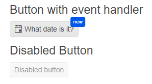

# Getting Started with the Button

This tutorial explains how to set up a basic Telerik UI for {{ site.framework }} Button and highlights the major steps in the configuration of the component.

You will initialize two buttons, one of them will have an event handler, an icon, and a badge. The other one will be rendered as disabled. Finally, you can run the sample code in [Telerik REPL](https://netcorerepl.telerik.com/) and continue exploring the components.

 

@[template](/_contentTemplates/core/getting-started-prerequisites.md#repl-component-gs-prerequisites)

## 1. Prepare the CSHTML File

@[template](/_contentTemplates/core/getting-started-directives.md#gs-adding-directives)

Optionally, you can structure the document by adding the desired HTML elements like headings, divs, paragraphs, and others.

```HtmlHelper
    @using Kendo.Mvc.UI

    <h4>Button with event handler</h4>
    <p>

    </p>
    <p id="date"></p>

    <h4>Disabled Button</h4>
    <p>

    </p>
```

```TagHelper
    @addTagHelper *, Kendo.Mvc

    <h4>Button with event handler</h4>
    <p>

    </p>
    <p id="date"></p>

    <h4>Disabled Button</h4>
    <p>

    </p>
```


## 2. Initialize the Button

Use the Button HtmlHelper or TagHelper to add the component to a page:

* The `Name()` configuration method is mandatory as its value is used for the `id` and the name attributes of the Button element.
* The `Content()` configuration specifies the text that is rendered within the button. This option accepts only string values and no HTML.
* The [`Enable()` configuration]() defines if the component is enabled or disabled.

```HtmlHelper
    @using Kendo.Mvc.UI

    <h4>Button with event handler</h4>
    <p>
        @(Html.Kendo().Button()
            .Name("dateButton")
            .Content("What date is it?"))
    </p>
    <p id="date"></p>

    <h4>Disabled Button</h4>
    <p>
        @(Html.Kendo().Button()
            .Name("disabledButton")
            .Content("Disabled button")
            .Enable(false))
    </p>
```

```TagHelper
    @addTagHelper *, Kendo.Mvc

    <h4>Button with event handler</h4>
    <p>
        <kendo-button name="dateButton">
            What date is it?
        </kendo-button>
    </p>
    <p id="date"></p>

    <h4>Disabled Button</h4>
    <p>
    <kendo-button name="disabledButton" 
        enable="false">
        Disabled button
    </kendo-button>
    </p>
```


## 3. Add an Icon and a Badge

The next step is to display an [icon]() and a [badge]() within the Button. This allows you to enhance its visual representation.

```HtmlHelper
    @using Kendo.Mvc.UI

    <h4>Button with event handler</h4>
    <p>
        @(Html.Kendo().Button()
            .Name("dateButton")
            .Content("What date is it?")
            .Icon("calendar")
            .Badge(b => b
                .Text("new")
                .Shape(BadgeShape.Pill)
                .Size(BadgeSize.Medium)
                .ThemeColor(BadgeColor.Info)))
    </p>
    <p id="date"></p>

    <h4>Disabled Button</h4>
    <p>
        @(Html.Kendo().Button()
            .Name("disabledButton")
            .Content("Disabled button")
            .Enable(false))
    </p>
```

```TagHelper
    @addTagHelper *, Kendo.Mvc

    <h4>Button with event handler</h4>
    <p>
        <kendo-button name="dateButton" 
            icon="calendar">
            <badge
            text="new"
            shape="@BadgeShape.Pill"
            theme-color="@BadgeColor.Info"/>
            What date is it?
        </kendo-button>            
    </p>
    <p id="date"></p>

    <h4>Disabled Button</h4>
    <p>
    <kendo-button name="disabledButton" 
        enable="false">
        Disabled button
    </kendo-button>
    </p>
```


## 4. Handle a Button Event

The Button exposes a `Click()` event that you can handle and assign specific functions to the component. In this tutorial, you will use the `Click()` event to display the current date and time.

```HtmlHelper
    @using Kendo.Mvc.UI

    <h4>Button with event handler</h4>
    <p>
        @(Html.Kendo().Button()
            .Name("dateButton")
            .Content("What date is it?")
            .Icon("calendar")
            .Badge(b => b
                .Text("new")
                .Shape(BadgeShape.Pill)
                .Size(BadgeSize.Medium)
                .ThemeColor(BadgeColor.Info))
            .Events(ev => ev.Click("onClick")))
    </p>
    <p id="date"></p>

    <h4>Disabled Button</h4>
    <p>
        @(Html.Kendo().Button()
            .Name("disabledButton")
            .Content("Disabled button")
            .Enable(false))
    </p>

    <script>
    function onClick(e) {
    document.getElementById('date').innerHTML=Date(); 
    }
    </script>
```

```TagHelper
    @addTagHelper *, Kendo.Mvc

    <h4>Button with event handler</h4>
    <p>
        <kendo-button name="dateButton" 
            on-click="onClick"
            icon="calendar">
            <badge
            text="new"
            shape="@BadgeShape.Pill"
            theme-color="@BadgeColor.Info"/>
            What date is it?
        </kendo-button>
            
    </p>
    <p id="date"></p>

    <h4>Disabled Button</h4>
    <p>
    <kendo-button name="disabledButton" 
        enable="false">
        Disabled button
    </kendo-button>
    </p>

    <script>
    function onClick(e) {
    document.getElementById('date').innerHTML=Date(); 
    }
    </script>
```


For more examples, refer to the [demo on using the events of the Button](https://demos.telerik.com/{{ site.platform }}/button/events).

## 5. (Optional) Reference Existing Button Instances

You can reference the Button instances that you have created and build on top of their existing configuration:

1. Use the `id` attribute of the component instance to establish a reference.

    ```script
    <script>
        var buttonReference = $("#dateButton").data("kendoButton"); // buttonReference is a reference to the existing dateButton instance of the helper.
    </script>
    ```

1. Use the [Button client-side API](https://docs.telerik.com/kendo-ui/api/javascript/ui/button#methods) to control the behavior of the widget. In this example, you will use the `enable` method to disable the button.

    ```script
    <script>
        var buttonReference = $("#dateButton").data("kendoButton"); // buttonReference is a reference to the existing dateButton instance of the helper.
        buttonReference.enable(false); // Disable the button.
    </script>
    ```

For more information on referencing specific helper instances, see the [Methods and Events]() article.


## Explore this Tutorial in REPL

You can continue experimenting with the code sample above by running it in the Telerik REPL server playground:

* [Sample code with the Button HtmlHelper](https://netcorerepl.telerik.com/cGlOckbS095MdJVn28)
* [Sample code with the Button TagHelper](https://netcorerepl.telerik.com/GwbYmkPI10bNjCaY15)



## Next Steps

* [Customize the Appearance of the Button]()
* [Configure the Button's Badge]()

## See Also

* [Using the API of the Button for {{ site.framework }} (Demo)](https://demos.telerik.com/{{ site.platform }}/button/api)
* [Button Client-Side API](https://docs.telerik.com/kendo-ui/api/javascript/ui/button)
* [Server-Side API of the Button](/api/button)
* [Knowledge Base Section](/knowledge-base)
