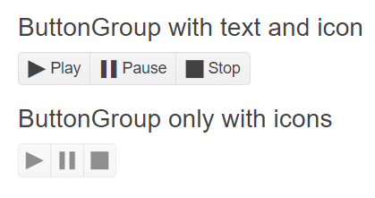

# Getting Started with the ButtonGroup

This tutorial explains how to set up a basic Telerik UI for {{ site.framework }} ButtonGroup and highlights the major steps in the configuration of the component.

You will initialize two button groups, one of them will have an event handler. The other one will be rendered as disabled. Finally, you can run the sample code in [Telerik REPL](https://netcorerepl.telerik.com/) and continue exploring the components.

 

@[template](/_contentTemplates/core/getting-started-prerequisites.md#repl-component-gs-prerequisites)

## 1. Prepare the CSHTML File

@[template](/_contentTemplates/core/getting-started-directives.md#gs-adding-directives)

Optionally, you can structure the document by adding the desired HTML elements like headings, divs, paragraphs, and others.

```HtmlHelper
    @using Kendo.Mvc.UI

    <h4>ButtonGroup with text and icon</h4>

    <br /><br />
    <h4>ButtonGroup only with icons</h4>
```

```TagHelper
    @addTagHelper *, Kendo.Mvc

    <h4>ButtonGroup with text and icon</h4>
    
    <br /><br />
    <h4>ButtonGroup only with icons</h4>    
```


## 2. Initialize the ButtonGroup

Use the ButtonGroup HtmlHelper or TagHelper to add the component to a page:

* The `Name()` configuration method is mandatory as its value is used for the `id` and the name attributes of the ButtonGroup element.
* The `Items()` configuration specifies the configuration of the items that are rendered within the ButtonGroup. You will use the `Add()` method to define three items: Play, Pause, and Stop.
* The `Text()` configuration method sets the text for each ButtonGroup item.

```HtmlHelper
    @using Kendo.Mvc.UI

    <h4>ButtonGroup with text and icon</h4>
    @(Html.Kendo().ButtonGroup()
        .Name("player")
        .Items(t => // Add the three ButtonGroup items.
        {
            t.Add().Text("Play");
            t.Add().Text("Pause");
            t.Add().Text("Stop");
        })
    )
    <br /><br />
    <h4>ButtonGroup only with icons</h4>
```

```TagHelper
    @addTagHelper *, Kendo.Mvc

    <h4>ButtonGroup with text and icon</h4>
        <kendo-buttongroup name="player">
            <buttongroup-items>
                <item text="Play"></item>
                <item text="Pause"></item>
                <item text="Stop"></item>
            </buttongroup-items>
        </kendo-buttongroup>
    <br /><br />
    <h4>ButtonGroup only with icons</h4>    
```


## 3. Add Icons

The next step is to display [icons]() for the items in the ButtonGroup. This allows you to enhance their visual representation. You will also add the second ButtonGroup component that will have only icons without text and will be rendered as disabled.

```HtmlHelper
    @using Kendo.Mvc.UI

    <h4>ButtonGroup with text and icon</h4>
    @(Html.Kendo().ButtonGroup()
        .Name("player")
        .Items(t =>
        {
            t.Add().Text("Play").Icon("play"); // Use the Icon method to render an icon in each ButtonGroup item.
            t.Add().Text("Pause").Icon("pause");
            t.Add().Text("Stop").Icon("stop");
        })
    )
    <br /><br />
    <h4>ButtonGroup only with icons</h4>
    @(Html.Kendo().ButtonGroup() // Initialize the second ButtonGroup component.
        .Name("disabledPlayer")
        .Items(t =>
        {
            t.Add().Icon("play");
            t.Add().Icon("pause");
            t.Add().Icon("stop");
        })
        .Enable(false) // Render the ButtonGroup component as disabled.
    )
```

```TagHelper
    @addTagHelper *, Kendo.Mvc

    <h4>ButtonGroup with text and icon</h4>
    <kendo-buttongroup name="player">
        <buttongroup-items>
            <item icon="play" text="Play"></item>
            <item icon="pause" text="Pause"></item>
            <item icon="stop" text="Stop"></item>
        </buttongroup-items>
    </kendo-buttongroup>
    <br /><br />
    <h4>ButtonGroup only with icons</h4>
    <kendo-buttongroup name="disabledPlayer" enable="false">
        <buttongroup-items>
            <item icon="play"></item>
            <item icon="pause"></item>
            <item icon="stop"></item>
        </buttongroup-items>
    </kendo-buttongroup>  
```


## 4. Handle a ButtonGroup Event

The ButtonGroup exposes the `Select()` event that you can handle and assign specific functions to the component. In this tutorial, you will use the `Select()` event to display the index of the selected button (0, 1, or 2) in the browser console.

```HtmlHelper
    @using Kendo.Mvc.UI

    <h4>ButtonGroup with text and icon</h4>
    @(Html.Kendo().ButtonGroup()
        .Name("player")
        .Items(t =>
        {
            t.Add().Text("Play").Icon("play");
            t.Add().Text("Pause").Icon("pause");
            t.Add().Text("Stop").Icon("stop");
        })
        .Events(ev => ev.Select("onSelect")) // Use the Select() event of the ButtonGroup.
    )
    <br /><br />
    <h4>ButtonGroup only with icons</h4>
    @(Html.Kendo().ButtonGroup()
        .Name("disabledPlayer")
        .Items(t =>
        {
            t.Add().Icon("play");
            t.Add().Icon("pause");
            t.Add().Icon("stop");
        })
        .Enable(false)
    )

    <script>
        function onSelect(e) {
            console.log("Selected index: " + e.indices); // Display the index of the selected button in the browser console.
        }
    </script>
```

```TagHelper
    @addTagHelper *, Kendo.Mvc

    <h4>ButtonGroup with text and icon</h4>
    <kendo-buttongroup name="player" on-select="onSelect">
        <buttongroup-items>
            <item icon="play" text="Play"></item>
            <item icon="pause" text="Pause"></item>
            <item icon="Stop" text="Stop"></item>
        </buttongroup-items>
    </kendo-buttongroup>
    <br /><br />
    <h4>ButtonGroup only with icons</h4>
    <kendo-buttongroup name="disabledPlayer" enable="false">
        <buttongroup-items>
            <item icon="play"></item>
            <item icon="pause"></item>
            <item icon="stop"></item>
        </buttongroup-items>
    </kendo-buttongroup>

    <script>
        function onSelect(e) {
            console.log("Selected index: " + e.indices);
        }
    </script>
```


## 5. (Optional) Reference Existing ButtonGroup Instances

You can reference the ButtonGroup instances that you have created and build on top of their existing configuration:

1. Use the `id` attribute of the component instance to establish a reference.

    ```script
    <script>
        var buttonGroupReference = $("#player").data("kendoButtonGroup"); // buttonGroupReference is a reference to the existing player instance of the helper.
    </script>
    ```

1. Use the [ButtonGroup client-side API](https://docs.telerik.com/kendo-ui/api/javascript/ui/buttongroup#methods) to control the behavior of the widget. In this example, you will use the `enable` method to disable the button.

    ```script
    <script>
        var buttonGroupReference = $("#player").data("kendoButtonGroup"); // buttonGroupReference is a reference to the existing player instance of the helper.
        buttonGroupReference.enable(false); // Disable the ButtonGroup.
    </script>
    ```

For more information on referencing specific helper instances, see the [Methods and Events]() article.



## Explore this Tutorial in REPL

You can continue experimenting with the code sample above by running it in the Telerik REPL server playground:

* [Sample code with the ButtonGroup HtmlHelper](https://netcorerepl.telerik.com/Gcbkdlbl240mRJYX21)
* [Sample code with the ButtonGroup TagHelper](https://netcorerepl.telerik.com/mwbYHlll23xULWMD44)



## Next Steps

* [Using Icons in the ButtonGroup]()
* [Configuring the Selection Mode in the ButtonGroup]()
* [Configuring the Index in the ButtonGroup]()

## See Also

* [Using the API of the ButtonGroup for {{ site.framework }} (Demo)](https://demos.telerik.com/{{ site.platform }}/buttongroup/api)
* [ButtonGroup Client-Side API](https://docs.telerik.com/kendo-ui/api/javascript/ui/buttongroup)
* [Server-Side API of the ButtonGroup](/api/buttongroup)
* [Knowledge Base Section](/knowledge-base)
